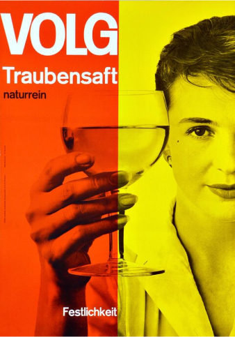
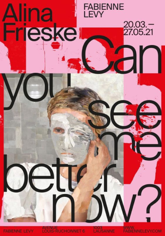

В 21 веке тяжело удивить клиента новыми визуальными решениями. **Сейчас мы то и делаем, что перерабатываем, то что когда-то уже создали и это нормально.** Прежде, чем начать работу над проектом - изучить работы других авторов становится обычным, а главное полезным делом.

**Таким образом и появляется насмотренность, которая как внутренняя шкала дает нам опору и понимание как отличить хорошее от плохого.** Чем больше насмотренность, тем шире становится твой кругозор. Вдобавок ко всему, визуальный вкус поможет тебе улучшить качество собственных работ, быстрее генерировать идеи быть в курсе последних трендов.

Пока ты только начинаешь свой путь не бойся, что насмотренности пока нет. Никто не рождается с уже развитым вкусом. **Насмотренность - это такой же практический навык, как и умение читать или писать.** Это своего рода мышца, которую можно и нужно тренировать. Спустя время она будет работать уже подсознательно и ты не заметишь, как начнешь делать еще более качественные проекты, которые могут стать ориентиром для других.

|  |  |  |
| -------------------------------------------------------------------- | -------------------------------------------------------------------- | -------------------------------------------------------------------- |
