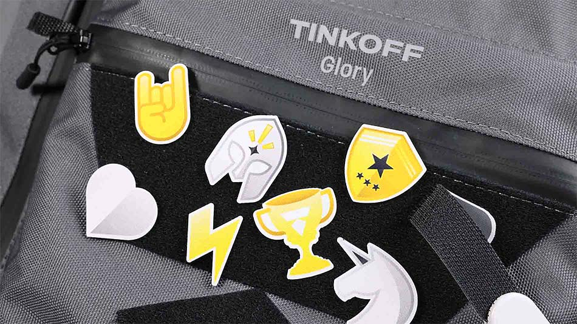
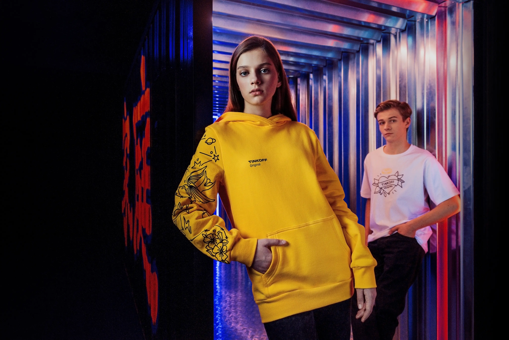
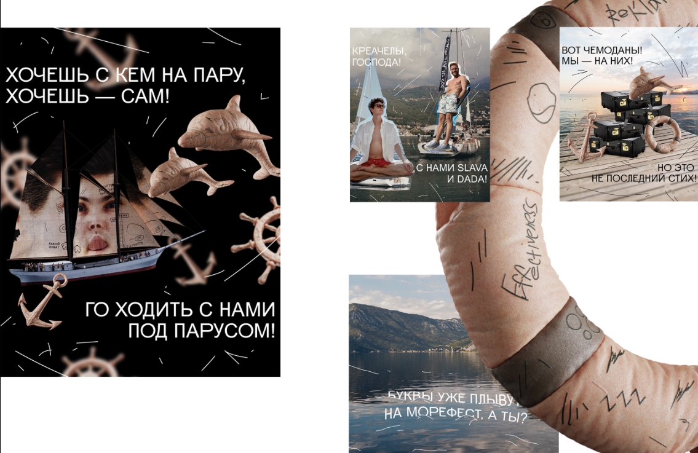
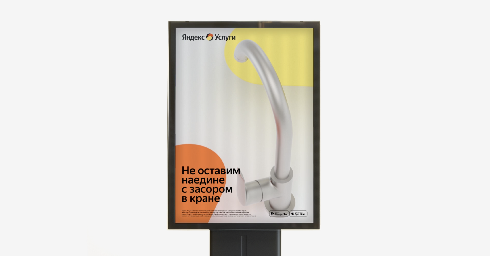
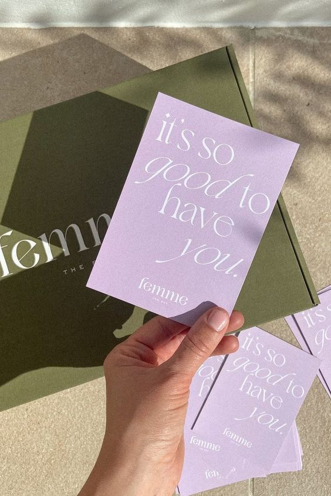
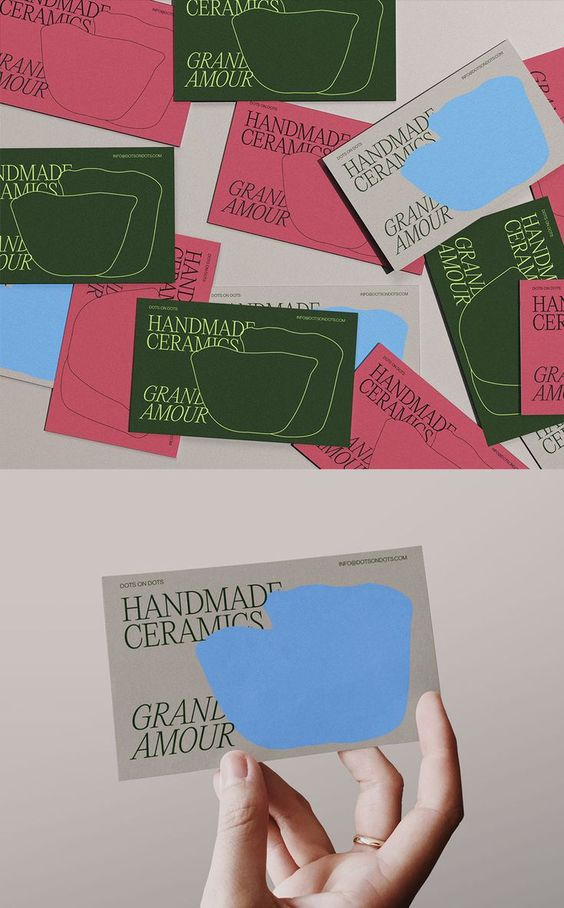

Перед началом работы тебе необходимо провести аналитику и все разложить по полочкам для того, чтобы фирменный стиль решал именно те задачи, которые перед тобой поставил заказчик. Аналитическую часть рекомендуем разместить на первых слайдах в презентации, так как главной составляющей удачного фирменного стиля является не сам дизайн, а та работа, которая выполняется до него.
 
**Задание**
 
1. **Сформулируй задачу, которую перед тобой поставил заказчик и зафиксируй ее в презентации.** (На отдельном слайде пропиши, что конкретно планируется реализовать, вводные данные о проекте, которые есть в ТЗ)
2. **Составь портрет целевой аудитории.** На отдельном слайде попробуй предположить, опираясь на описание компании и анализ конкурентов, кто может быть ЦА бутика. Определи ЦА на основе следующих критериев: возраст, пол, уровень дохода, образование, а также социальные, психологические, поведенческие, географические признаки. Зафиксируй их в презентации, для наглядности можешь прикрепить фотографии потенциальной аудитории.
 
> **Целевая аудитория** — это группа людей или организаций, которую компания выбирает для направленной рекламной или маркетинговой кампании. Выбор целевой аудитории помогает компании сосредоточить свои ресурсы и усилия на наиболее вероятных клиентах и повышает эффективность рекламных кампаний.
 
3. **Выбери имиджевые носители, рекламную продукцию и упаковочные изделия, на которых будет размещаться фирм стиль.** Это необходимо, чтобы в полной мере продемонстрировать твой фирм. стиль заказчику. Брошюры, листовки, каталоги, визитки, бирки, наклейки и т.д... У нас нет четкого регламента, что хочет видеть клиент, поэтому ты можешь показать свою концепцию на любом, комфортном для тебя количестве носителей, которое по твоему мнению точно может пригодиться бутику. Чтобы было интереснее, старайся выбирать разную форму и размеры носителей, так ты сможешь более разнопланово представить свою идею. Обращай внимание на то, что визуальный стиль на носителях не должен выглядеть как ресайз.
 
> **Имиджевые носители** — это печатные изделия с корпоративным стилем. Сюда входят сувениры, визитные карточки, фирменные блокноты, папки, конверты, приглашения и прочая имиджевая продукция.
 

> **Рекламная продукция.** Сюда относятся плакаты, листовки, постеры, брошюры, буклеты, каталоги и т.д. Эта группа считается самой многочисленной. Основная цель рекламной печатной полиграфии – привлечь внимание потенциальных клиентов, а также продвинуть на рынке торговую марку. Такие изделия должны выделить компанию среди конкурентов, вызвать повышенный интерес к товарам и услугам, поэтому в оформлении приветствуются креативные дизайнерские идеи.

> **Упаковочные изделия.** Сюда входят изготовленные разными методами этикетки, наклейки, стикеры, коробки, пластиковые и бумажные пакеты. Упаковочная полиграфия выдвигает ряд специфических требований: прочностные и гигиенические аспекты, надежную защиту от фальсификации и подделки.
 

> **Ресайз** — это процесс изменения размера элементов дизайна, таких как изображения, текст или графика, с сохранением пропорций и качества. В этом задании мы не опираемся на ресайз, а создаем для каждого носителя свою композицию, не стоит делать ее везде одинаковой. От размера и формы зависит то, как будет выглядеть композиция: какие-то элементы можно убирать, а что-то, наоборот, добавлять. Стоит следить за тем, чтобы нагрузка элементов в каждом носителе была разная. Главное, чтобы форма шла за смыслом, а не наоборот.
 
1. **Создай фреймы с оригинальным размером носителей.** Чтобы сразу делать правильно, и соблюдать пропорции, можешь создать рабочую область в нужных размерах всех носителей, которые ты выбрал для работы. (можешь взять мм) и работать уже внутри этих размеров. Размеры носителей можно легко найти в поисковиках, они как правило стандартизированы.
