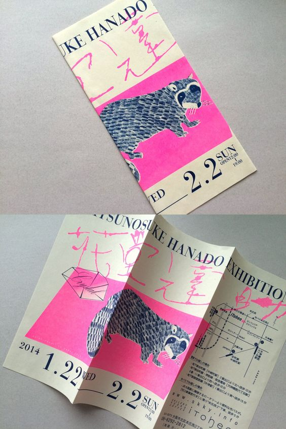
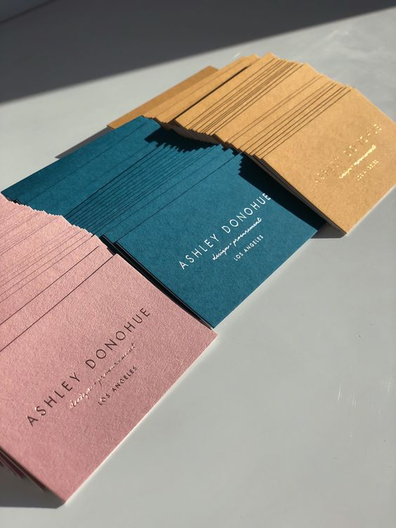
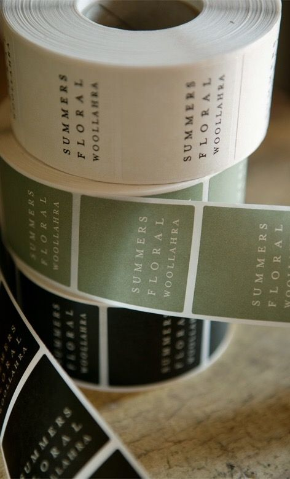

На этом этапе перед тобой стоит задача перенести все свои идеи и наработки на выбранные тобой носители, внимательно следи за композицией, соразмерностью шрифтов. Важно не перегружать макеты. Можешь использовать любые стилистические приемы, самостоятельно подобрать фотографии (не забудь зафильтровать их в едином стиле), если того требует твоя идея.  

|  |  |  |
| - | - | - |

**В итоге у тебя должно получится 3-7 носителей с разной композицией внутри.** Помни, что вся работа должна быть выполнена в едином ключе, а значит во всех макетах мы используем один комплект цветовой гаммы, шрифтов, фотографий и т.д.

> Важно, чтобы стиль был узнаваемым, отражал философию и ценности бренда, и был применим на всех носителях. Стиль должен включать в себя логотип, цвета, шрифты, дизайн элементы и т.д. Кроме того, важно следить за единообразием стиля на всех носителях.
