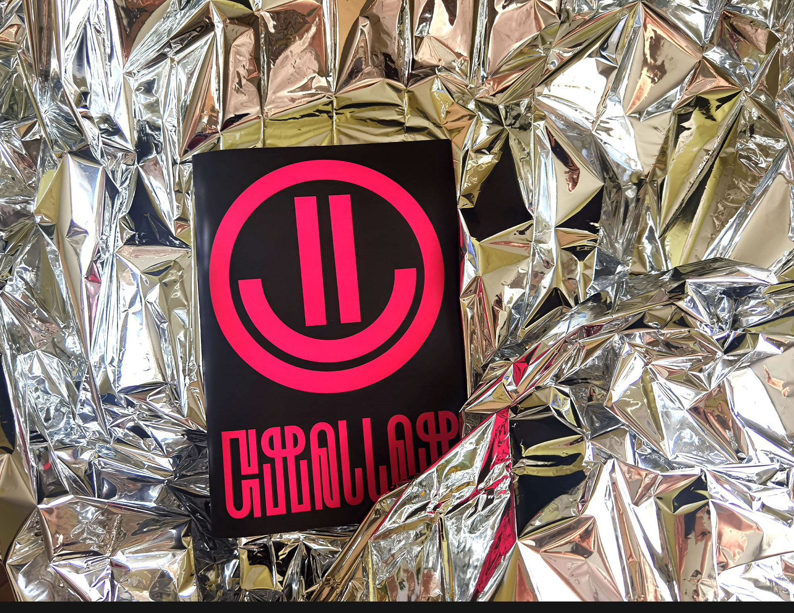
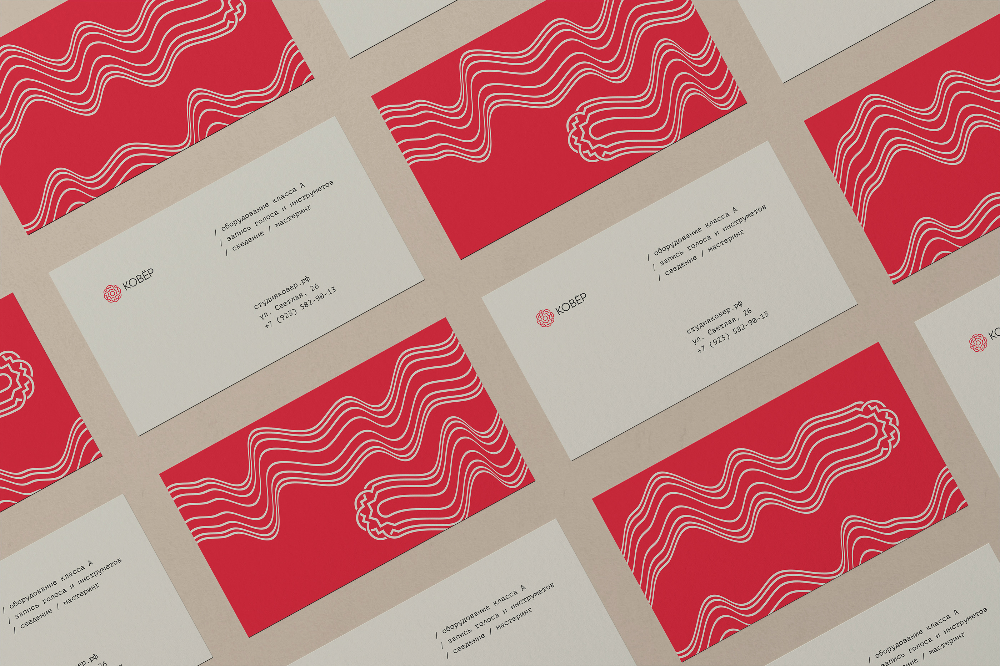
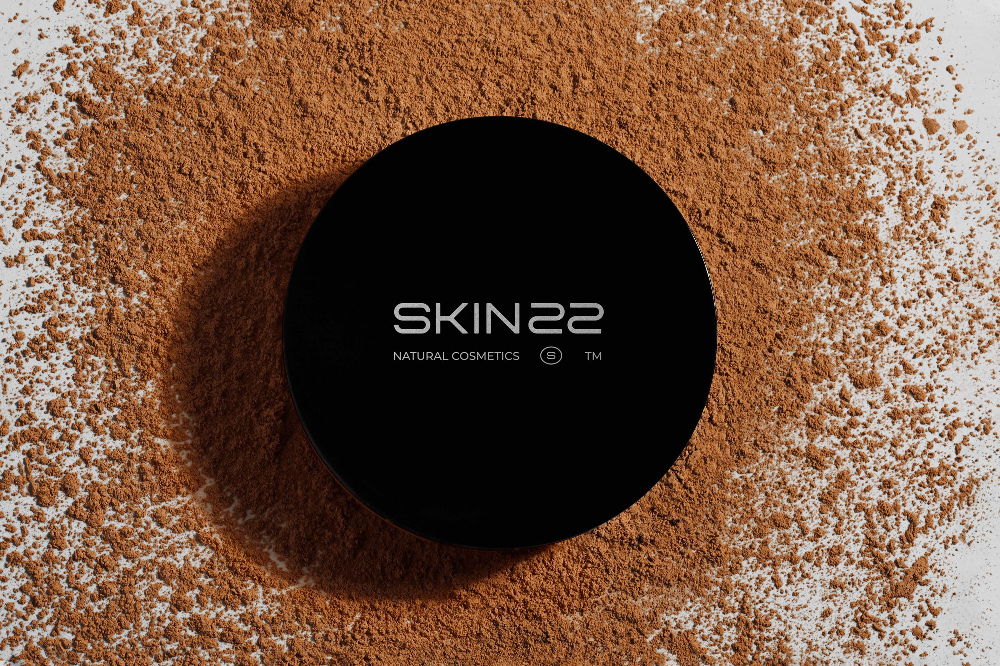

Эта работа под звездочкой, ты можешь самостоятельно решить будешь его добавлять или нет. Так как в нем тебе понадобится умение пользоваться Adobe Photoshop или Adobe Illustrator. Мокапы нам нужны обычно для того, чтобы более наглядно показать, как будет выглядеть концепция уже на готовых носителях в реальной жизни. Существует библиотека уже готовых мокапов, ты можешь воспользоваться ею и создать более эффектную подачу для своего портфолио, даже, если ты не знаток фотошопа. Ниже найдешь ссылки на мокапы. Кстати, в YouTube достаточно много видео с инструкциями, которые помогут тебе разобраться как ими пользоваться.

|  |  |  |
| - | - | - |

**Твоя задача попробовать создать несколько мокапов для своих носителей и добавить их в свой проект.**

**Ссылки на мокапы:**  
[zippypixels.com](https://zippypixels.com/products/mockups)  
[artlab.club](https://artlab.club/)  
[www.canva.com](https://www.canva.com/templates/mockups/)  
[cssauthor.com](https://cssauthor.com/mockups/)  
[www.freepik.com](https://www.freepik.com/free-photos-vectors/mockup)  
[thenameapp.com](https://thenameapp.com/mockups/)  
[www.renderforest.com](https://www.renderforest.com/mockup-generator)  
[freebiesbug.com](https://freebiesbug.com/psd-freebies/mockups/)  
[www.behance.net](https://www.behance.net/search/projects/?search=mockup)  
[www.mockupworld.co](https://www.mockupworld.co/all-mockups/)
