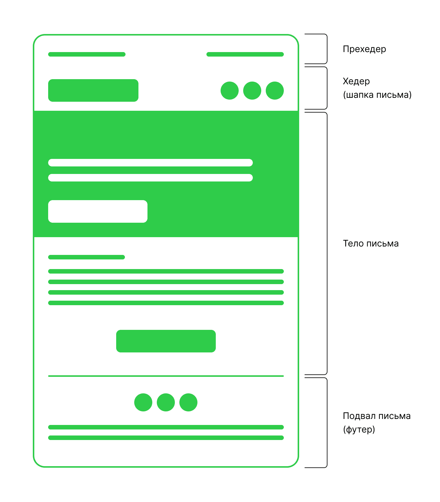
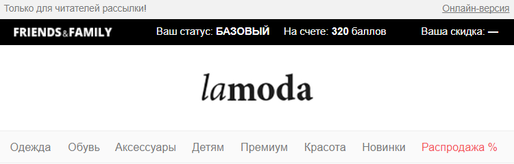

Структура email-рассылки очень похожа на структуру лендинга:

1. **Прехедер** - текст, который отображается в заголовке письма на странице с входящими сообщениями. Но в самом письме эта зона часто используется для указания ссылок на веб-версию письма и/или на сайт отправителя.
2. **Хедер** – здесь находится логотип, можно добавить меню по необходимости

3. **Тело письма** - основной блок письма с описанием спецпредложений, подборкой товаров и материалов с сайта. Краткое описание e-mail рассылки, которое клиент увидит в почте вместе с темой письма. Оно может включать текст, изображения, видео или другие медиа-элементы.
4. **Футер** – это подвал письма. Здесь обычно располагают контактную информацию, ссылки на соц. сети. А также здесь необходимо разместить ссылку для возможности отписаться, это требование сервисов рассылок.

 
В таком письме интуитивно понятно, что более подробная информация находится в теле письма, а в футере располагаются ссылки на соцсети и всё, что связано с обратной связью. 
 
> **Задание** - сделай примерный эскиз рассылки, опираясь на табличную верстку.