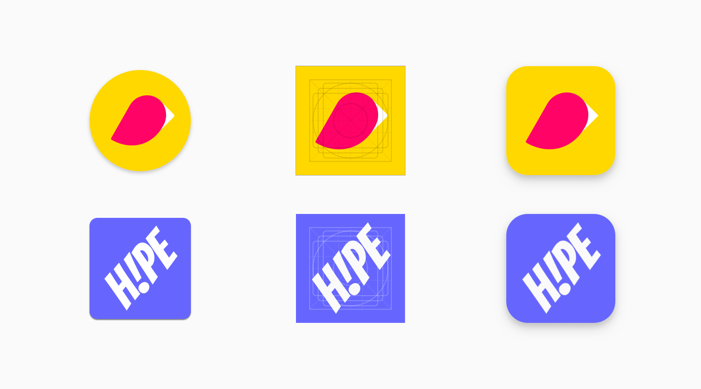
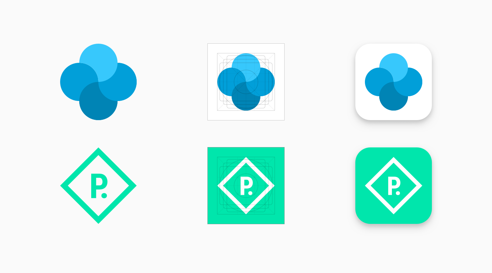
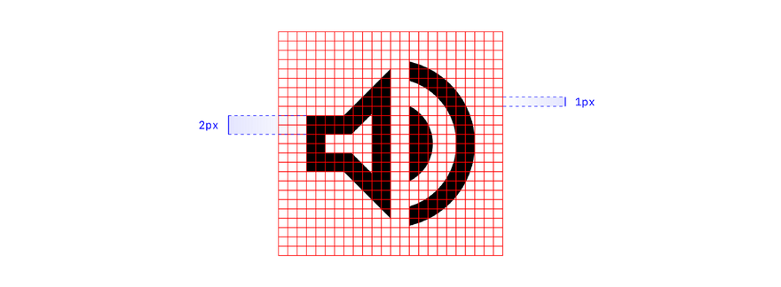
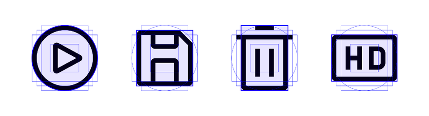
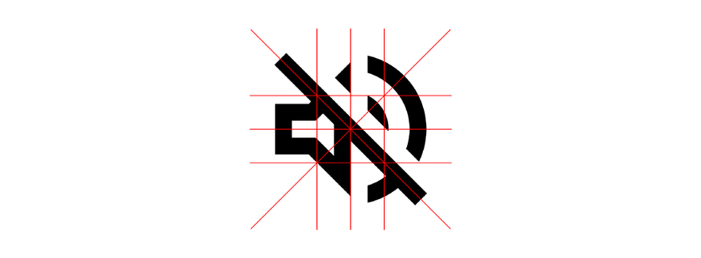
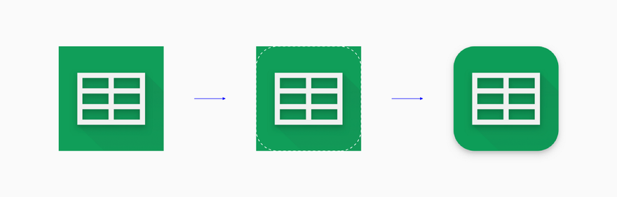
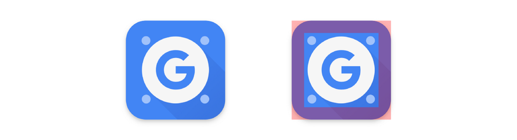

Иконки в интерфейсе обычно сводятся к базовым формам: вертикальному, горизонтальному или диагональному прямоугольнику, кругу, треугольнику или квадрату. Если размыть изображения, то получатся похожие кляксы с примерно одинаковым визуальным весом.

 
В любой иконке можно выделить оптическую сетку. Сетка закладывает её визуальную основу и позволяет сделать процесс проектирования быстрым и последовательным. Оптическая сетка иконки может складываться из нескольких частей: пиксельной сетки, базовых фигур и ортогоналей, маски и охранной области. Каждый из этих элементов обеспечивает контрольные точки для рисования, но может использоваться по усмотрению автора. Например, при создании иконки не всегда нужна маска или пиксельная сетка.
 
## Рассмотрим составляющие сетки более детально:
1. **Пиксельная сетка**
Пиксельная сетка помогает рисовать с определенным шагом. Приращение в 1px долгое время считалось стандартом для цифровых технологий, а шаг в 0.5px пикселя стал применяться совсем недавно. Привязка к пикселям помогает сделать иконки четкими на экранах с более низким разрешением.

2. **Базовая фигура**
Базовые фигуры предоставляют исходные формы шаблонов. Обычно используются четыре основных элемента: круг, квадрат, прямоугольник в портретной и ландшафтной ориентации. Фигуры обеспечивают необходимый стандарт, оставляя для тебя место для гибкости и творчества. Цель вовсе не в том, чтобы каждая иконка идеально соответствовала базовой форме.

3. **Ортогонали**
Ортогонали заимствованы из перспективы рисунка – относятся к ключевым линиям, которые пересекают центральную точку иконки и создают дополнительные вершины для использования. Эти линии обычно разрезают холст под углом 90 ° и 45 °. Когда требуются дополнительные углы, следующим шагом будет увеличение 15 ° и 5 °.

4. **Маска**
Маска кастомизирует контейнер иконки из квадратного холста, используемого по умолчанию. Маски могут быть встроены в сам актив или применены к нему впоследствии. Например, Play Store применяет ко всем иконкам маску прямоугольника с закругленными углами.

 
5. **Охранная зона**
Безопасная область показывает, где должно располагаться важное содержимое значка, а область обрезки – показывает область, которую следует избегать. В некоторых случаях безопасная область – это всего лишь рекомендация, но в случаях, когда контент будет обрезан, необходимо строго следовать безопасной области.

