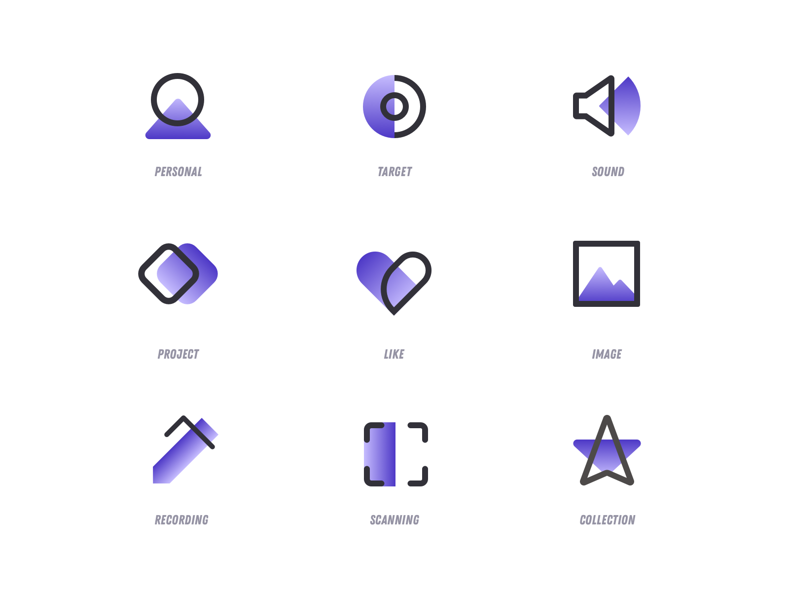

**Как добиться единого стиля?**  
1. **Единая система.** Чтобы набор иконок воспринимался как единое целое, у них должны быть повторяющиеся элементы. Это могут быть скруглённые или острые углы, одинаковая толщина обводки, общая цветовая палитра или декоративные детали. Разработай единую систему для своего стиля иконок. Установи правила для цветовой палитры, линий, заполнения и других атрибутов, которые будут использоваться во всех иконках. Это поможет создать согласованный и единый стиль для всех иконок.
 
2. **Единая детализация.** В разных иконках нужно соблюдать одинаковый уровень детализации. У всего семейства должен быть свой характерный и узнаваемый стиль.
 
3. **Один стиль.** Не стоит совмещать в одном наборе иконки разных стилей. Это может затруднить восприятие интерфейса и повысить когнитивную нагрузку на пользователя.

