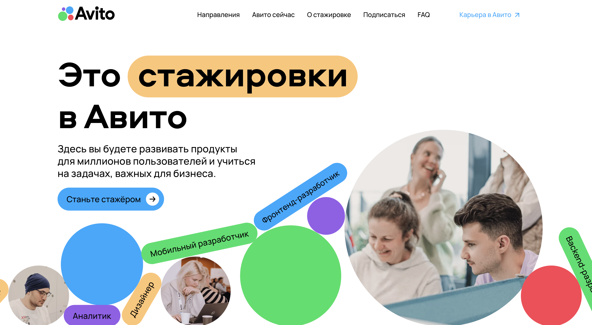
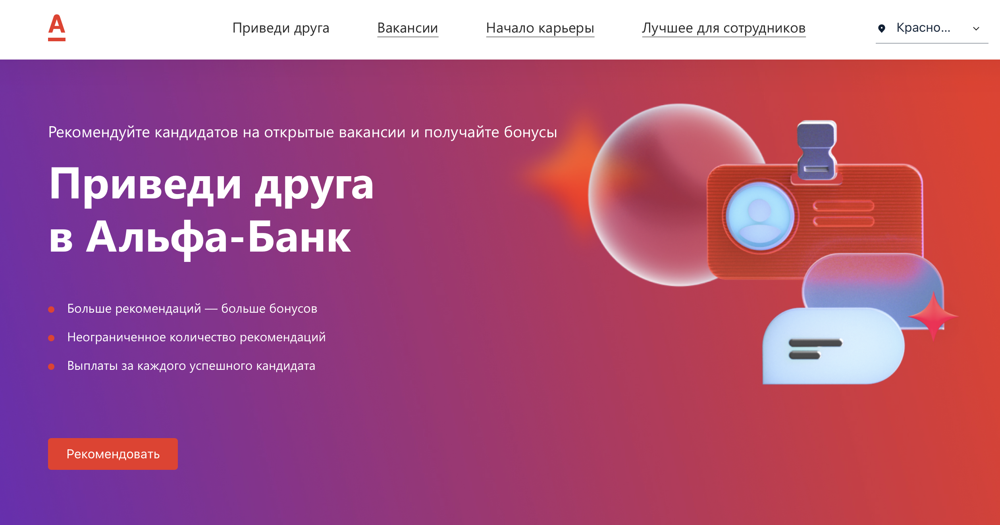

> **Лендинг** – это веб-страница, основной целью которой является побуждение посетителя сделать одно конкретное действие. Этим действием может быть покупка товара, заказ услуги, оформление подписки или регистрация на сайте.
 
Лендинги играют важную роль в цифровом маркетинге и рекламных кампаниях, поскольку они специально разработаны для привлечения внимания посетителей и стимулирования их к выполнению определенного действия.
 
## Еще о важности лендинга:
 
1. **Увеличение конверсии:** Лендинги создаются с учетом конкретной цели, такой как совершение покупки, подписка на рассылку или заполнение формы. Они фокусируются на одном предложении или продукте, что делает их более убедительными для посетителей и повышает вероятность конверсии.
 
2. **Целевой маркетинг:** Лендинги могут быть созданы для конкретных маркетинговых кампаний или сегментов целевой аудитории. Это позволяет маркетологам настраивать сообщение и дизайн в соответствии с конкретными потребностями и интересами целевой аудитории, увеличивая шансы на конверсию.
 
 
3. **Сбор данных и генерация лидов:** Лендинги часто включают формы или механизмы сбора лидов, которые позволяют маркетологам собирать ценную информацию о клиентах. Это помогает создавать базу данных лидов для будущих маркетинговых усилий и обеспечивает возможность персонализированного коммуникации.
 
4. **Тестирование и оптимизация:** Лендинги могут быть легко протестированы и оптимизированы для улучшения их производительности. Путем тестирования различных вариантов заголовков, текстов, элементов дизайна и CTA маркетологи могут определить наиболее эффективные элементы и проводить оптимизацию на основе данных для увеличения конверсии.
 
5. **Пользовательский опыт:** Лендинги обычно имеют простой и понятный макет с минимальным количеством отвлекающих элементов. Это помогает посетителям быстро понять предложение и выполнить желаемое действие.
 
6. **Увеличение эффективности рекламных кампаний:** Лендинги могут быть связаны с рекламными кампаниями, такими как контекстная реклама или реклама в социальных сетях. Они помогают увеличить эффективность рекламы, поскольку посетители, переходящие на лендинг, уже заинтересованы в предложении и более склонны к конверсии.
 
 
## Отличия лендинга от сайта
 
Многие делают сайты-одностраничники, что-то среднее между промостраницей и полноценным сайтом, называя их лендингами. Это не совсем корректно, хотя такие гибридные продукты также бывают весьма эффективны. Но дело в том, что сайт — это всегда самостоятельный источник, а лендинг – призывающая к действию посадочная страница. То есть в отличие от сайта она куда-то ведет и может являться лишь его частью, а не самостоятельным ресурсом.
 
Важным отличием также является то, что целевая посадочная страница всегда концентрирует внимание пользователя на совершении конверсионного действия. В то время как одностраничный сайт охватывает много моментов, например, презентует компанию и целый набор ее услуг.
 
## Что помогает привести пользователя к целевому действию?
 
1. **Продукт.** Пользователь должен с первой секунды открытия сайта точно понимать какую возможность ему предоставляют на сайте. Для этого необходимо сформулировать и отобразить на сайте оффер, то есть ценное коммерческое предложение, выраженное в краткой форме. Также лендинг должен содержать очень краткую, но емкую информацию о выгодах и преимуществах сотрудничества с вами.
 

 
2. **Целевая аудитория.** При разработке лендинга очень важно на каком языке ты будешь разговаривать с потенциальной ЦА. Здесь важно учитывать демографические, поведенческие, психологические, социальные признаки.
 
> **Целевая аудитория** — это группа людей или организаций, которую компания выбирает для направленной рекламной или маркетинговой кампании. Выбор целевой аудитории помогает компании сосредоточить свои ресурсы и усилия на наиболее вероятных клиентах и повышает эффективность рекламных кампаний.
 
**Чтобы было легче составить портрет целевой аудитории обычно используют следующие критерии, на которые можно ориентироваться при составлении портрета:**
 
**Демографические характеристики:** возраст, пол, местоположение, образование, доход и семейное положение.
 
**Поведенческие характеристики:** это покупательские привычки, предпочтения, интересы, поведение в сети, использование социальных медиа. Это поможет понять, как аудитория взаимодействует с продуктом или услугой, и какие маркетинговые стратегии могут быть эффективными.
 
**Психологические характеристики:** ценности, убеждения, интересы, образ жизни и личностные черты.
 
**Персонажи и истории:** типичные представители целевой аудитории. Персонажи помогут создать более конкретное и эмоциональное представление об аудитории и лучше понять их потребности и мотивацию. Можно дать имя персонажу, подумать над внешностью, перечислить привычки, особенности характера, а также найти фотографии, чтобы продемонстрировать ЦА и визуально.

3. **Целевое действие.** Цель лендинга – убедить пользователя совершить действие. Важно не переборщить с действиями, чтобы не запутать человека, а также использовать очень простые и понятные формулировки для кнопок.

