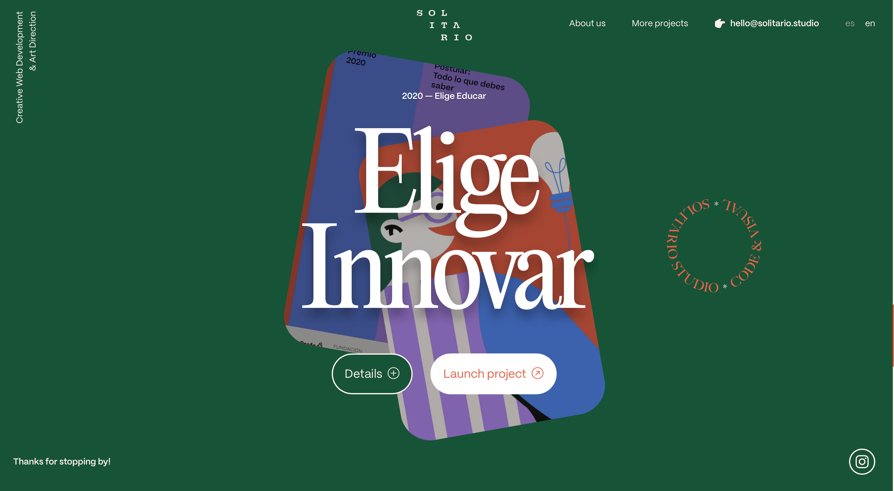

## Одноэкранный лендинг  
Из названия очевидно: это лендинг, который полностью помещается на первом экране. Он содержит заголовок с УТП, кнопку призыва к действию и, как правило, форму для сбора контактов (иногда форма изначально скрыта и появляется после нажатия на кнопку). Дело в том, что в интернете люди не читают, а сканируют. Чаще всего пробегаясь только по заголовкам на посадочной странице, потому что информации слишком много, чтобы вчитываться во всё. Поэтому главный экран так важен. Здесь может быть предложение о подписке, регистрация, запись на консультацию, ананос мероприятия и тд.

 
## Информационный лендинг
Это тип лендинга, который предназначен для предоставления информации о продукте, услуге, событии или компании. Основная цель информационного лендинга - передать посетителям необходимую информацию и вызвать у них интерес или доверие к предлагаемому предложению. Целевым действием такого лендинга будут «узнать подробности»

 
## Промостраница
Излюбленный способ продвижения. Промостраницы могут закрывать задачи на любом этапе воронки продаж:
 
**Формировать спрос** — рекламная статья может привлекать людей, даже если потребности в продукте или услуге у них еще нет. Например, вы можете написать статью о проблеме вашей аудитории и предложить решение в виде своего продукта. Если зацепите читателя, он изучит материал и, возможно, задумается о покупке.
 
**Знакомить с продуктом** — в некоторых нишах много похожих товаров и услуг, и людям сложно сделать выбор. Поэтому публикации в ПромоСтраницах — подходящий вариант, чтобы подробно описать все преимущества продукта и отстроиться от конкурентов.
 
**Подталкивать к покупке** — если читатель уже знаком с товаром или услугой, рекламная статья в ПромоСтраницах может стать дополнительной точкой входа на лендинг, сайт или другую посадочную страницу, где пользователь сможет совершить покупку. По статистике ПромоСтраниц, около 40% людей, которые дочитали рекламную статью, переходят на сайт с предложением.
 
**Формировать отложенный спрос** — не все товары или услуги люди готовы покупать сразу. Статьи в ПромоСтраницах помогают с отложенными продажами — если материал будет интересным и полезным, читатель запомнит рекламируемый продукт, а потом с большой вероятностью купит у вас, а не у конкурентов.
 
**Реклама в ПромоСтраницах** дает широкие охваты, потому что показывается в сервисах Яндекса и на сайтах Рекламной сети (РСЯ). Это позволяет повысить узнаваемость бренда за счет большого количества пользователей. Дневная аудитория РСЯ — более 70 млн человек более чем на 55 000 площадок.
 
**Что бы ни продавала промостраница, она, как правило, строится по стандартной схеме: знакомство с продуктом — презентация — дополнительные выгоды — целевое действие (сделка).**
 

