В лендинге очень важно выстроить информацию логично и последовательно, предвосхищая вопросы пользователя, выстраивая структуру.
 
Четких правил о том, как выстраивать структуру нет, но **есть стандартный набор блоков:**
- Хедер
- Первый экран с уникальным торговым предложением (УТП).
- Информация о проекте, услуге, продукте
- Преимущества
- Отзывы
- Форма с целевым действием
- Футер
 
## Первый экран
Это блок, который видно сразу, как пользователь открывает сайт. Обычно в нем содержится краткое описание продукта и призыв его приобрести. Исследования о важности первого экрана: 7 из 10 пользователей не листают дальше первого экрана, а покидают сайт сразу. На первом экране обычно размещают уникальное торговое предложение (УТП) или оффер.
Это конкретное предложение покупателю: купить конкретный товар и получить конкретную выгоду – это и есть заголовок, а в подзаголовке обычно раскрывают чуть подробнее послание.

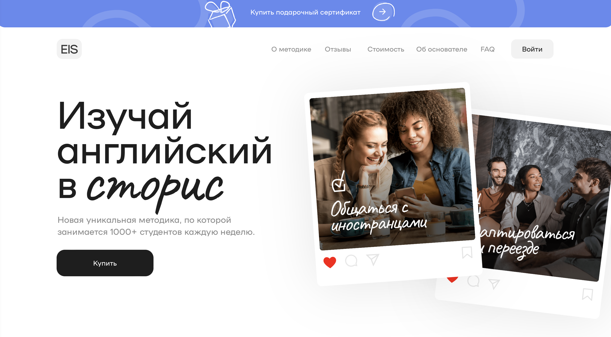

 
**УТП сразу говорит, чему посвящён лендинг и о каких услугах или товарах идет речь. Это ключевой маркетинговый инструмент, поэтому его необходимо правильно оформить для привлечения внимания пользователя.**
 
## Изображения и графика
При выборе графики или изображения для главной страницы, стоит в первую очередь опираться на целевую аудиторию, а также не забывать о том, что пользователь должен сразу понять или увидеть, что конкретно ему предлагают.
 
**Старайся не перегружать экран излишней графикой, следи за тем, чтобы главная информация хорошо считывалась.**
 

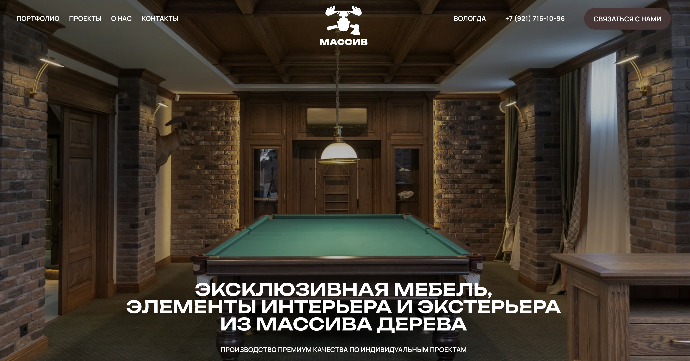

 
**Кнопка СТА (call to action)**  
Или по-другому «Призыв к действию», а еще ее называют кнопкой призыва к действию. Это элемент на странице, который предлагает посетителям выполнить определенное действие, такое как "Купить сейчас", "Подписаться", "Зарегистрироваться" и т. д.
 
**Важно, чтобы надпись на кнопке совпадала с целью лендинга. Кнопка также должна быть заметной, чтобы пользователь точно обратил на нее внимание, выделяя ее цветом / формой / размером / расположением**
 

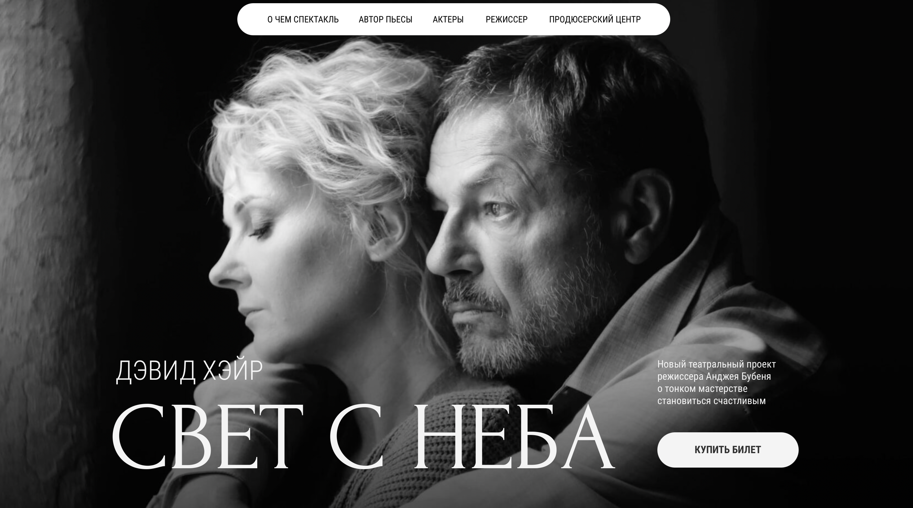

## Информация о проекте, услуге, продукте
После первого экрана обычно пользователю дают возможность ознакомиться с информацией более подробно.
 
**В этих блоках можно расположить:**
 
**Описание продукта.** Важно удобно сверстать этот блок, избегая слишком большую длину строки, большие абзацы.Можно чередовать с изображениями.
 

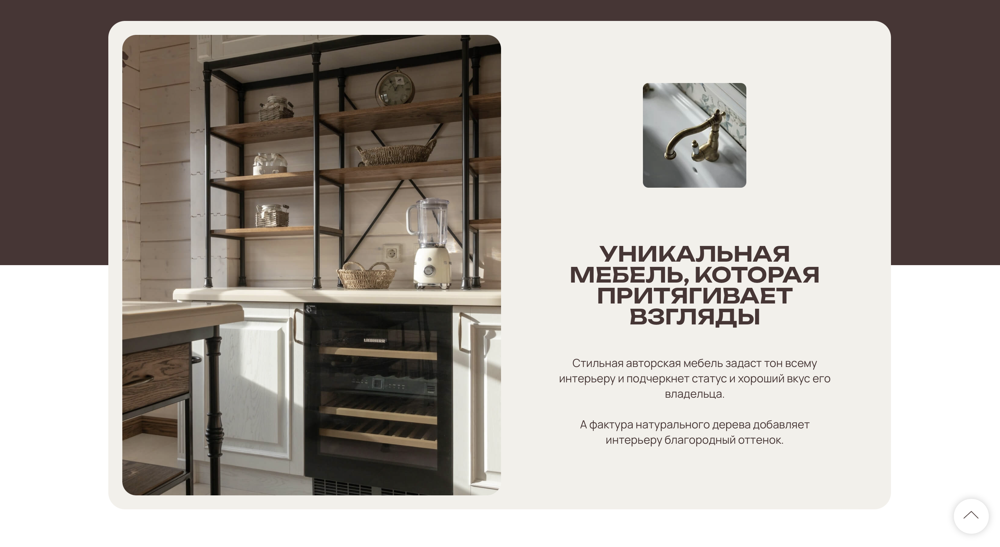

 
**Стоимость.** В этом блоке можно сверстать прайсы, а также рассказать, как его можно купить.
 

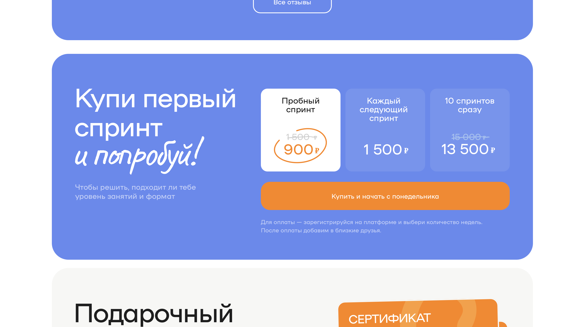

 
**Фотографии и видео.** В этом блоке важно следить за качеством изображений и их сочетанием между собой. Можно использовать плитку или слайдер. Кроме изображений, в лендингах используют видео. Можно поставить демонстрационный ролик, запись интерфейса программы или сервиса, видеонарезку с прошедшего мероприятия или любой ролик с YouTube, который относится к продукту.
 

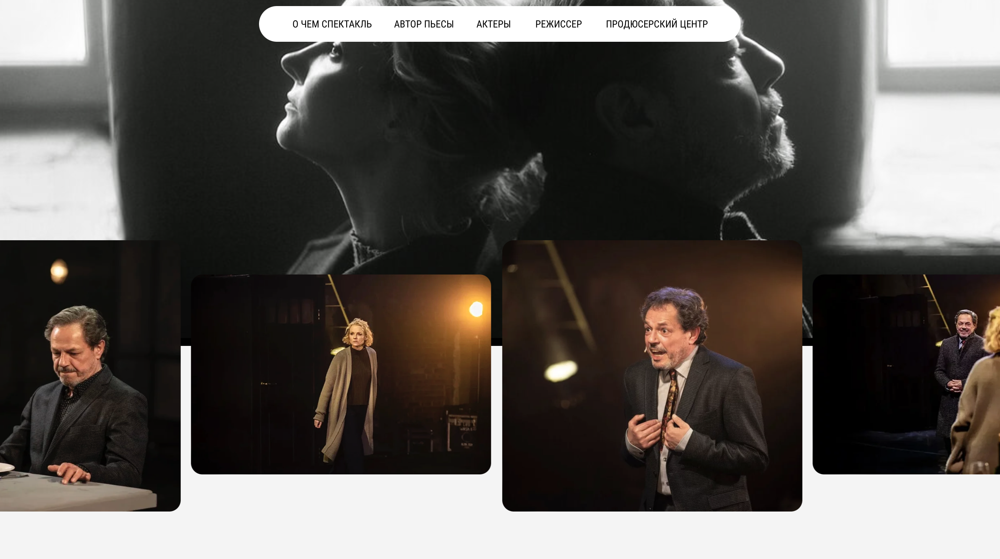

## Преимущества
Здесь все просто. В этом блоке обычно тезисно рассказывают о преимуществах товара или услуги.
 

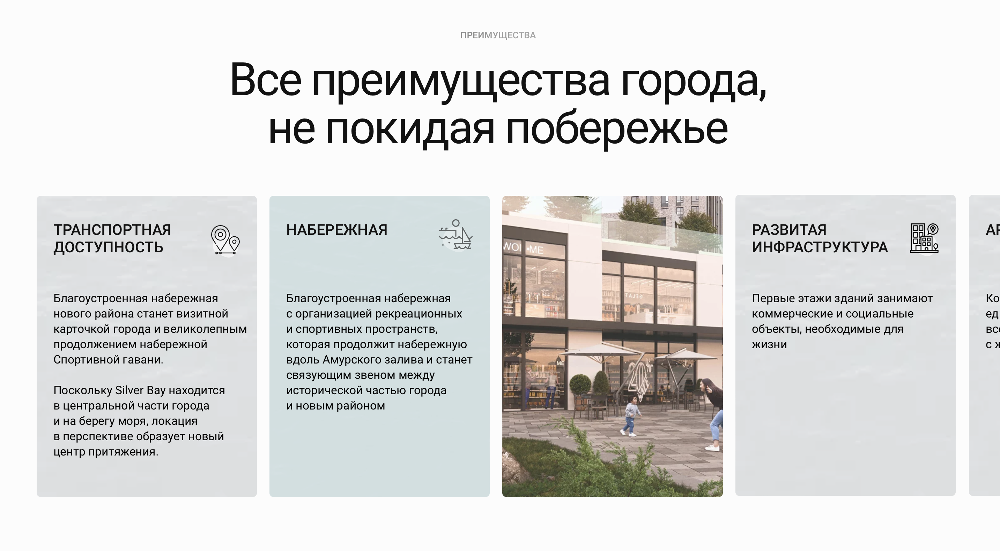

 
## Отзывы
В этом разделе обычно находятся отзывы, информация СМИ, награды, диплом и тд.
 

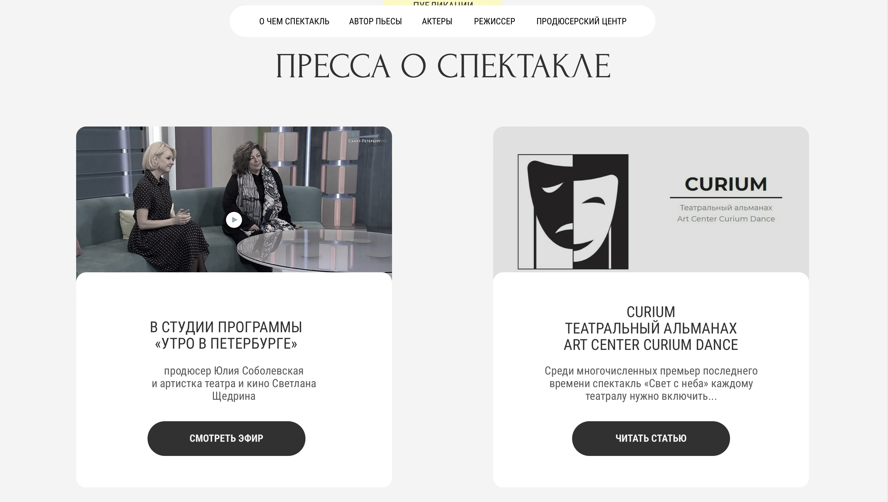

 
## Форма с целевым действием
> **Целевое действие** — это любая активность, к которой бизнес побуждает пользователя: подписаться на рассылку, зарегистрироваться на сайте, добавить товар в корзину, оформить заказ.
 

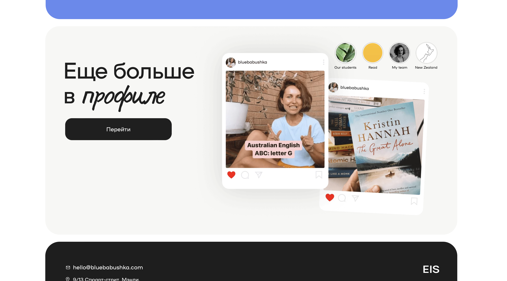

 
Чтобы создавать хорошие формы, важно не только разбираться в дизайне, но и применять принципы юзабилити (англ. слово usability происходит от глагола to use — «использовать» и означает доступность и удобство интерфейса для пользователя).

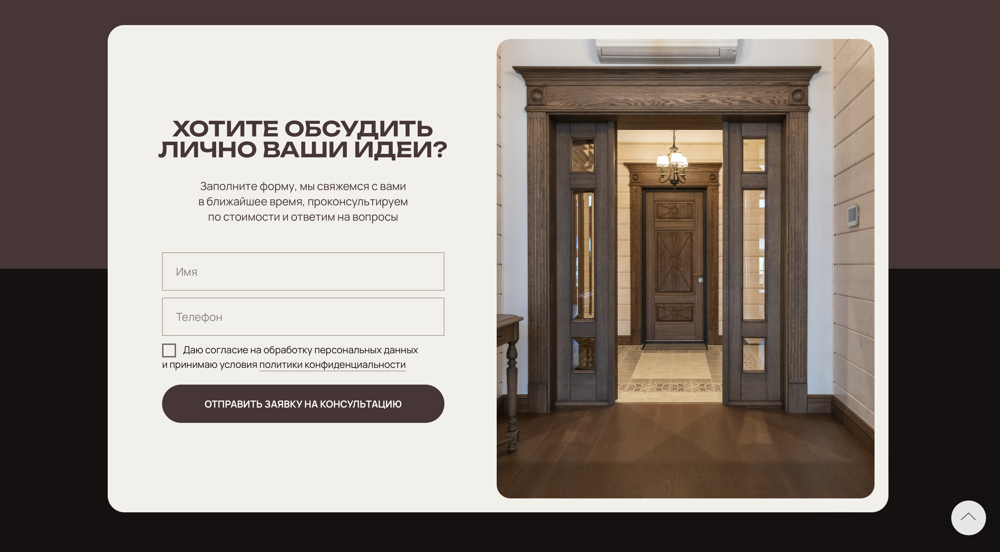

 
## Хедер и футер
 
> **Хедер (или заголовок)** — это верхняя часть веб-страницы или документа

**В хедере обычно размещают следующую информацию:**
 
**Логотип или название сайта:** Хедер часто содержит логотип или название сайта, которое помогает идентифицировать бренд или организацию, связанную с веб-страницей.
 
**Навигационное меню:** Хедер может содержать навигационное меню, которое предоставляет ссылки на различные разделы или страницы веб-сайта. Навигационное меню облегчает посетителям перемещение по сайту и нахождение нужной информации.
 
**Контактная информация:** В хедере можно разместить контактную информацию, такую как номер телефона, адрес электронной почты или ссылку на страницу контактов. Это позволяет посетителям быстро найти способы связи с владельцами или администраторами сайта.
 
**Кнопки CTA (призыва к действию):** Хедер может содержать кнопки CTA, которые призывают посетителей выполнить определенное действие, например, "Купить сейчас" или "Зарегистрироваться".
 
**Дополнительная информация:** В хедере можно разместить дополнительную информацию, такую как ссылки на социальные сети, языковые переключатели, поиск по сайту и другие элементы, которые могут быть полезны посетителям.
 

 
> **Футер** — это нижняя часть веб-страницы, которая обычно содержит дополнительную информацию и элементы навигации.
 
**В футере обычно размещают следующую информацию:**
 
**Навигационные ссылки:** Футер может содержать дополнительные ссылки на различные разделы или страницы веб-сайта. Это позволяет посетителям быстро перемещаться по сайту и находить нужную информацию.
 
**Контактная информация:** В футере можно разместить контактную информацию, такую как номер телефона, адрес электронной почты или ссылку на страницу контактов. Это позволяет посетителям быстро найти способы связи с владельцами или администраторами сайта.
 
**Ссылки на социальные сети:** Футер может содержать ссылки на профили веб-сайта в различных социальных сетях.
 
**Информация о правах и авторских правах:** Футер может содержать информацию о правах и авторских правах, связанных с содержимым веб-сайта. Это может включать годы, название компании или авторские знаки.
 
**Дополнительная информация:** В футере можно разместить дополнительную информацию, такую как ссылки на политику конфиденциальности, условия использования, часто задаваемые вопросы и другие разделы, которые могут быть полезны посетителям.
 
**Футер обычно содержит информацию, которая не является основной и не требует прямого взаимодействия со страницей. Он предоставляет дополнительные ресурсы и ссылки для посетителей, чтобы они могли получить дополнительную информацию или связаться с владельцами сайта.**

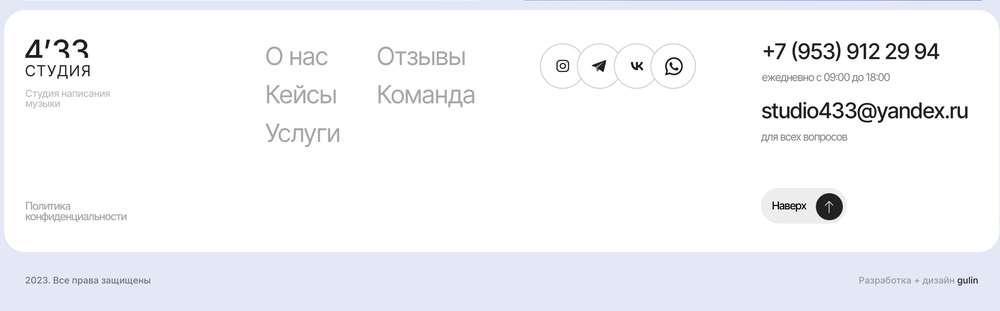

