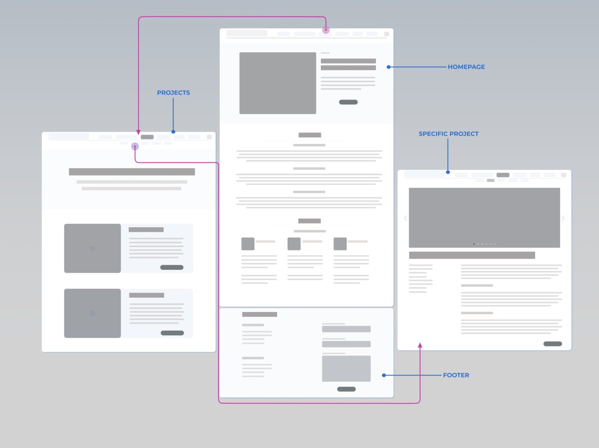
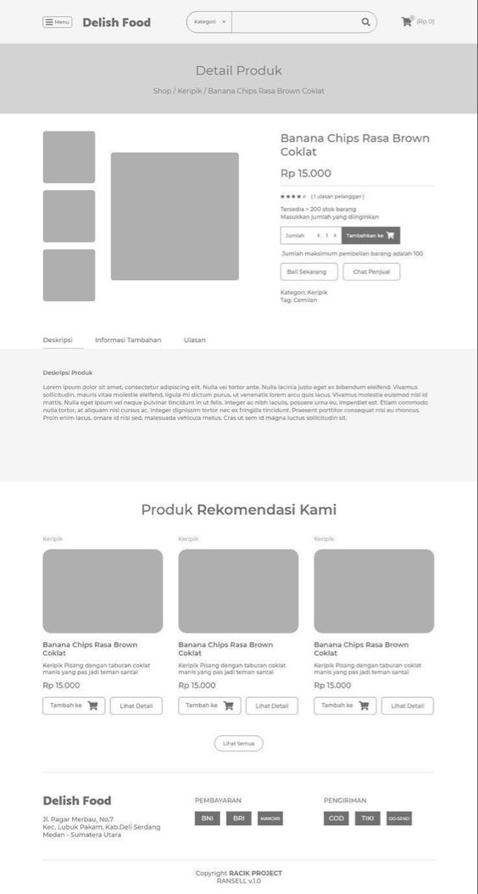
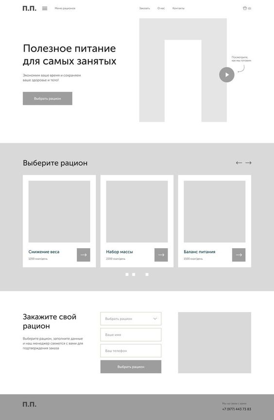
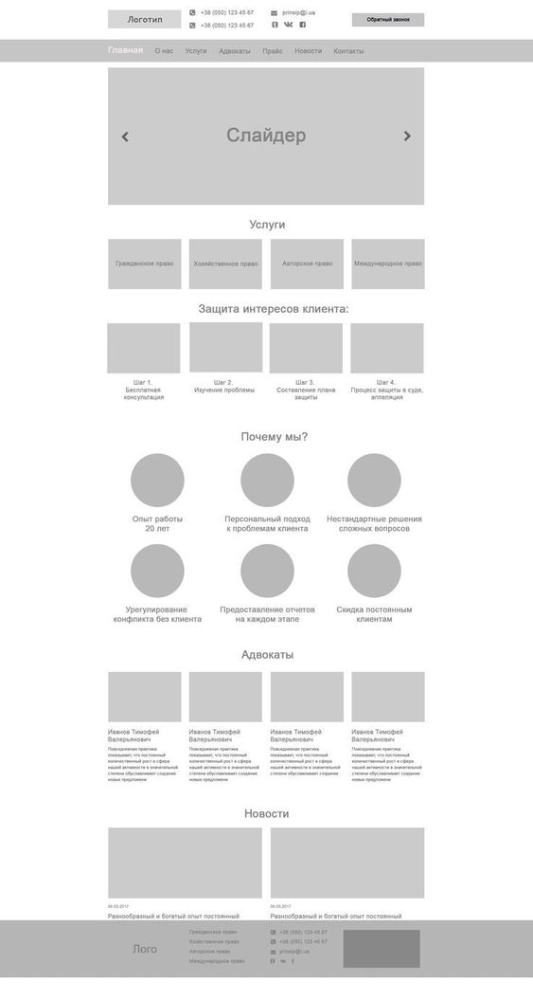
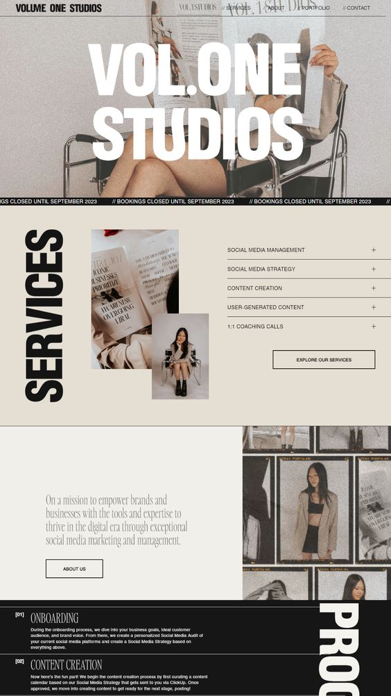

> **Вайрфрейм** — это схема высшего уровня, иллюстрирующая структуру сайта, приложения или проекта. На нем нет эскизов или большого количества деталей. На нем показана структура и ключевые элементы.

Вайрфрейминг — это простой способ визуализации дизайна приложения или веб-сайта, а также определения элементов нового проекта. Простая схема позволит легко представить, как различные элементы будут взаимодействовать друг с другом и выявить потенциальные UX-проблемы.

**Вайрфрейм должен четко показывать:**  
- Основою группу контента (заголовки, текстовые блоки, кнопки, иконки, плейсхолдеры для фото и тд.)
- Структуру информации (каким образом они будут располагаться на экране)
- Базовую визуализацию взаимодействия между интерфейсом и пользователем
 
**Что не включаем в вайрфрейм:**
- Детали и цвета
- Фотографии (вместо них используем плейсхолдеры – это серые прямоугольники)
- Готовые тексты
 
Визуализация вайрфрейма должна быть эстетичной, но сильно упрощена, без деталей и цветов. Используй Черный, белый и серые полутона – это типичные цвета, которые тебе понадобятся. Можешь выбрать какой-то один единый цвет для выделения кнопок, например.
 
**Готовые библиотеки с вайрфремами:** [Ссылка на Figma](https://www.figma.com/community/category/wireframes)
 
Создание вайрфреймов позволяет согласовать структуру сайта на ранней стадии и исправить ошибки.

## Как создать вайрфрейм?

**Определи цели и функциональность сайта.** Это поможет лучше понять, какие элементы и разделы должны быть включены в вайрфрейм.
 
**Создай структуру сайта.** Определи основные разделы и подразделы, которые будут присутствовать на сайте. Это поможет организовать информацию:
- Хедер
- Первый экран с уникальным торговым предложением (УТП).
- Информация о проекте, услуге, продукте
- Преимущества
- Отзывы
- Форма с целевым действием
- Футер

**Размести основные элементы интерфейса.** Логотип, навигационное меню, заголовки, текстовые блоки и плейсхолдеры. Расположи их на странице таким образом, чтобы было понятно, как они будут взаимодействовать друг с другом.

**Не забывай про пользовательский опыт (UX).** Размести элементы таким образом, чтобы пользователи могли легко найти нужную информацию и выполнить желаемые действия. Обрати внимание на навигацию, расположение кнопок и удобство использования сайта.

**Добавь детали.** После создания основной структуры и размещения элементов интерфейса, добавь дополнительные детали, такие как формы, кнопки CTA (призыва к действию), футер и другие элементы, которые могут быть важны для лендинга. Помни о том, что кнопку СТА мы используем минимум два раза: на главном экране и в конце. Если блоков много можно использовать и чаще.

**Используй сетку.** Для создания вайрфрейма также важно использовать сетку и выравнивать все блоки по ней.

Существует множество инструментов, которые помогут создать вайрфрейм, мы рекомендуем использовать Figma и там же собирать макет. Важно помнить, что вайрфрейм — это набросок, который помогает визуализировать структуру и компоненты сайта, но не отображает окончательный дизайн. Он служит основой для разработки и дальнейшего дизайна лендинга.
        

## Переходим к дизайну

В будущем, когда твой вайрфрейм будет согласован командой, заказчиком можно приступать к дизайну. Добавляем цвета, дизайн – элементы, фото и тд. Совершенно допустимо вносить корректировки в композиционные решения на финальном макете, главное сохранять логику.
 
**А также, не забывай использовать верные размеры для фреймов:**  
 
**Desktop** — мониторы ноутбуков и компьютеров: 1201–1600 px в ширину. Стандарт — 1440 px.  
**Phone** — мобильные телефоны: 320–959 px в ширину. Самый распространённый размер — 320 или 375 px.  
**Tablet** — планшеты: 960–1200 px в ширину. Стандарт — 960 px.
 

