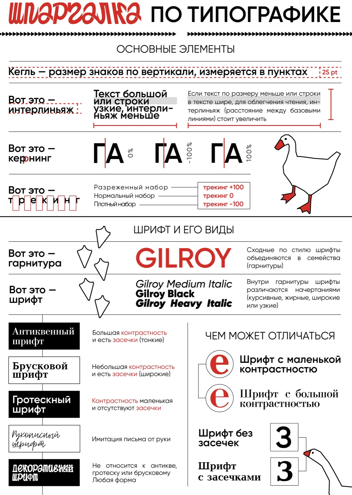

> **Типографика** — это искусство и наука о создании и расположении типографских элементов, таких как буквы, цифры, знаки препинания и другие символы, на странице или в других медиа. Она охватывает различные аспекты дизайна текста, включая выбор и комбинирование шрифтов, размеры, межстрочные интервалы, выравнивание и интервалы между символами.
 
**О типографике:** [Ссылка на Habr](https://habr.com/ru/sandbox/144742/)
 
**Основные термины, которые мы будем использовать в этом блоке:**
 
> **Гарнитура** - Семейство всех начертаний. Начертания могут отличаться по насыщенности, наклону и т.д. Различное начертание шрифтов образует семейство шрифтов — гарнитуру.  
> **Начертание** - вариант шрифта внутри одного семейства. Начертания могут варьироваться от обычного (Regular) до полужирного (Bold), курсивного (Italic), полужирного курсивного (Bold Italic) и других.  
> **Графема и глиф.** Графема — это буква, глиф — стиль её написания.
Кегль — это размерность символа по высоте. Обычно задается в пикселях(px).  
> **Интерлиньяж** — расстояние между двумя строками, дословно переводится «написанное между строк». Задается интерлиньяж всегда относительно величины кегля — в 1,3 — 1,4 раза больше данного значения.  
> **Выключка** — выравнивание текста. По правому краю, по левому краю, по центру, по ширине.  
> **Верстка** — это процесс создания и организации содержимого на веб-странице или в печатном материале. Она включает в себя размещение текста, изображений, графики и других элементов дизайна на странице с определенной структурой и композицией. Верстка должна иметь четкую структуру, которая позволяет организовать и представить информацию логически и последовательно. Это может включать использование заголовков, подзаголовков, списков и других элементов для разделения контента на смысловые блоки. 

**Сколько шрифтов можно использовать?**  
Для того, чтобы выбрать шрифт и гарнитуру, необходимо определиться со стилистикой своего проекта. Тут решающую роль играет контекст. Учитывай настроение, которое передаёт шрифт. Шрифт может быть разным: наборным, декоративным, рукописным, с засечками и без. А иногда и вовсе вариативным.

Чёткого правила, сколько шрифтов использовать в проекте, не существует. Но чем их больше, тем труднее с ними работать, поэтому чаще всего используется лишь несколько. В проекте может быть один-единственный шрифт, но при этом несколько шрифтовых начертаний. Как правило, они используются, чтобы выделить разные типы текстов.

Для небольших форм дизайна (визитки, плаката, меню, лендинга, короткой статьи) этого в принципе хватит. Однако если ты делаешь более сложный макет, то, скорее всего, тебе понадобятся как минимум два шрифта — из одной гарнитуры или из разных. Их называют шрифтовой парой. Чаще всего она нужна для того, чтобы отделить заголовок от текста и выстроить на странице визуальную иерархию.

**Удачную шрифтовую пару можно подобрать следующий образом:**  
1. Использовать разные начертания одной гарнитуры
2. Использовать шрифты из надсемейств, в которых есть и антиква, и гротеск
3. Контрастная пара. Например, антиква плюс гротеск. Примеров шрифтовых пар, построенных по принципу контраста, бесконечное множество, и сформулировать универсальные правила их выбора невозможно.

> **Антиква** имеет классический или старинный стиль. Эти шрифты часто используются для создания заголовков или декоративных элементов в дизайне.  
> **Гротеск** вид шрифта без засечек, поэтому в названии используется слово sans(«без»).  
> Популярные представители гротеска: Arial, Helvetica, Verdana.

**Существуют также художественные шрифты: художественный и акцидентный,** которые применяются исключительно для визуального восприятия. Они не годятся для набора основного текста и предназначены для заголовков и других небольших отрывков текста с целью привлечения и акцентирования внимания. К акцидентным можно отнести и готические гарнитуры, по рисунку имитирующие средневековые рукописные почерки.
 
**Лицензия шрифта**  
Шрифт не бывает бесплатным сам по себе, за его разработку всегда кто-то платит. Выбрать шрифт можно в нескольких источниках:
 
1. Коллекция [Google Fonts](https://fonts.google.com) За создание шрифтов заплатила корпорация. Компания разрешает использовать шрифты и в личных, и в коммерческих целях. Гарнитуры из коллекции Google Fonts распространяются по свободным лицензиям SIL Open Font License — её разработали специально для шрифтов — и Apache License, которая относится не только к шрифтам, но и другим компьютерным программам. Здесь более 800 шрифтов, их можно применять совершенно свободно.
2. [Fontstand](https://fontstand.com/fonts?search=cstm) Если тебе этого покажется мало, попробуй Fontstand. На этом сервисе ты можешь арендовать шрифт на месяц или на два. Стоить это будет во много раз дешевле, чем купить его навсегда. Но если потом решишь использовать какой-то из этих шрифтов в реальном проекте, не забудь купить постоянную лицензию.
3. Шрифт бесплатно распространяет студия или автор. Например, в коллекции [Paratype 12 шрифтов](https://www.paratype.ru/catalog?freefonts=true&sortType=bestsellers), которые можно использовать бесплатно практически без ограничений. Компания запрещает только перепродавать их и сохранять модифицированный шрифтовой файл под оригинальным именем.
4. [Font storage](https://fontstorage.com/ru/) Здесь хранится уже 650 шрифтов. Что важно — много хороших на кириллице.
5. [Type.today](https://type.today/ru) Проект, который делает свои шрифты и адаптирует западные под кириллицу.
6. [Tomorrow.type.today](https://tomorrow.type.today/ru) Акцидентные и экспериментальные шрифты от Type.today. Некоторые из них можно скачать в триальной версии.
7. [Future Fonts](https://www.futurefonts.xyz) Ещё один ресурс с акцидентными и экспериментальными шрифтами. Некоторые тоже можно скачать и попробовать.
8. [PangramPangram](https://pangrampangram.com) Шрифтовая студия, предоставляющая доступ ко всем своим шрифтам бесплатно для персонального (некоммерческого) использования. Не все шрифты поддерживают кириллицу. Проверяй этот момент в описании.
9. [Typotheque](https://www.typotheque.com/fonts) Здесь можно потренироваться в сочетании шрифтов, созданных в одноимённой студии.

> **Как проверить лицензию на шрифт?**  
>Единой базы данных о всех шрифтах нет. Самый простой способ выяснить, платный перед вами шрифт или нет, погуглить: забить в строку поиска его название и слово «лицензия» или «license».
 
Полезные расширения для браузера, которые помогут узнать название использованных в дизайне сайтов шрифтов:
 
1. [WhatFont](https://chrome.google.com/webstore/detail/whatfont/jabopobgcpjmedljpbcaablpmlmfcogm?hl=ru)
2. [Fonts Ninja](https://www.fonts.ninja)
 
**Как устанавливать шрифты**  
Про форматы шрифтов [Ссылка на Habr](https://habr.com/ru/articles/159907/)  
**Для начала скачай на компьютер все файлы шрифтов, которые тебе понравились.**  
Не забывай о том, что каждое начертание идёт отдельным файлом. Если хочешь установить всю гарнитуру, нужно скачать столько файлов, сколько есть начертаний.
Если у тебя всего пара файлов, то установить их можно, просто открыв и нажав на соответствующую кнопку.
 
## Интерлиньяж  
> **Интерлиньяж** — это расстояние между базовыми линиями двух соседних строк.
Оптимальное значение интерлиньяжа лежит в диапазоне 120–145% от кегля, или размера шрифта. Обычно он измеряется в типографских пунктах (pt, пт) или пикселях (px, пкс).  
Например, если шрифт 20 px, интерлиньяж лучше сделать 24–29 px. Однако это не железное правило, а совет. Ведь оптимальный интерлиньяж зависит от особенностей конкретного шрифта.  
Есть ещё один простой принцип: интерлиньяж всегда должен быть больше, чем расстояние между словами. Иначе получится, что слова в соседних строках стоят друг к другу ближе, чем слова внутри одной строки. А это затруднит чтение.

В графических редакторах интерлиньяж по умолчанию установлен на 120% от кегля. Для средних и небольших кеглей это нормально. Однако, если буквы очень маленькие или, напротив, очень большие, потребуется индивидуальная отладка.
- Если текст очень крупный, при стандартном интерлиньяже между строками останется слишком много пустот. Значит, интерлиньяж нужно сделать поменьше.
- Если текст очень мелкий, при стандартном интерлиньяже его будет трудно читать - расстояние между строками стоит увеличить.
- Если ты используешь очень насыщенное начертание, интерлиньяж тоже лучше сделать чуть больше.
- Расстояние между блоками текста должно быть больше, чем интерлиньяж.
 
## Длина строки  
Чем длиннее строка, тем больше должен быть интерлиньяж. А вот колонка из слишком коротких строчек со стандартным интерлиньяжем будет смотреться некрасиво. Его лучше уменьшить. Но как определить оптимальную длину строки?

Чем длиннее строка, тем сложнее удержать её в фокусе. Человек прочитывает её до конца, взгляд уходит слишком далеко, и начало следующей строки теряется. Однако и слишком короткая строка тоже неудобна. Вроде весь текст перед глазами, но приходится часто перепрыгивать со строчки на строчку. А это утомляет. Строки должны быть не слишком длинные и не слишком короткие. При наборе объёмного текста оптимальное значение составляет 40–60 символов (это примерные величины — никто каждый знак не считает).

Длинные строки (до 70 символов) можно использовать только для небольших текстов. Если во фрагменте 3–4 строчки, человек их прочитает, не путаясь, но при большем объёме это уже неудобно. Заголовки можно делать значительно короче. Там нормальна длина в 20–40 символов.

## Выравнивание  
Текст не должен шататься из стороны в сторону. Для удобства чтения его следует приучить к порядку и выровнять — сделать выключку.
Про выключку: [Ссылка на Dzen](https://dzen.ru/a/X2H9Se1vJ0-_Zgdc?utm_referer=www.google.com).  
Про иерархию в тексте: [Ссылка на VC](https://vc.ru/design/385060-tipografika-v-veb-dizayne-v-cifrah#:~:text=Иерархия%20–%20это%20то%2C%20как%20вы,блока%20в%20котором%20находится%20текст).  
Иерархия типографики или как подобрать размер: [Ссылка на Dzen](https://dzen.ru/a/ZIXjm2UmFHqbxbTm)

**Попрактиковаться в настройке параметров текста ты сможешь с помощью тренажёра [Better Web Type](https://betterwebtype.com/triangle/)**
 
**Коротко о том, как создать хорошую верстку:**
1. Определи формат для текста (книжный, вертикальный, плашка с надписью и тд)
2. Так ты сможешь выбрать соответствующую длину строки.
3. В зависимости от неё ты настроишь интерлиньяж.
4. Длина строки и интерлиньяж подскажут, какие расстояния нужно сделать между разными элементами, например между текстом и заголовком.
5. Исходя из этого, ты настроишь отступы от текста до края формата.