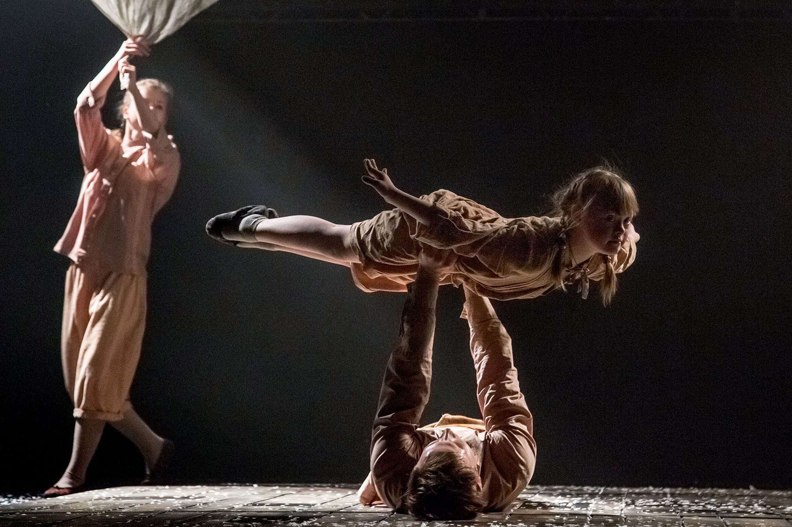
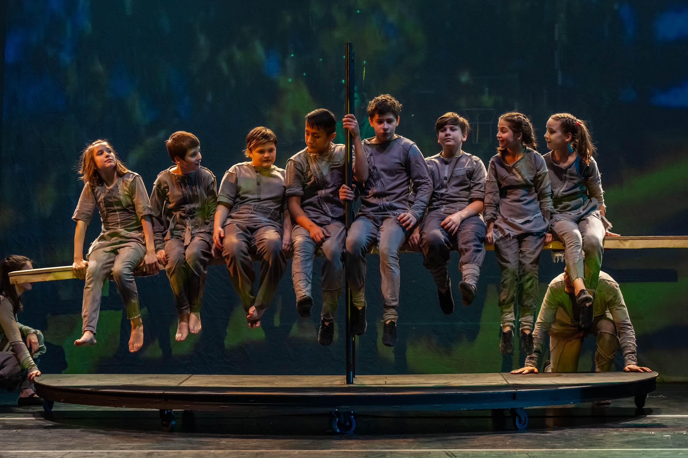
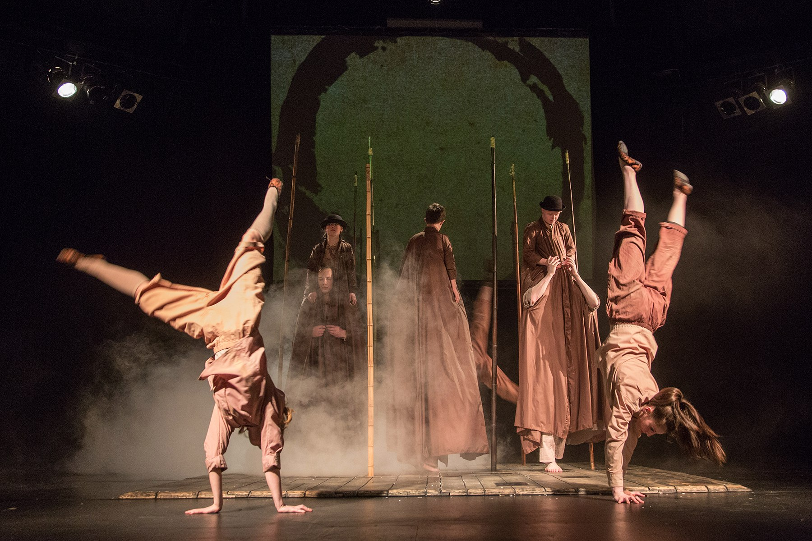
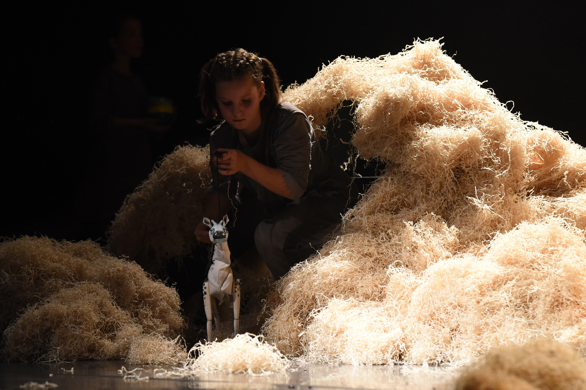
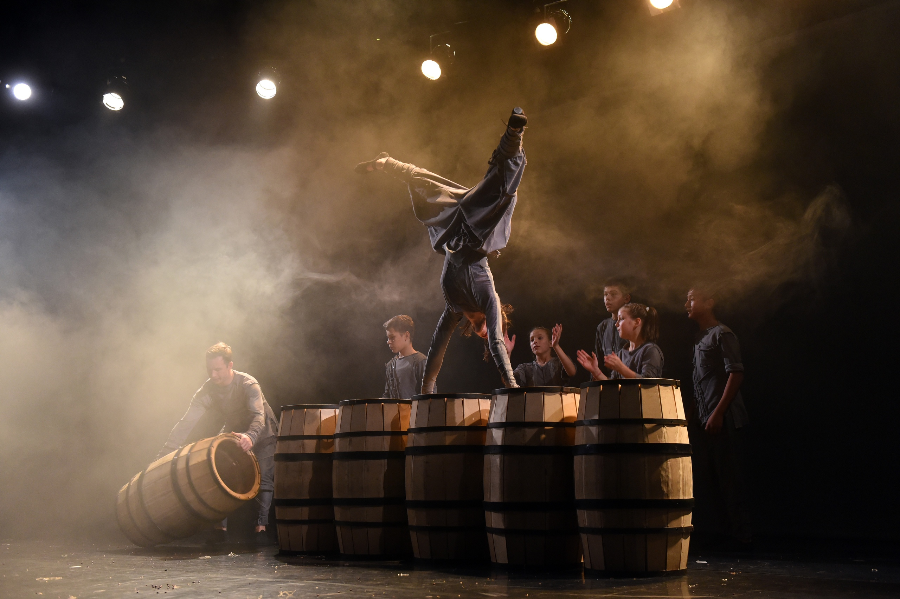
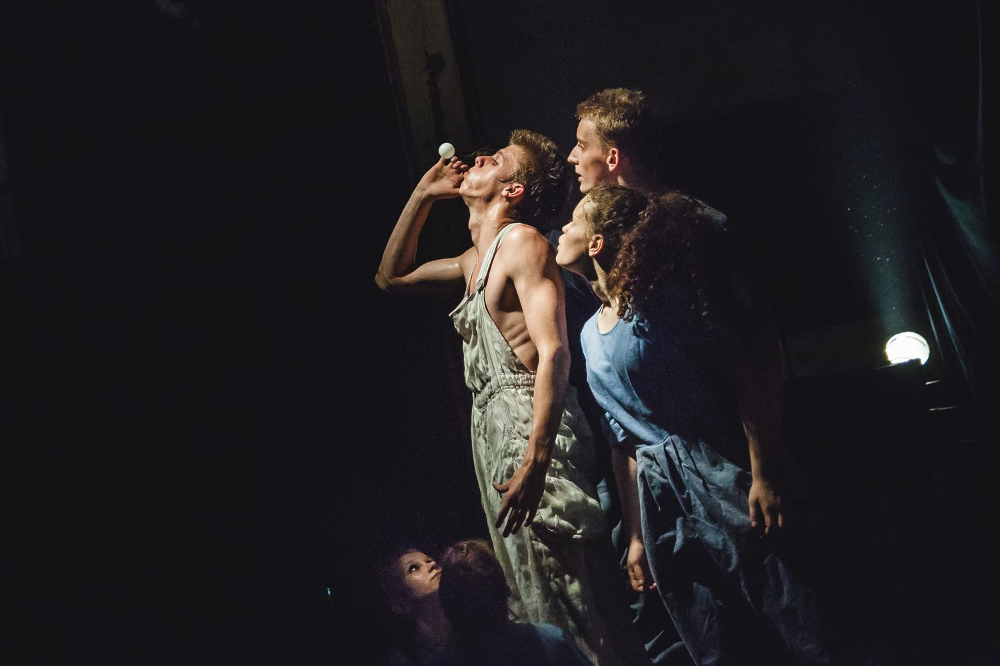

**Твоя задача:** создать десктопную версию лендинга для Упсала-цирка, используя тексты и изображения, предоставленные заказчиком.
 
Упсала-Цирк — это современный цирк для детей и взрослых, где соединяются акробатика, жонглирование, контемпорари, элементы уличной культуры, паркура и брейкданса. Каждый курс решает свою творческую задачу: новички ставят цирковой карнавал, средняя группа увлечена постановкой спектакля, выпускники готовят сольные номера. Здесь занимаются дети из неблагополучных и приемных семей, а также ребята с особенностями развития бесплатно. Трудным подросткам мало кто помогает: их отправляют за забор спецшколы или спецучилища «перевоспитывать», а на деле — ломают. Упсала-Цирк меняет контекст с «вы преступники, и с вами все ясно» на «вы талантливы и можете прыгнуть выше головы».
 
«Через цирк мы говорим о важном, отвечаем на социальные вызовы и создаём общество, в котором хотим жить. Шутки в сторону! Цирк — это серьёзно. Как говорят в цирке, это заруба. И наша заруба — создавать возможности для раскрытия творческого потенциала, чтобы люди становились свободнее и счастливее. Через эксперименты мы узнаём и расширяем границы. Мы меняем себя, общество и пространство вокруг.»
 
**Зачем цирку лендинг?** Сейчас ребята открыли новый хулиганский набор на цирковой курс в Санкт-Петербурге для детей из групп социального риска. Набор ведется для ребят возраста от 9 до 11 лет (включительно). Здесь учатся делать сальто, прыгать фляки, крутить диаболо и жонглировать — в общем, погружаться с ногами и руками в Новый цирк. Но самое главное — учат говорить с миром через язык искусства так, чтобы услышали, направив хулиганскую энергию в цирковое русло. В лендинге необходимо осветить то, чем занимается цирк, его ценности, а также уделить внимание целевой аудитории. Целевым действием лендинга является сбор заявок для отбора на курс.
 
**Целевая аудитория** – это непосредственно сами участники труппы - дети из неблагополучных и приемных семей, а также ребята с особенностями развития (9-11 лет), а также все неравнодушные продвинутые, современные старшие, кому не все равно на судьбы других людей и сможет порекомендовать эту организацию.

 
 
Информация для лендинга: [ссылка на Figma](https://www.figma.com/file/1axRbm0TZjUiAlRZKZkyL5/%D0%97%D0%B0%D0%B4%D0%B0%D0%BD%D0%B8%D1%8F-%D0%93%D1%80%D0%B0%D1%84%D0%B8%D0%BA%D1%81%D0%B8?type=design&node-id=53%3A2&mode=design&t=f6uvDadEWw6xWCko-1)

_Обязательно сделай копию файла с гайдлайном, который мы предоставили и работай уже с ней._