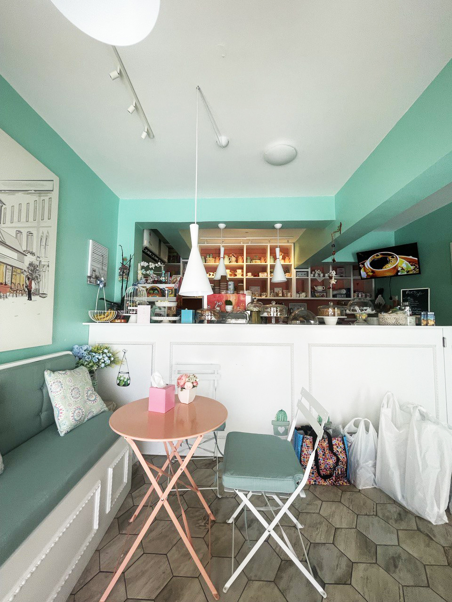
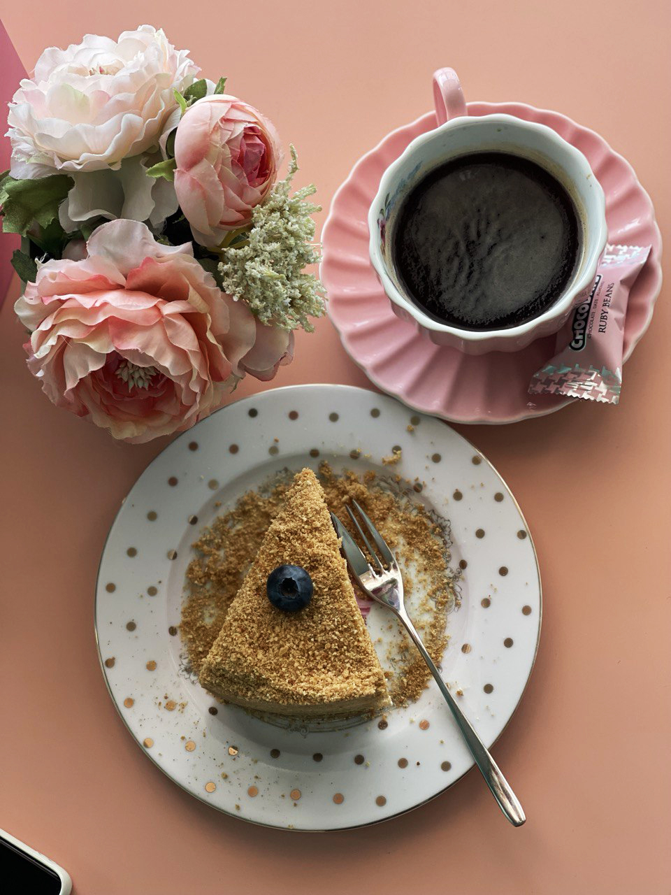
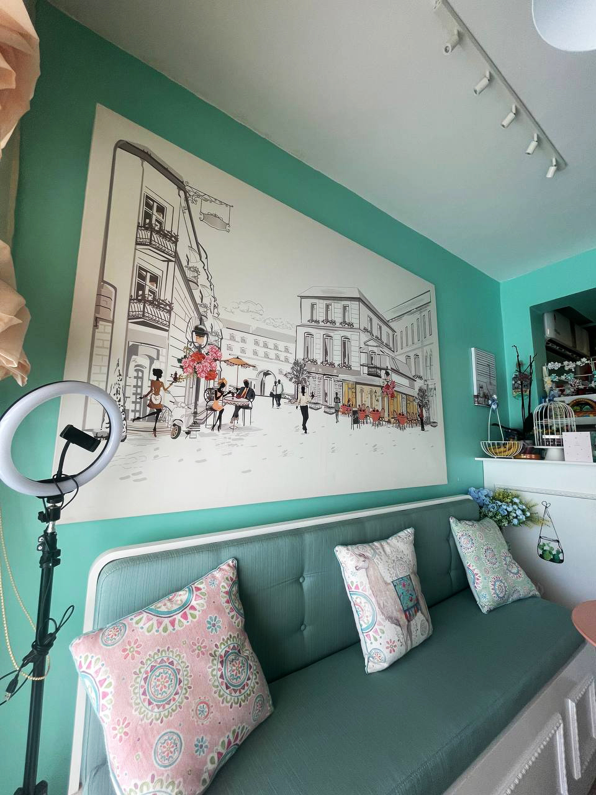

Наверняка ты уже в курсе, что логотип является визуальным символом и одним из ключевых элементов брендинга. Логотип помогает идентифицировать бренд и отличить его от других компаний или продуктов. Он служит своеобразной визитной карточкой бренда и позволяет потребителям легко узнать и запомнить его. Логотип может передавать информацию о ценностях и идентичности бренда. Через цвета, формы и символы, он может выражать основные принципы, характеристики и цели компании. Качественный и профессионально выполненный логотип способствует созданию доверия к бренду. Логотип является основой для остальных элементов визуального образа бренда, таких как упаковка, рекламные материалы, веб-сайт и т. д. Он обеспечивает консистентность и единообразие визуального стиля.

**Перед тобой стоит задача создать шрифтовой логотип для кафе «Аист», используя материалы, предложенные ниже. Рекомендуем не пропускать первый этап с аналитической частью и внимательно пройтись по всему материалу. Даже если кажется, что ты все знаешь. Так ты сможешь более полноценно донести свои идеи и убедительно продемонстрировать свой проект. Мы советуем потратить на это задание 7-10 дней с учетом интенсивной работы над ним. По окончанию ты можешь сдать проект на проверку свободным экспертам в любое время или же свериться самостоятельно по чек-листу.**

Удачи!
