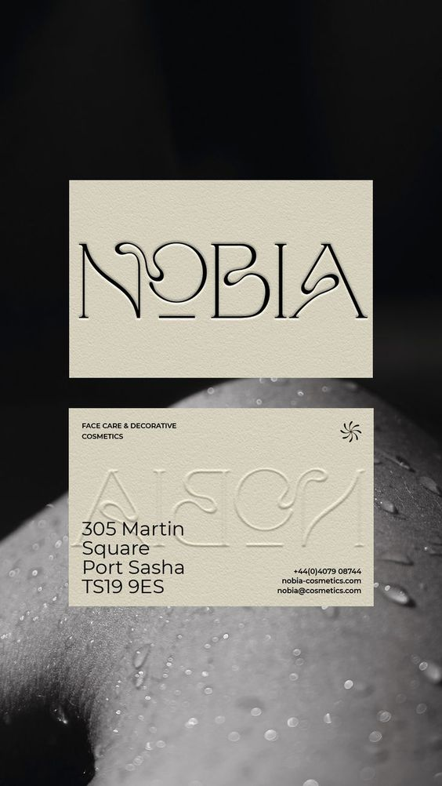
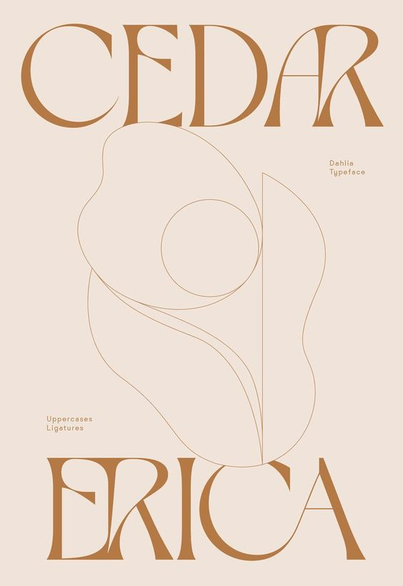
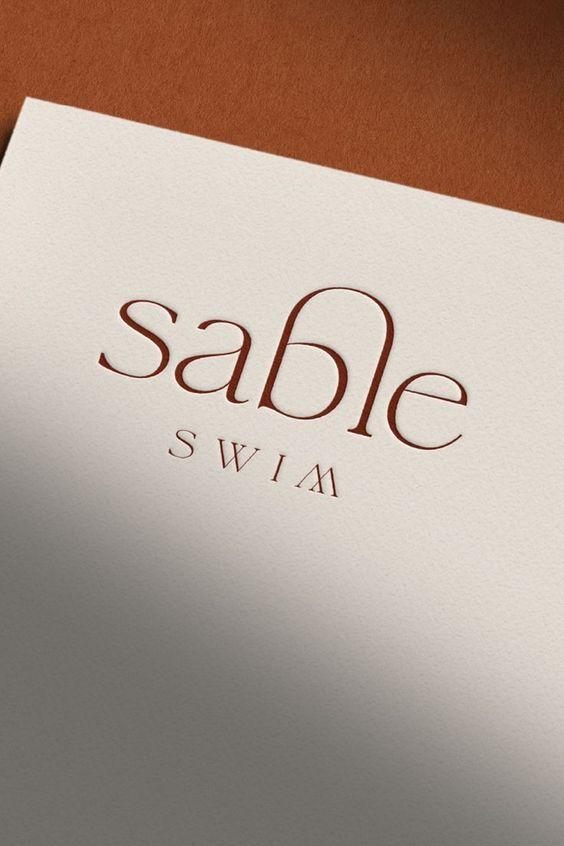
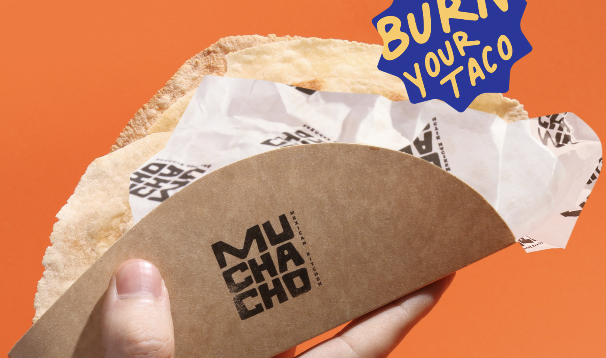

Когда шрифт выбран, ты можешь скорректировать его параметры, чтобы придать логотипу нужное настроение и сделать его более оригинальным. Ниже представлены приемы, которыми обычно пользуются дизайнеры при создании логотипа. Попробуй использовать некоторые из них, которые подойдут твоей идее.

1. **Начертание, кегль, кернинг и трекинг.**

> **Начертание** - вариант шрифта внутри одного семейства. Начертания могут варьироваться от обычного (Regular) до полужирного (Bold), курсивного (Italic), полужирного курсивного (Bold Italic) и других.
> **Кегль** — это размерность символа по высоте. Обычно задается в пикселях(px).
> **Кернинг** — расстояние между двумя отдельными буквами в зависимости от их формы. Если имеются две буквы с выступающими элементами, то образуется большое расстояние между ними. В таком случае можно регулировать это расстояние, чтобы написание было равномерным.
> **Трекинг** — расстояние между всеми буквами в слове.

Например, ты можешь расположить буквы очень близко друг к другу, чтобы логотип смотрелся более монолитно, или, наоборот, увеличить трекинг, чтобы предать воздушности и невесомости.

2. **Компоновка**
Компоновка включает выбор и расположение графических элементов, шрифтов, цветов и других дизайнерских элементов, чтобы создать единое и запоминающееся визуальное представление.
Логотип может быть выстроен в фигуру или объект, если это уместно и отвечает посылу компании.

3. **Детали**
Кроме того, в стандартный шрифт можно добавить необычную деталь. Например, объединить буквы в лигатуру. Такая деталь привлекает внимание, возможно при таких соединениях появится символ, который будет ассоциироваться с компанией.

> **Лигатура** — это типографский термин, который описывает соединение двух или более символов в один графический элемент. Обычно лигатуры применяются для соединения комбинаций букв в словах, чтобы улучшить внешний вид и читаемость текста. Лигатуры могут быть применены к различным парным символам, таким как буквы f и i, f и l, а также другие комбинации.

Важно внести свои корректировки в готовый шрифт для того, чтобы логотип стал уникальным и действительно подходящим. На этом этапе важно перевести шрифт в кривые в той программе, в которой ты работаешь и видоизменить его: возможно где-то добавятся скосы, сократится или увеличится трекинг, решение за тобой, главное, чтобы создаваемый образ подходил по духу компании.

4. **Специально созданный шрифт**
Если готовые шрифты не подходят или кажутся слишком скучными, можно сконструировать свой шрифт. Создание собственного шрифта — это интересный творческий процесс, который позволяет выразить свою уникальность и стиль. Тебе не обязательно создавать весь алфавит, так как это работа целой команды и не одного месяца. Попробуй собрать шрифт из тех букв, которые есть в названии кафе.

> **Как создать свой шрифт?**
> 1. Начни с определения концепции и стиля шрифта. Реши, хочешь ли ты создать рукописный шрифт, геометрический шрифт или что-то совершенно уникальное. Определи основные черты, которые вы хотите включить в свой шрифт.
> 2. Ты можешь начать с рукописных набросков или использовать векторные инструменты в программе, где можно работать с вектором.
> 3. Отредактируй и доработай каждый символ, чтобы он выглядел согласованно и хорошо читаемо. Удели особое внимание пропорциям, контурам и интервалам между символами.
> 4. Рассмотри создание различных вариаций шрифта, таких как полужирные, курсивные или заглавные буквы. Это добавит гибкость и разнообразие.
> 5. Проверь шрифт на разных размерах и в разных контекстах. Убедись, что он хорошо читаем. Внеси необходимые корректировки, если это необходимо.

5. **Визуальная метафора**  
При разработке логотипов также можно использовать визуальные метафоры.  Сама по себе метафора — это скрытое сравнение, перенос свойств одного объекта на другой. В данном случае ты анализируешь возможные ассоциации, связанные с компанией или её сферой деятельности, и превращаешь их в визуальный образ. Метафора может быть использована для создания эмоциональной связи с аудиторией, установления узнаваемости и передачи ключевых характеристик бренда.

**Примеры метафор в логотипах, которые мы все знаем:**
Apple. Логотип Apple, изображающий откусанное яблоко, является метафорой для знака знания, привлекательности и инноваций.  
Nike. Логотип Nike, изображающий стилизованное крыло, является метафорой для победы, энергии и движения.  
Twitter. Логотип Twitter, изображающий силуэт птицы, является метафорой для связи, сообщений и быстроты.  
Amazon. Логотип Amazon, изображающий улыбающуюся стрелку, является метафорой для широкого ассортимента товаров и удовлетворения потребностей клиентов от А до Я.

**Ассоциации тебе уже удалось найти на первом этапе при аналитической работе, осталось продумать метафоры, если ты планируешь их использовать в логотипе.**

6. **Форма и контрформа**
Ещё один способ создать оригинальный логотип — поработать с формой и контрформой. 
В дизайне, форма и контрформа являются важными понятиями, относящимися к визуальной композиции и взаимодействию элементов дизайна. Они помогают создать баланс, гармонию и привлекательность в дизайнерских работах.

> **Форма** — это визуальное представление объекта или элемента в дизайне. Она может быть геометрической (круглая, квадратная, треугольная) или органической (естественной формы). Формы могут быть большими или маленькими, простыми или сложными, а их взаимное расположение и сочетание могут создавать определенное впечатление и эффект.  
> **Контрформа** — это пространство, ограниченное или окружающее форму. Это отрицательное пространство вокруг или внутри формы. Контрформа может быть рассматриваема как "пустота" или "отрицательное пространство", которое активно взаимодействует с формой и помогает ей выделяться и быть более заметной.

Важно понимать, что форма и контрформа тесно связаны друг с другом и взаимодействуют для создания баланса и гармонии в дизайне. 

> **Задание:** Выбери приемы, с которыми хочешь поработать или предложи свои варианты. На этом этапе важно перевести выбранный шрифт в кривые и модернизировать его под твою идею.
