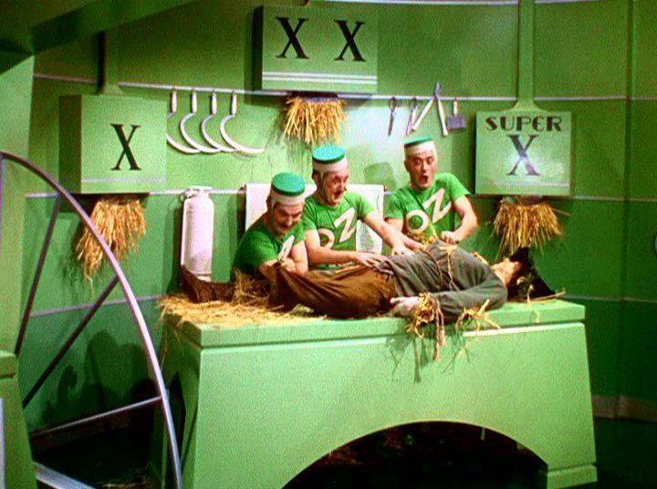
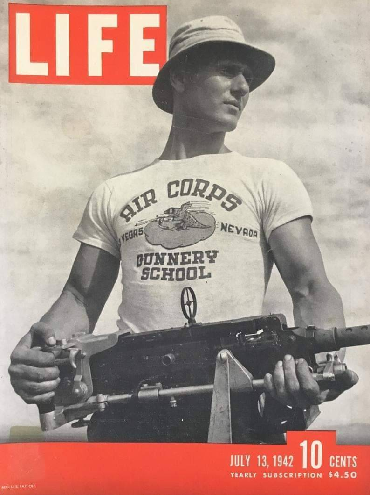
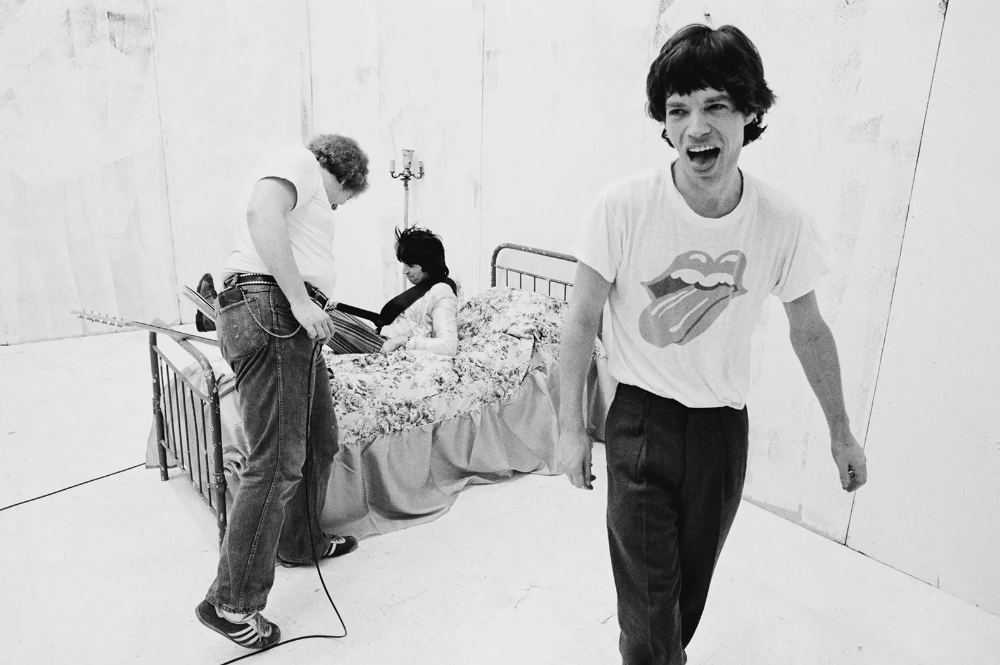
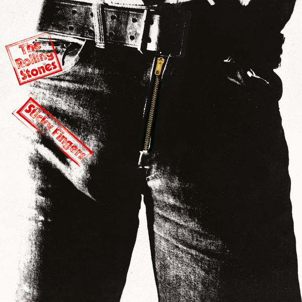
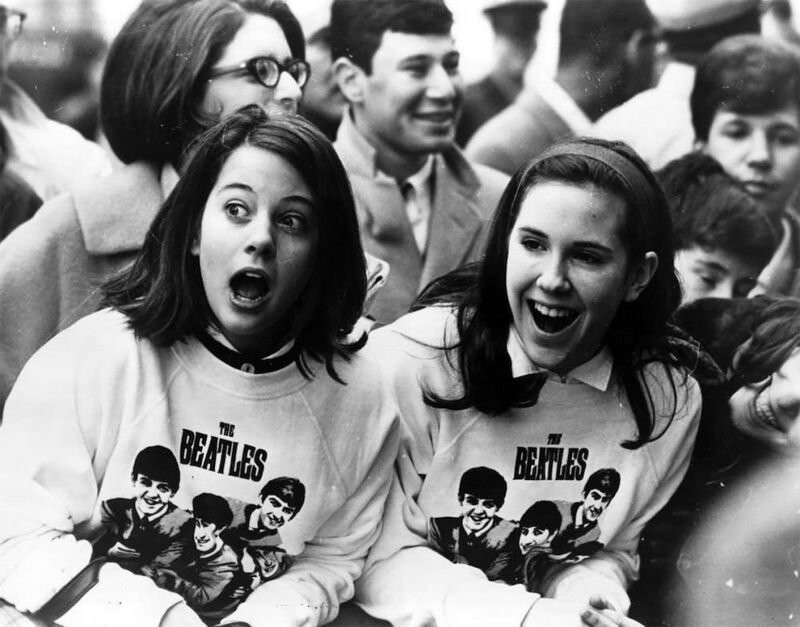
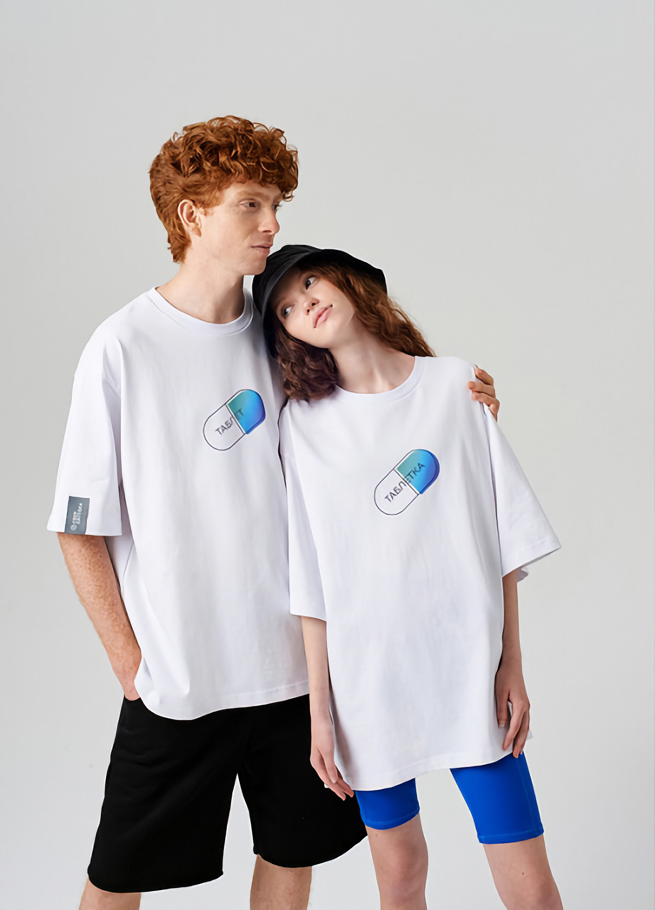
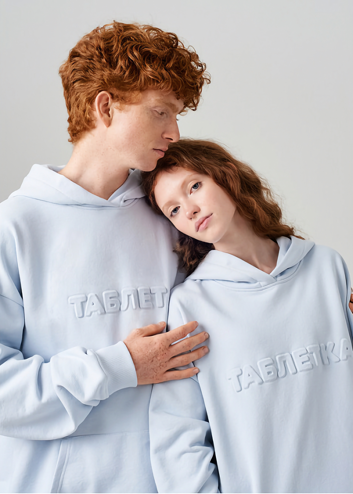

> **Мерч (merch)** — это сокращение от английского слова "merchandise", что означает продукцию или товары, связанные с определенным брендом, артистом, фильмом, игрой и т. д. Мерчандайзинг (merchandising) - это процесс создания, производства и продажи таких товаров. Мерч может включать в себя различные предметы, такие как футболки, кепки, постеры, значки, игрушки, коллекционные предметы и многое другое. Он часто украшен логотипами, изображениями или другими символами, связанными с определенным брендом или артистом.
 
80 лет назад вещи с принтами стали только появляться в повседневной жизни, на экранах телевизоров и страницах журналов. Так, одними из первых их появлений в мейнстримных медиа принято считать фильм 1939 года "Волшебник страны Оз" и обложку журнала "LIFE" 1942 года. На последней изображен солдат в футболке "Air Corps Gunnery School" - во время Второй Мировой многие американские военные отделения и места обучения создавали футболки со своими "логотипами" и названиями. Зеленые майки рабочих Изумрудного города с принтом "OZ", в свою очередь, являются, возможно, первым примером мерча.
 

 
В качестве рекламного носителя мерч стали использовать и в политике — в 1948 году во время кампании кандидата в президенты Томаса Дьюи появились футболки, с напечатанным лозунгом «Dew it with Dewey» («dew it» приравнивалось к «do it», поэтому фраза гласила: «Сделай это с Дьюи»).

Использование в рекламе принтованной одежды стало моментом зарождения мерча, при этом массовое распространение он получил с 50-60-х годов с появлением хиппи, демонстраций и протестов, а также развитием массовой музыкальной культуры.

**Музыкальный мерч**
На Западе музыкальная атрибутика начала процветать в 60-70-х годах. Свой мерч с успехом продавали The Beatles, Led Zeppelin и Sex Pistols. Концертная атрибутика создавалась не только для фанатов, но и приносила значительный дополнительный доход исполнителям.
 
В это же время появился мерч, который стал результатом коллаборации музыкантов и художников/дизайнеров — Джон Паше нарисовал логотип с высунутым языком для Rolling Stones, а Энди Уорхол для альбома Sticky Fingers той же группы создал провокационную обложку. Эти изображения также стали переносить на одежду и различные предметы.
 

 
В России мода на музыкальный мерч пришлась на конец 80-х и 90-е, однако поначалу футболки или нашивки с названием групп достать было достаточно сложно. Часто такой мерч фанаты изготавливали вручную, например, вышивая изображения на напульсниках. Позднее, с появлением специальных магазинов, музыкальный мерч стал более доступным. Он также отличал представителей различных субкультур: рокеров, металлистов, готов и панков.
 
Со временем мерч перешел в корпоративную среду. Компании начали массово выпускать одежду с логотипами любимых исполнителей в фирменном стиле, таким образом продвигая свои бренды.
 
**Мерч сегодня**
 
На сегодняшний день мерч – это не просто логотип на футболке, это целая история, которая транслирует ценности бренда. Сейчас мерч выпускают все: от маленьких до больших компаний. Его часто встретишь на мероприятиях, форумах, фестивалях, конференциях, целые города также занимаются разработкой своего собственного мерча.
 

