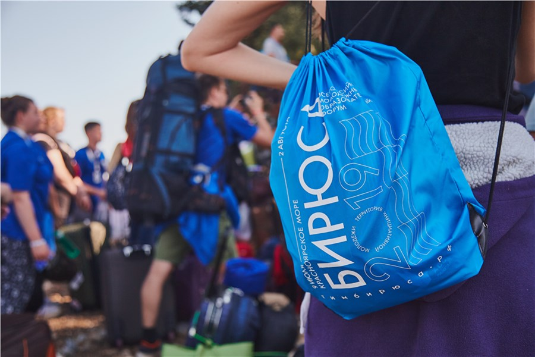
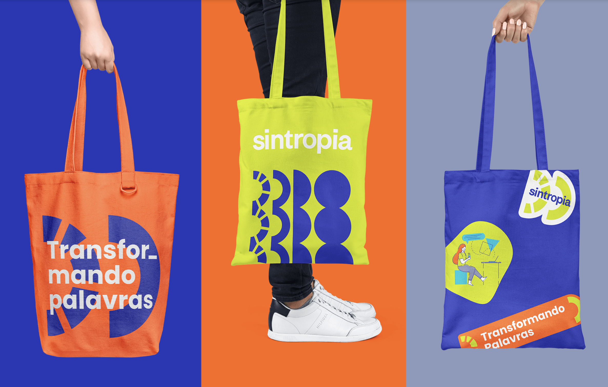
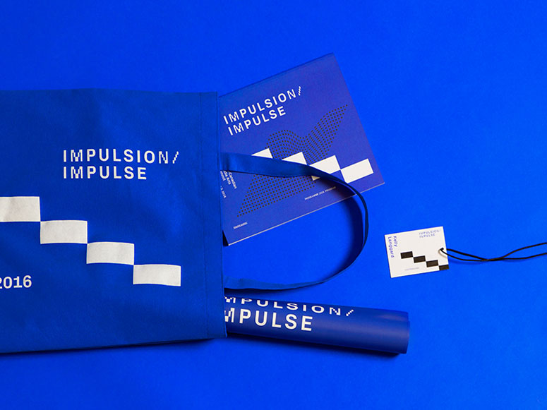
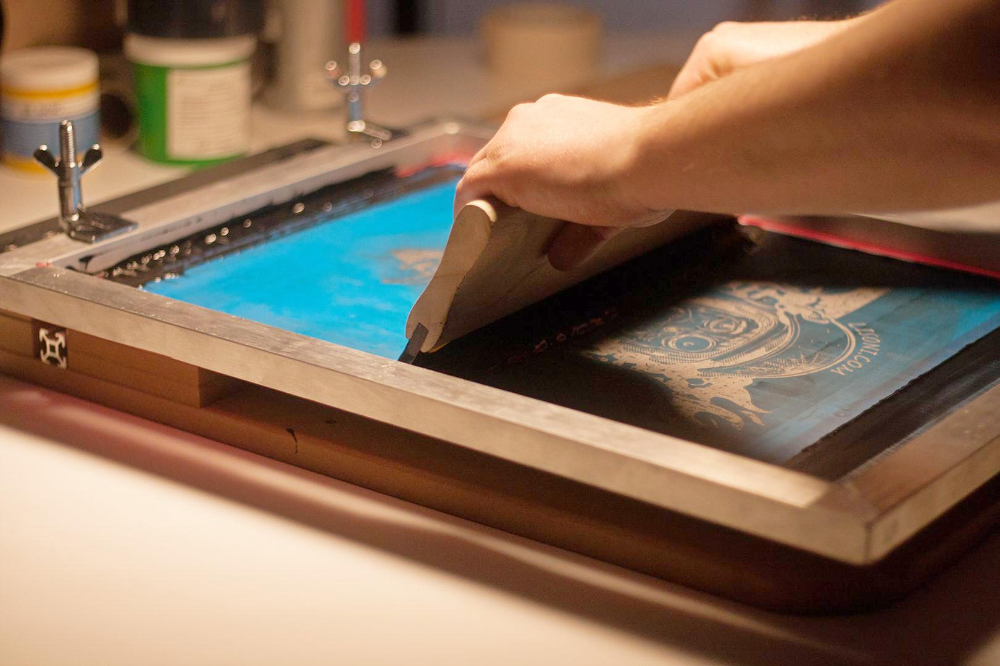
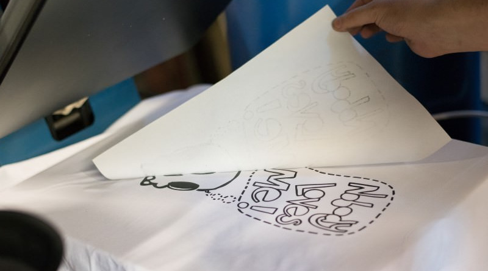
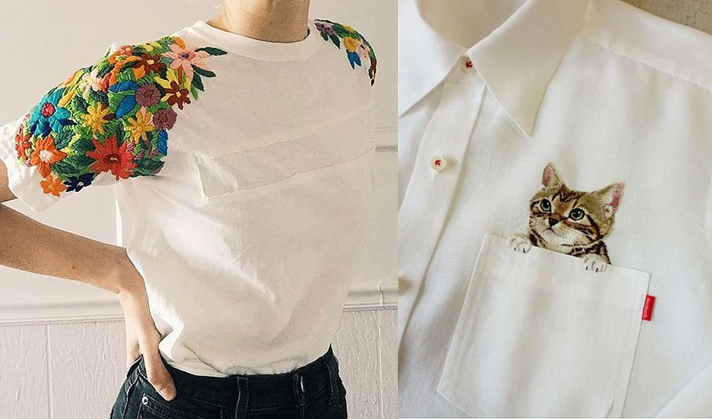
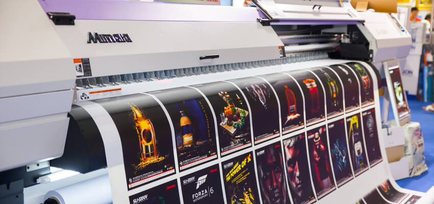
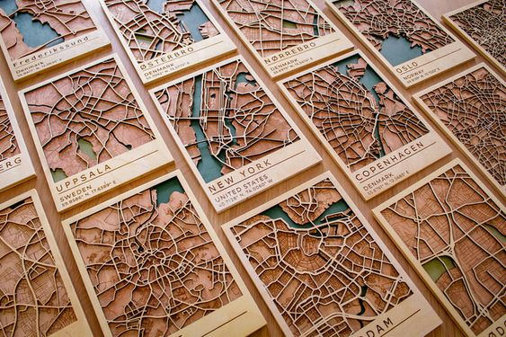

Любой мерч размещается на носителях. Носитель мерча может включать в себя различные предметы, такие как:
- Сумки и рюкзаки
- Пакеты
- Футболки, худи,
- Кепки
- Значки и ручки
- Кружки и термосы
- Постеры и блокноты
- Чехлы, флешки, наушники
- Нестандартные неожиданные предметы и т.д.
 
**Цель носителя мерча** - представить продукцию максимально привлекательным и удобным способом для покупателей. Он может быть разработан с учетом брендбука, а также допустимо вносить новые идеи и использовать дополнительную графику, иллюстрации, надписи и т д. Главное, чтобы новые инструменты были оправданы и соответствовали концепции самого бренда.
 

 
**Способы печати**
Мерч может быть изготовлен из различных материалов, включая картон, пластик, металл, стекло и т. д. В зависимости от материалов дизайнеру необходимо подобрать способ печати, по этому вопросу лучше консультироваться с типографией, с которой планируется сотрудничать.
 
**Существует несколько способов нанесения печати на мерч:**
 
**Шелкография:** это один из наиболее распространенных способов нанесения печати на текстильные изделия, такие как футболки и кепки. В этом процессе используется рамка с тканевым экраном, через который наносится краска на поверхность изделия. Шелкография обеспечивает яркие и долговечные результаты.
 

 
**Термотрансфер:** способ нанесения печати используется для переноса изображения на текстильные изделия с помощью тепла и давления. Изображение печатается на специальной пленке, которая затем переносится на поверхность изделия при нагревании. Термотрансфер обеспечивает высокое качество печати и возможность нанесения сложных дизайнов.

**Вышивка:** способ нанесения печати основан на создании изображения с помощью вышивки нитками на поверхности текстильного изделия. Вышивка обеспечивает текстурный и прочный результат, и часто используется для создания логотипов или деталей на футболках, кепках и других текстильных изделиях.
 

 
**Цифровая печать:** способ нанесения печати позволяет напечатать изображение непосредственно на поверхности мерча с помощью специального принтера. Цифровая печать обеспечивает высокую детализацию и возможность печати на различных материалах, включая текстиль, пластик и металл.

 
**Гравировка:** способ нанесения печати используется для создания рельефного изображения на поверхности металлических или деревянных изделий. Гравировка может быть выполнена с помощью лазерного или механического оборудования и обеспечивает элегантный и долговечный результат.
 

 
Выбор способа нанесения печати на мерч зависит от типа продукции, материала, бюджета и требуемого дизайна. Каждый способ имеет свои преимущества и ограничения, поэтому важно выбрать подходящий способ в соответствии с конкретными потребностями и целями проекта.

 
> **Задание** - определись с каким видом носителей ты будешь работать. Необходимо выбрать 3-5 носителей, изучить и выбрать способы печати. Добавить слайд в презентацию с выбранными видами носителей, добавить аргументацию, почему ты считаешь, что этот вид подойдет целевой аудитории, указать способ печати.