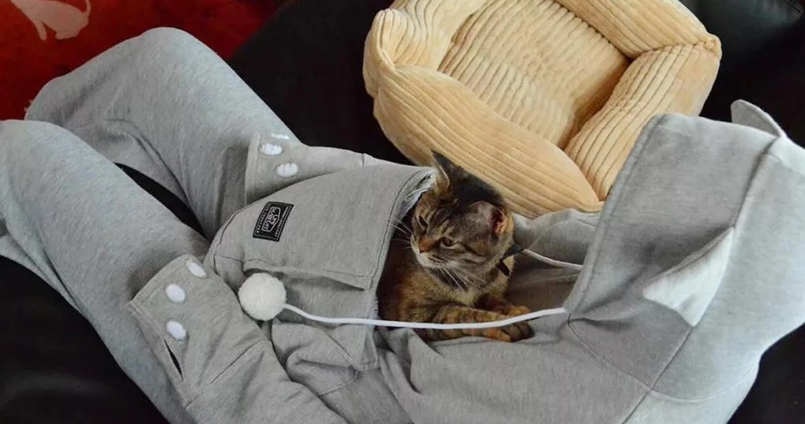
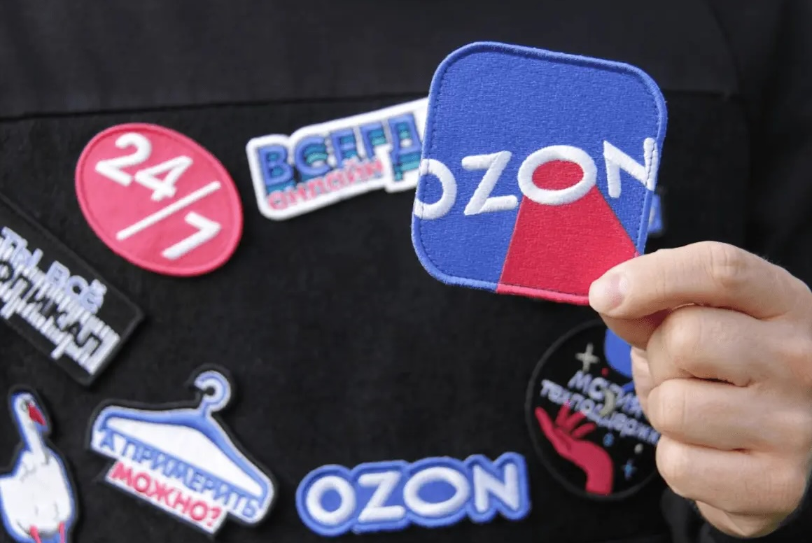
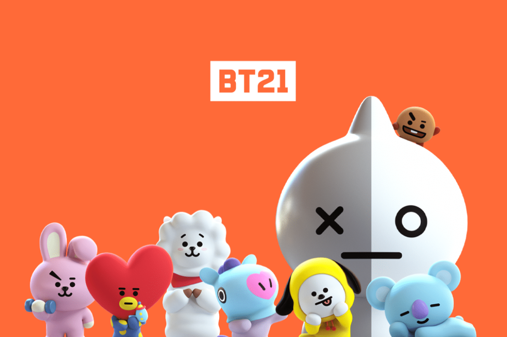
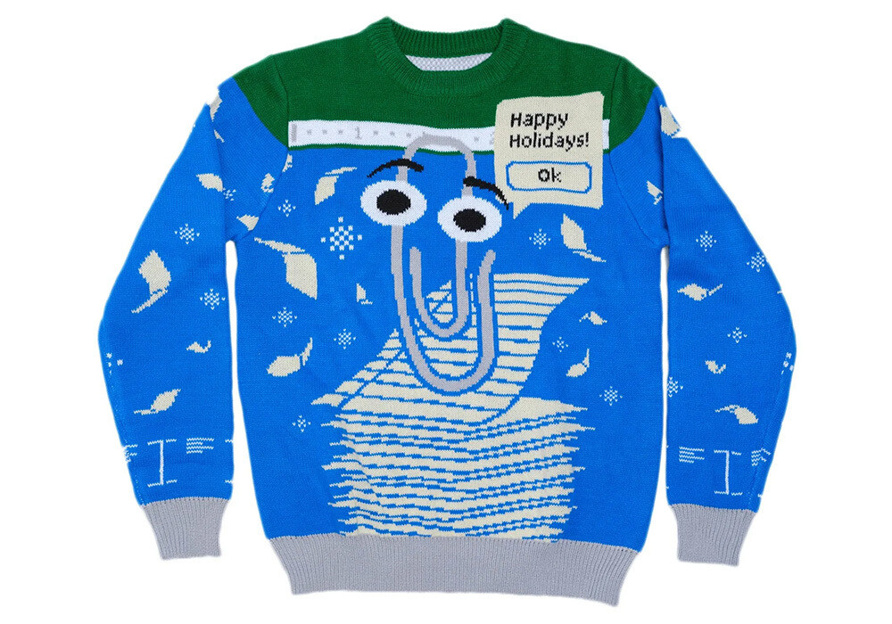
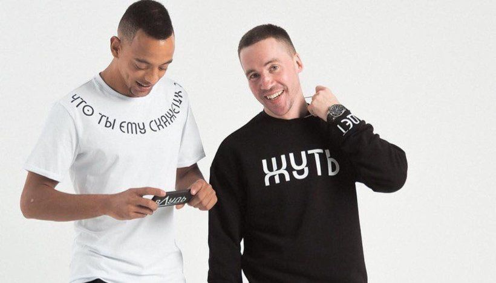

При создании мерча используют разные инструменты, чтобы сделать его более интересным и запоминающимся.
 
## Какие инструменты бывают?

## Нестандартные носители
Используя такой инструмент, важно не переусердствовать, чтобы идентификация и ассоциация с брендом не потерялась.

Японцы — мастера придумывать необычные штуки. В этот раз они удивили весь мир и особенно геймеров/фрилансеров. Для тех, кто часто сидит за компьютером и не может уделить время своему домашнему любимцу, они придумали худи со специальным карманом для котика или небольшой собачки.
 

 
## Мерч со сменными стикерами  
Идея со сменными стикерами простая, но оригинальная, и может адаптироваться под любую корпоративную культуру. Сменные стикеры могут быть даже с NFC-кодами, которые интегрируются в любой мерч. Такие метки дают простор для фантазии. Например, чтобы геймифицировать ритейл или корпоративное мероприятие. Достаточно приложить телефон к стикеру и перед вами предсказание или фраза дня.
 

 
1. **Многоразовые продукты:** это мерч, который можно использовать многократно. Мерч в виде переносной кружки или бутылки, которую покупатель сможет использовать повторно
2. **Необычные материалы:** можете использовать дерево, металл, стекло или другие материалы, которые будут придавать вашему мерчу особую текстуру и внешний вид.
3. **Функциональные продукты:** мерч в виде флешки, брелока или другого аксессуара, который будет полезен и функционален для вашей целевой аудитории
 
Упаковка
Упаковка-сюрприз: упаковка, которая будет вызывать улыбку и интерес у покупателей. Например, можно создать упаковку в виде подарочной коробки или сюрпризной капсулы, которую нужно распаковывать, чтобы получить мерч.
 
А еще можно создать мерч в форме животного, фигуры или символа, связанного с брендом

 
## Мерч с историей
Мерч, который рассказывает историю мероприятия или бренда, надолго остается в памяти клиентов. Неповторимый пример такого сувенира — странные свитера от Microsoft с изображениями старых продуктов компании. Их выпускаются каждый год. Помните забавную скрепку-помощника в Word или операционную систему XP?
 
 

## Метафоры
Метафоры также могут быть использованы в мерче для создания уникального и запоминающегося визуального образа или сообщения.
 
**Какими могут быть метафоры?**
Символы: например, если бренд ассоциируется с силой и энергией, можно использовать форму самого носителя в виде огня.  
**Абстрактные формы:** например, использование волн или спиралей может символизировать движение, прогресс или трансформацию.  
**Использование животных:** например, использование изображения орла может символизировать силу и свободу, а изображение бабочки может символизировать преображение и рост.  
**Словесные игры:** например, можно создать дизайн, который играет с двусмысленностью или ассоциациями слов.
 
## Слоганы и тренды  
Классный способ выделиться из толпы и выразить свою индивидуальность. Особенно это касается корпоративной продукции, которую не купить в обычном магазине. Это могут быть забавные или остроумные заголовки со смелой яркой типографикой.
 

 
> Задание - подумай, какие инструменты тебе бы хотелось использовать для создания будущего мерча. Выбери подходящие для себя.