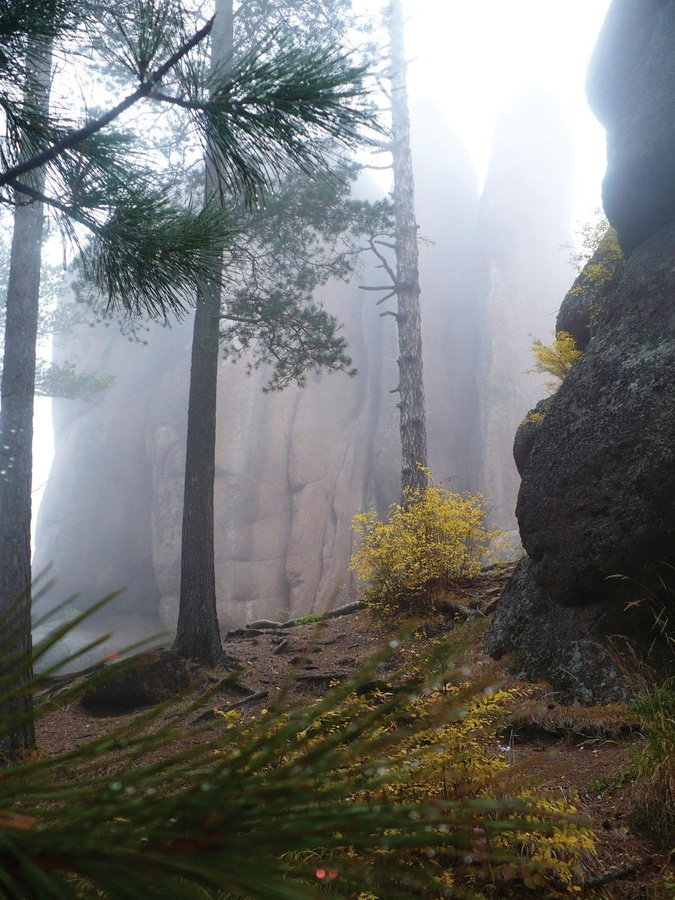
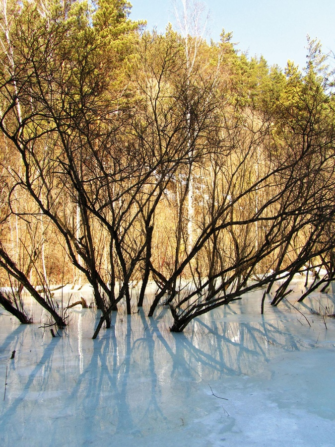
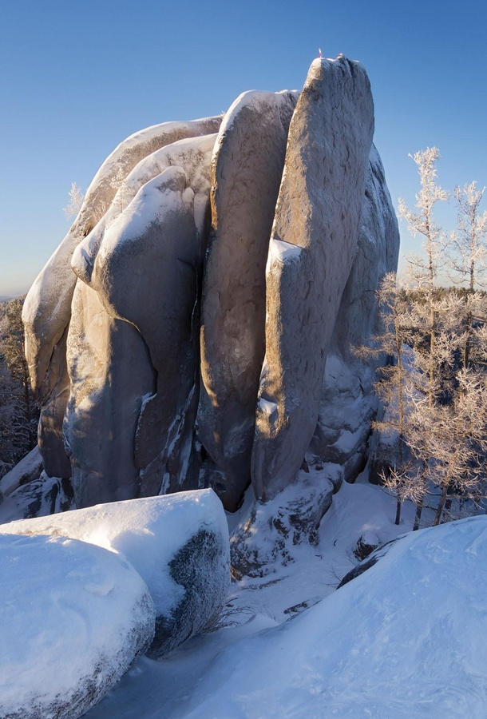
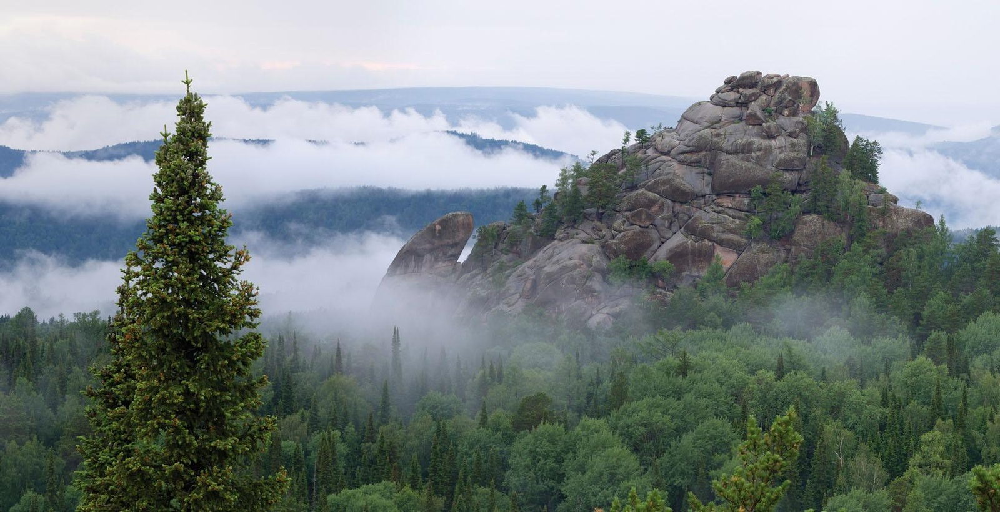
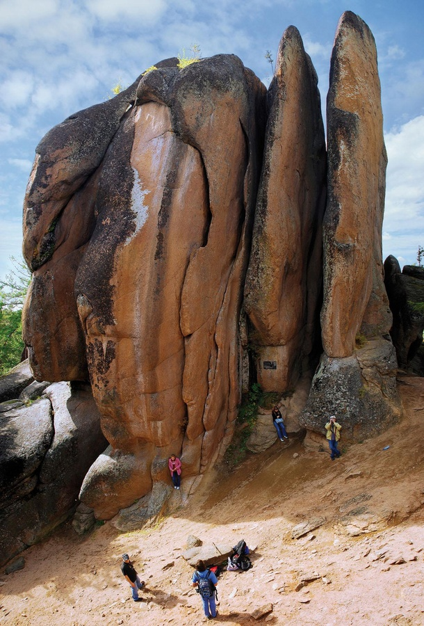
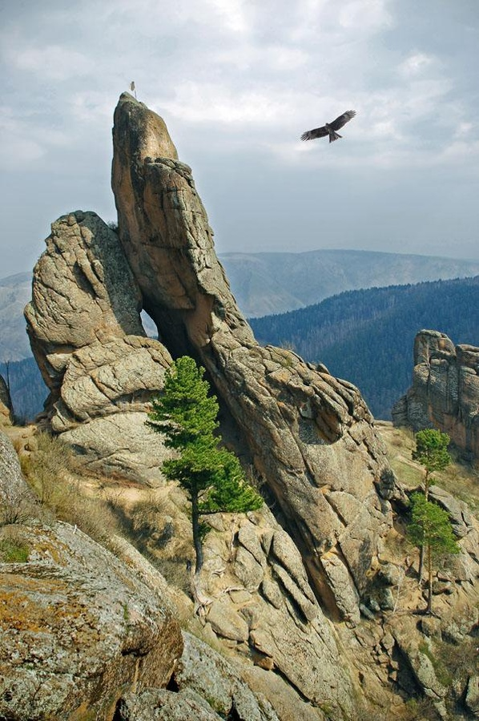
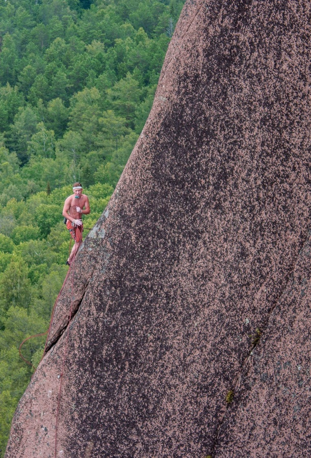

**Твоя задача:** создать концепцию для мерча национального парка «Столбы» и запаковать ее в презентацию. На этапе концепта тебе нужно определиться с носителями и стилистикой, а также выбрать подходящие варианты нанесения. И собрать предложение в презентацию.  

**«Столбы»** — это удивительный парк по красоте и разнообразию, потрясает масштабными и разнообразными ландшафтами, уникальной сибирской природой. Это старейшая в России особо охраняемая природная территория, созданная в 1925 году по инициативе местных жителей для сохранения живописного уголка от варварской рубки леса и добычи природного камня. Свое название нацпарк получил не случайно. Основной достопримечательностью территории стали сиенитовые скалы, по велению природы, принявшие облик исполинских великанов с угадываемыми очертаниями людей, животных и мифологических существ. «Столбы» по праву являются визитной карточкой, брендом Красноярского края и города Красноярска, любимым местом отдыха красноярцев, которые заряжаются здесь энергией и здоровьем.
 
Парк топит за экологию, здоровый образ жизни, субботники, за проведение времени на природе семьей и друзьями – это является главной ценностью. Здесь ты можешь прогуляться по местности, посетить визит-центр, где часто размещаются выставки, а теперь еще и планируется продавать мерч, пообедать на скалах и просто хорошо провести время.
 
Заказчики ждут классных креативных, не заезженных решений, которые отражали бы особенности заповедника: причудливые формы гор, разнообразие животного мира, таинственность и магию природы, ценности.

**Целевая аудитория** парка очень разнообразна — семьи с детьми, студенты и школьники, которые приходят сюда на пикник, пожилые люди, занимающиеся хайкингом. Но заказчикам хотелось бы сфокусироваться на более молодой аудитории и увидеть концепцию, которую с удовольствием бы носила современная молодежь в повседневной жизни.
 
Гайдлайн парка: [ссылка на Figma](https://www.figma.com/file/1axRbm0TZjUiAlRZKZkyL5/%D0%97%D0%B0%D0%B4%D0%B0%D0%BD%D0%B8%D1%8F-%D0%93%D1%80%D0%B0%D1%84%D0%B8%D0%BA%D1%81%D0%B8?type=design&node-id=32%3A5&mode=design&t=G7vM54TarlR1vEXG-1)

Обязательно сделай копию файла с гайдлайном, который мы предоставили и работай уже с ней.