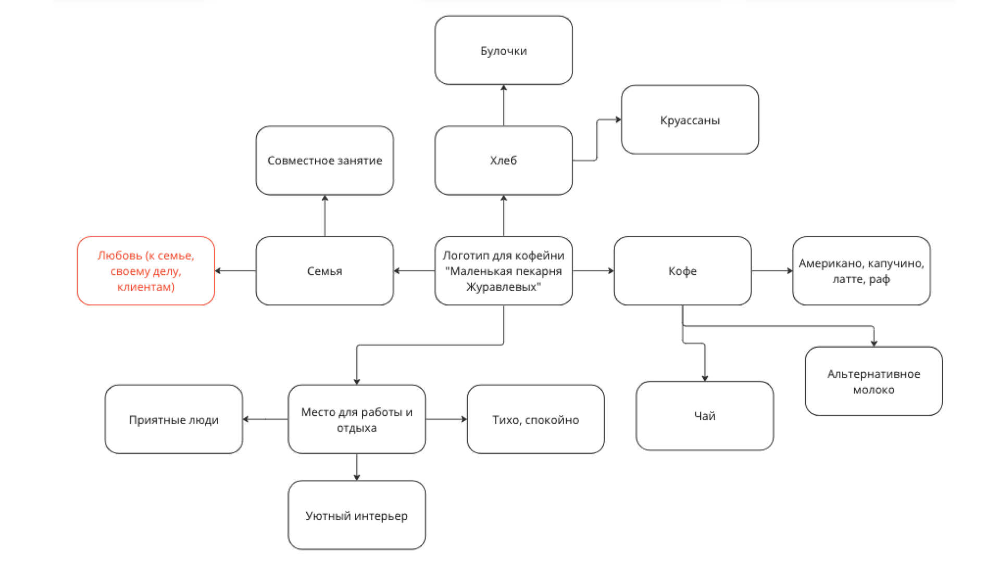

При поиске референсов ты можешь столкнуться с непониманием, что конкретно нужно искать и как правильно вбивать запрос, в этом случае тебе может помочь карта ассоциаций или ассоциативное поле.
 
> **Ассоциативное поле** - инструмент изучения концепта, с помощью создания ассоциаций разных уровней, которые помогают организовать информацию и управлять вниманием аудитории, облегчая восприятие и понимание стиля.

**Как сделать ассоциативную карту?**
Используй в описании существительные, глаголы, прилагательные: называй эмоции, характеристики, похожие предметы, геолокацию

1. Изучи еще раз внимательно ТЗ. Выпиши несколько слов — существительных и прилагательных, — которые ассоциируются у тебя с данной компанией. Это будут ассоциации первого порядка — самые очевидные образы, то, что приходит в голову сразу.
2. Теперь нужно подобрать ассоциации второго порядка. Это как бы расширение понятий с первого уровня.
3. Затем выписываем ассоциации третьего порядка. На этом этапе происходит ещё большее расширение образов первого и второго уровней. Здесь мы уже заходим на территорию эмоциональных образов, бессознательно улавливаемых человеком. Тут могут появиться цвета, фактуры, ощущения – это ключевые ассоциации, которые помогут сформировать стиль
 
Уровней ассоциаций может быть сколько угодно. Если они приходят в голову, значит, их нужно фиксировать. Ассоциации подскажут тебе, какие визуальные образы могут стоять за темой твоего проекта.
 

