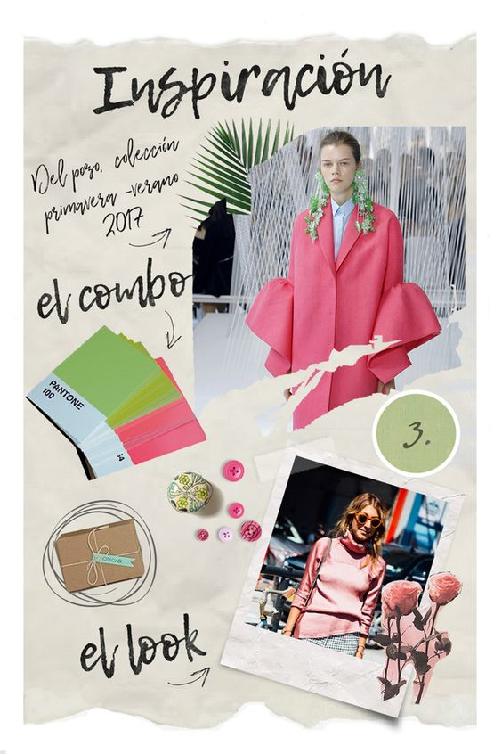
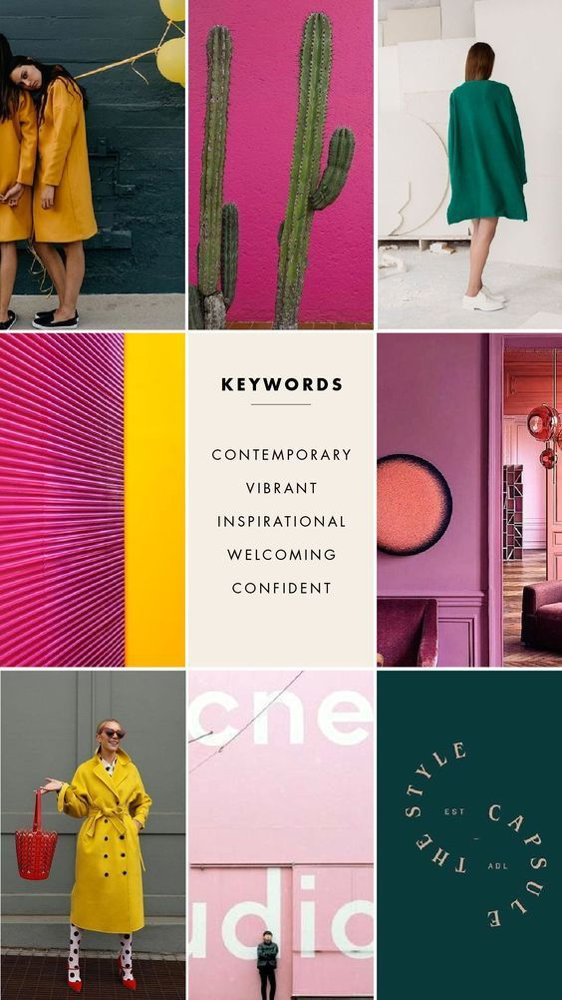
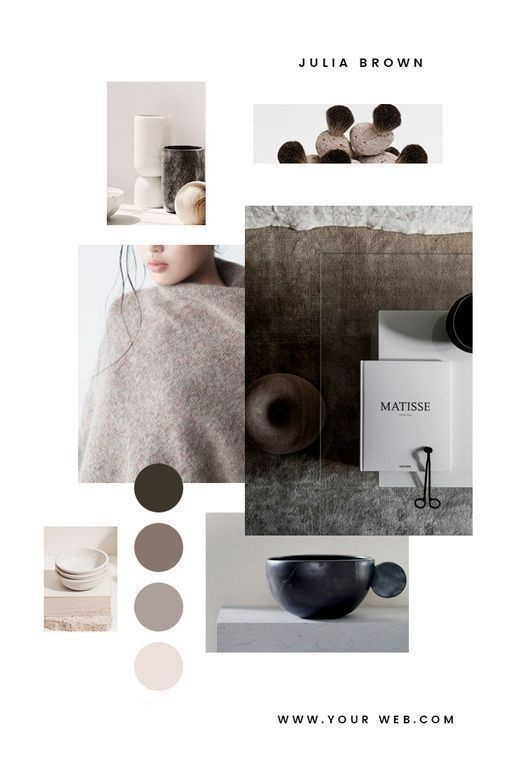
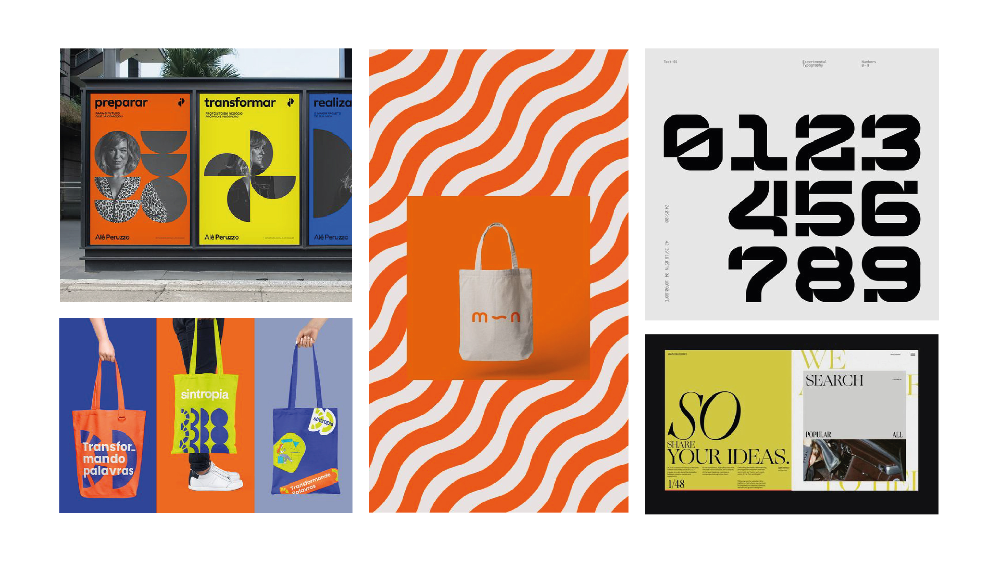
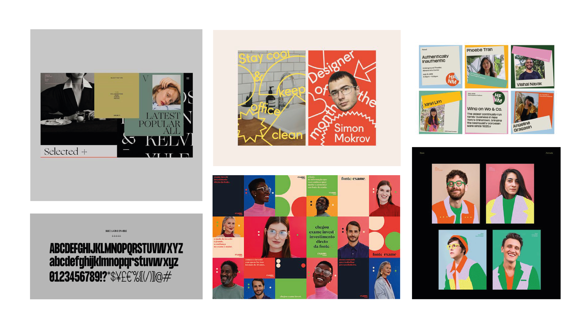

Дизайнеры уже давно не изобретают велосипед, поэтому, чтобы было легче определиться со стилем можно воспользоваться референсами. Посмотри работы других дизайнеров, отметь для себя их сильные и слабые стороны, это поможет найти удачные приемы и переиспользовать их в своей работе.
 
> **Референсы** — это изображения или объекты, которые дизайнер или художник выбирает при подготовке проекта и к которым обращается во время работы. Это твоя доска настроения. Ты можешь поискать примеры того, что может пригодиться тебе в работе с логотипом: примеры построения сеток, шрифтовые сочетания их характер, композиционные решения. Поиск референсов необходим для того, чтобы продемонстрировать заказчику какие способы по решению задач уже существуют и понять какие дизайн - приемы сейчас актуальны, чтобы переиспользовать что-то для себя.
 
**Мы рекомендуем разделять референсы на стилистические и функциональные.**
 
**В стилистические референсы можно добавить:**
- Примеры графических решений
- Цветовая палитра, примеры сочетания цветов
- Стиль иллюстраций, фотографий и иконок
- Скриншоты, которые нравятся тебе по атмосфере и настроению
- Примеры шрифтов, отражающих характер продукта
- Ключевые фразы, которые помогли тебе с поисками или навели на нужные выводы и пригодятся для передачи твоих мыслей клиенту.
 
**Главная задача стилистических референсов передать настроение и характер будущего стиля.**

 
**А вот в функциональные референсы можно добавить:**  
Изображения, где видны приемы с интересными композиционным решением, шрифтовая пара, цветовая палитра, иллюстрация, скриншот сайта, макет журнала, книги, полиграфия и т д. Это поможет найти для себя новые приемы и переиспользовать их в своей работе.

 
**Главная задача функциональных референсов показать приемы, которые хотелось бы переиспользовать в будущей стилистике на примерах других авторов, опираясь на ЦА и задачи проекта.**
 
**Где искать референсы?**  
[behance.net](https://www.behance.net) Здесь очень много не просто работ дизайнеров, а полноценных кейсов, потому как большинство выкладывают свои работы именно сюда. Ты можешь подписаться на авторов и дизайн-студии, чьи работы считаешь классными и следить за их творчеством постоянно.  
[dprofile.ru](https://dprofile.ru/) Площадка очень похожая на Behance, много крутых кейсов разных направлений дизайна.  
[dribbble.com](https://dribbble.com) Сайт, на котором дизайнеры также публикуют свои портфолио. Это более закрытое комьюнити авторов, также можно найти хорошие качественные работы.  
[ru.pinterest.com](https://ru.pinterest.com) Один из первых базовых ресурсов, с которых обычно начинают развитие насмотренности. У Pinterest два преимущества: возможность создавать свои подборки (мудборды) и алгоритмы, которые формируют ленту с учетом прошлой активности.  
[maxibestof.one](https://maxibestof.one/websites) / [siteinspire.com](https://www.siteinspire.com) Ресурсы с качественными сайтами и ссылками на них.  
[awwwards.com](https://www.awwwards.com) Это мировая конкурсная площадка для веб-дизайнеров и разработчиков. Здесь ты сможешь выложить свой сайт, который в дальнейшем будет оценивать сообщество Awwwards и международное жюри.

**Ресурсы с визуалом соц сетей:**  
[steep.design](https://www.steep.design)  А здесь ты найдешь классную подборку сторис от известных брендов и не только.  
[maxibestof.one](https://maxibestof.one/websites) / [siteinspire.com](https://www.siteinspire.com)  Ресурсы с качественными сайтами и ссылками на них.  
[awwwards.com](https://www.awwwards.com)   Это мировая конкурсная площадка для веб-дизайнеров и разработчиков. Здесь ты сможешь выложить свой сайт, который в дальнейшем будет оценивать сообщество Awwwards и международное жюри.  
[designspiration.com](https://www.designspiration.com)  Эта площадка похожа на Pinterest, здесь также можно найти различные направления: фотография, типографика, полиграфия, архитектура, веб-дизайн и многое другое. Удобно, что у скриншотов показана цветовая палитра. Также можно в специальной палитре, которая находится в строке поиска, выбрать цвет и посмотреть, что у них есть в такой гамме.

**Телеграмм-каналы:**  
[Posterino](https://t.me/posterino) — подборки плакатов. Подача стандартная — каждый пост это шесть работ одного автора. Здесь ты найдешь множество референсов и вдохновения для себя.  
[ParaGraph](https://t.me/paradigm_graphics) — кейсы известных студий, результаты конкурсов, фестивалей, айдентика, брендинг, наружная реклама.  
[Magazine Design](https://t.me/magazine_design) — «лучшие идеи, воплощённые в журналах, книгах, типографической продукции дизайнерами со всего мира». К каждому выложенному посту с проектом прилагается ссылка на страничку автора на Behance.  
[Шрифтовой дизайн](https://t.me/typeschool) — канал дизайнера Сергея Рассказова. Сергей делится хорошими проектами, рассказывает о новостях шрифтового мира.

**Аргументация выбора референсов**
Для того чтобы насматриваться осознанно, тебе важно задавать себе вопросы анализируя работы других авторов. Почему дизайнер выбрал именно этот цвет? Почему мне это нравится / не нравится? Почему это решение правильное? Старайся обращать внимание не только на те приёмы, которые кажутся удачными, но и на менее удачные решения.
 
Когда будешь работать с референсами задай себе вопросы ниже и зафиксируй ответы рядом с работами авторов, которые ты выберешь. Таким образом заказчику будет понятен твой выбор, идея. Ты можешь анализировать композиционные решения, выбор цвета, шрифтовой пары, фотостиль и т.д.
 
1. Почему мне нравится или не нравится эта работа?
2. Какую задачу решал дизайнер?
3. Решил ли он ее?
4. Где еще может пригодится такое решение?
5. Почему дизайнер этого не сделал?
6. Как можно решить эту задачу лучше?

> **Задание** - найди 5-10 изображений с функциональными и стилистическими референсами. Разбей их на два слайда. Добавь рядом с выбранными референсами аргументацию их выбора. Отмечай удачные и менее удачные приемы, ориентируясь на вопросы выше.