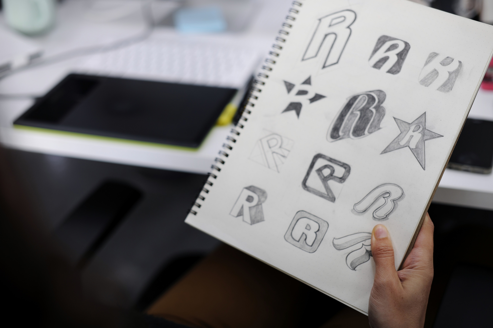

Ориентируясь на собранные референсы и портрет целевой аудитории попробуй сделать свои первые наброски. Ты можешь сделать их вручную и добавить фотографии процесса в презентацию. А можешь поработать с наброском уже сразу в Figma. Эскиз может быть примерным. Задача показать основную идею.
 
Что размещаем в набросках? Первые идеи по логотипу, цветовой палитре, шрифтам, возможно, у тебя уже появятся первые идеи по дизайн-элементам. Не забудь проаргументировать свои решения рядом с набросками.