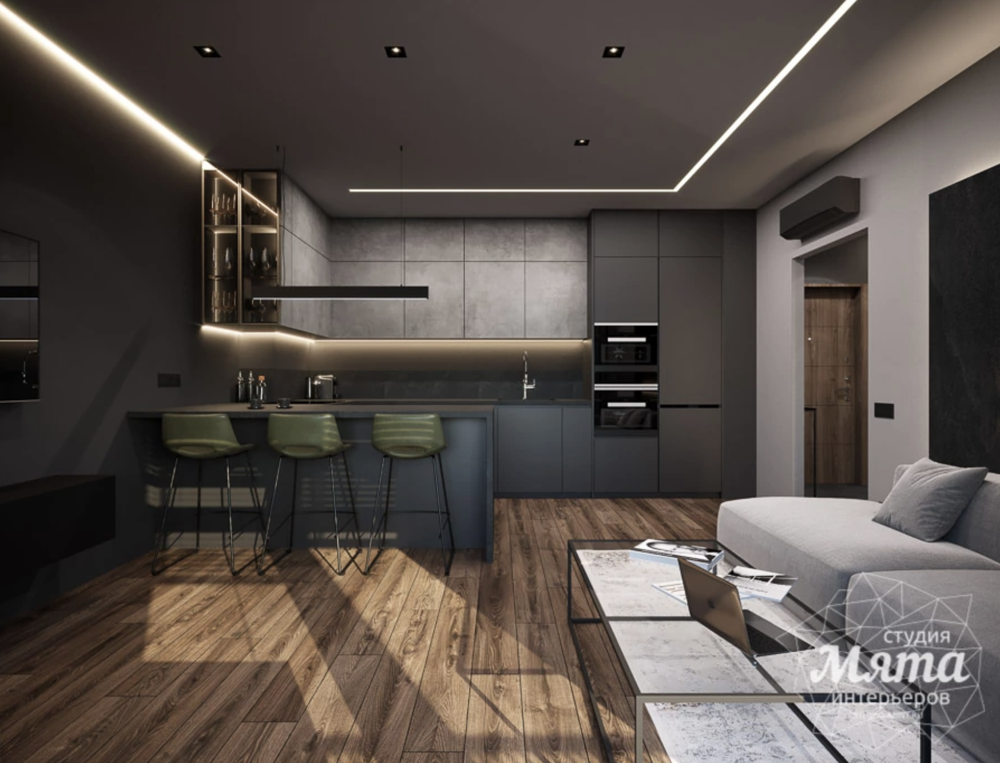
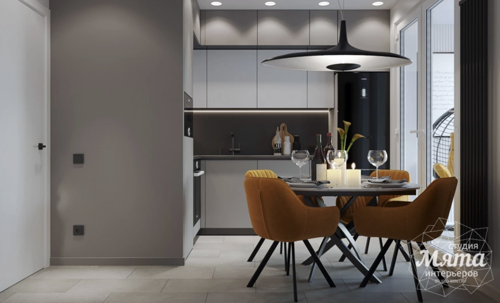
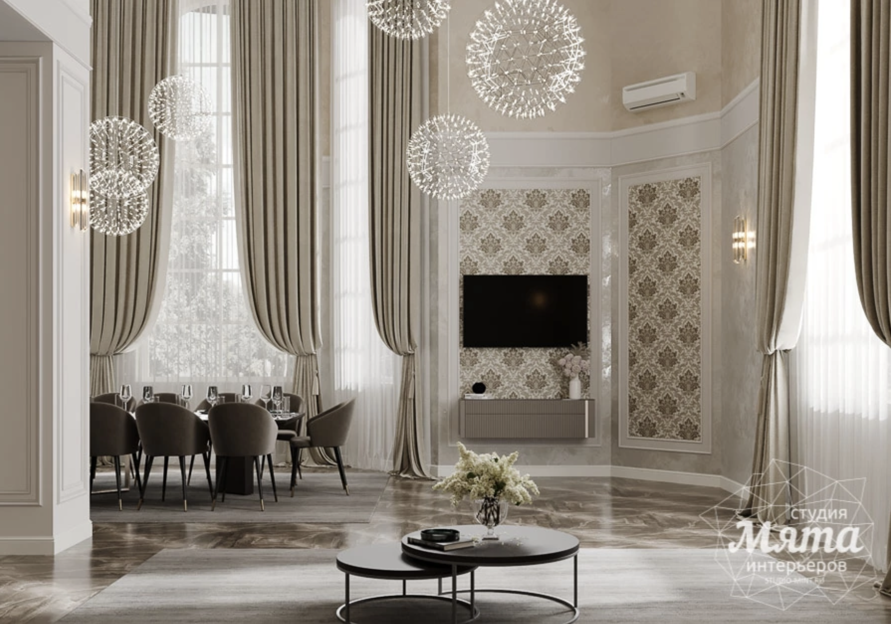
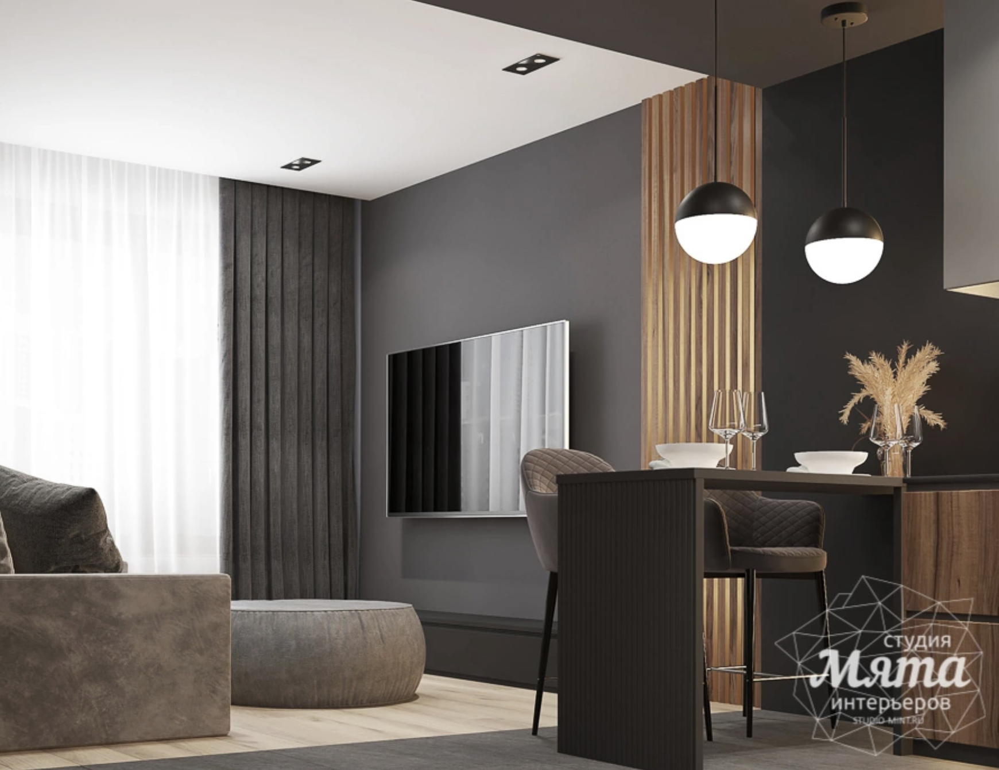
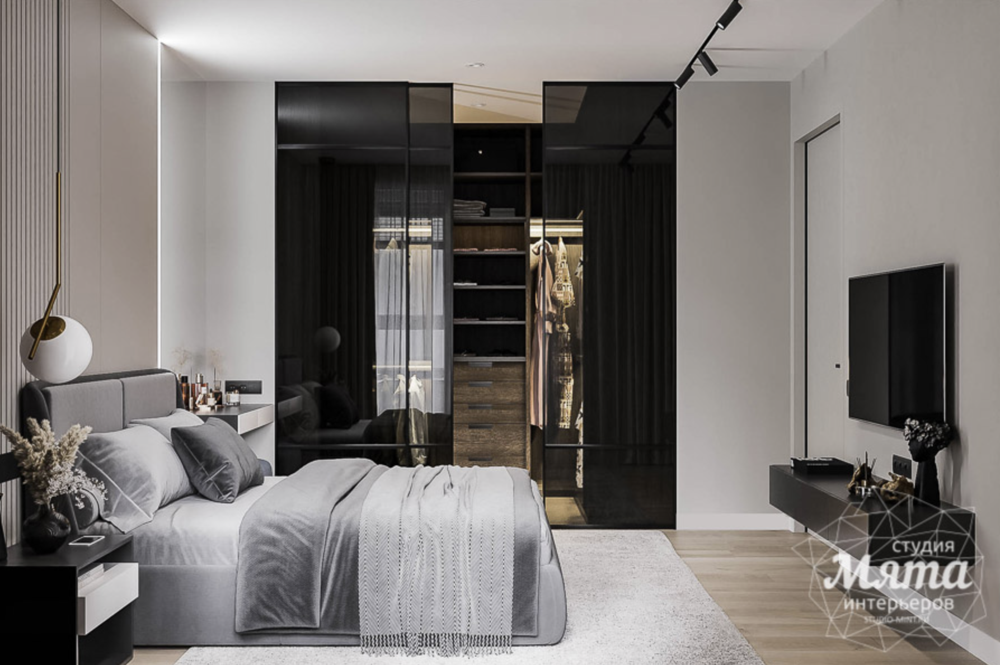
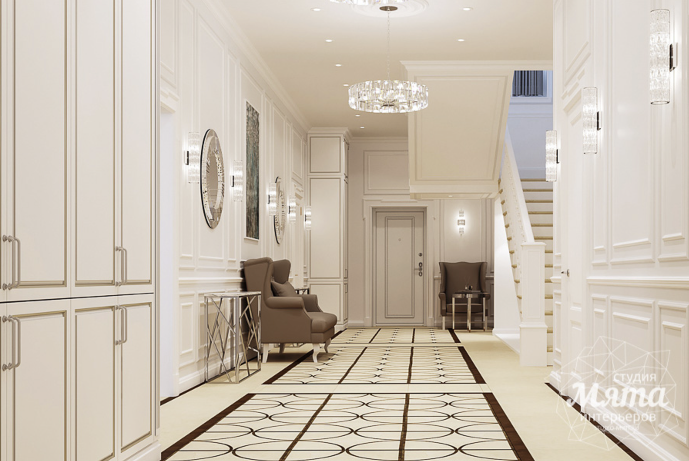

**Твоя задача:** создать мудборд для студии дизайна интерьера «Мята», составить ассоциативное поле, проанализировать Целевую Аудиторию компании, прописать основную идею проекта, показать первые наброски (если пока не готов работать в программе, можно сделать черновик от руки и прикрепить фотографии) и зафиксировать всю информацию на слайдах и создать мини-презентацию. Проект необходимо сделать в Figma, используя предоставленный шаблон ниже.
 
У компании уже есть фирменный стиль, но он достаточно устарел, в связи с этим планируется переупаковка бренда: создание логотипа, фирменного стиля. Ты только начал сотрудничество со студией, поэтому, чтобы убедиться, что вы смотрите в одну сторону с заказчиком, он попросил составить небольшой мудборд с будущей стилистикой проекта.
 
**У студии есть пожелание для тебя:** показать визуально свежий современный подход к работе, использовать чистые благородные оттенки. Минималистично и тонко использовать дизайн-элементы в будущей стилистике. Не использовать шрифты с засечками, а также декоративные или рукописные.
 
**Дизайн студия «Мята»** — это международная сеть, которая занимается созданием дизайна интерьеров любой сложности. Все проекты уникальны, студия против типового подхода. Компания не рисует красивые картинки, а делает реальные проекты, которые легко воплотить в жизнь, как с участием студии, так и самостоятельно.
 
**Целевая Аудитория** – 30-45 лет, люди со средним достатком, в основном женщины. Проживают в жилых комплексах премиум сегмента, есть семья.
 
На выходе заказчик хочет увидеть референсы по будущей стилистике, а также фотографии, передающие настроение будущего стиля, работы других авторов, на которых наглядно можно увидеть композиционные решения, шрифты, цветовую палитру, любые другие приемы, которые по твоему мнению могли бы помочь передать идею. Постарайся подробно про аргументировать свой выбор. Возможно, у тебя появятся и первые наброски, их можно также показать в презентации.
 

 
     
 
Информация, которую можно использовать для рассылки:
Шаблон презентации: [Ссылка на фигму](https://www.figma.com/file/pAK5VZ2AVUcEyHiHV3Ebeb/Untitled?type=design&node-id=0%3A1&mode=design&t=glPhMw09RUJOUMxa-1)
 
Обязательно сделай копию файла с шаблоном, который мы предоставили и работай уже с ней.