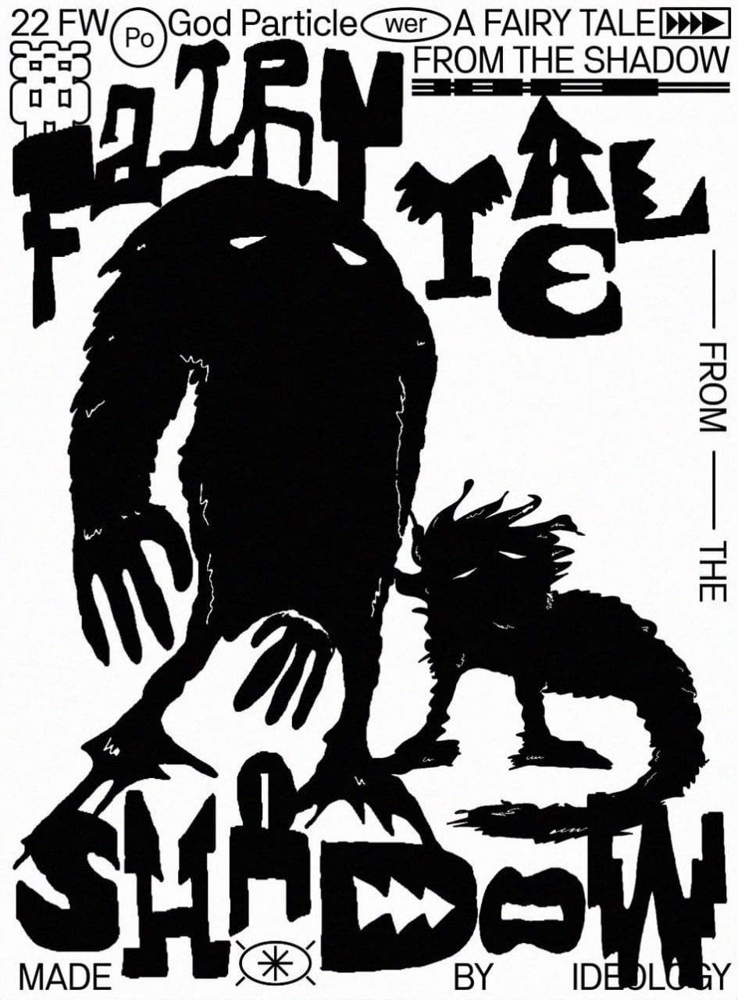
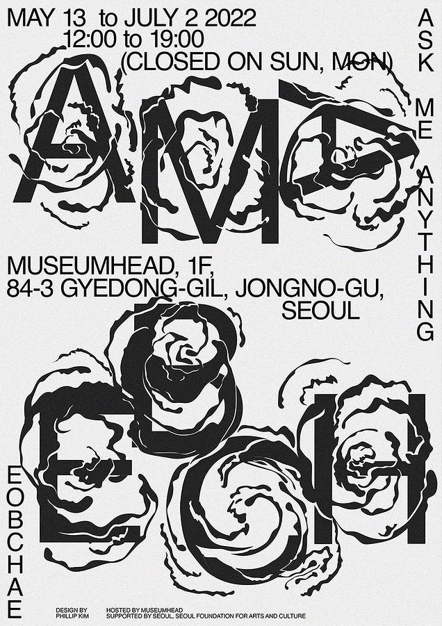
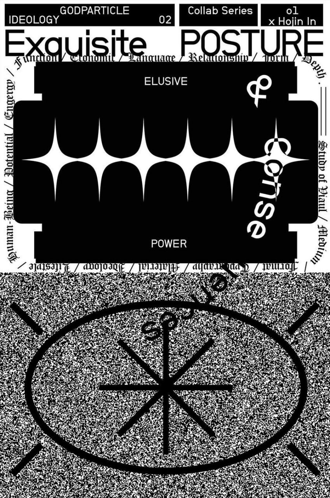

> **Графика в дизайне** — это любые изображения, дополняющие основные элементы фирменного стиля: иллюстрации, фотографии, пиктограммы и многое другое.

Векторная графика представляет собой изображения, созданные с помощью математических формул и которые можно масштабировать до любого размера. Векторная графика создается на основе математических формул, которые определяют позицию, форму, цвет и другие свойства объектов. Файлы векторной графики, такие как SVG и AI, позволяют масштабировать изображения без потери качества и сохранять четкость и детали. Векторная графика особенно полезна для создания логотипов, иконок и других графических элементов.

Графика в дизайне играет важную роль в создании визуальной привлекательности, передаче информации и установлении настроения. Она может быть использована в различных областях дизайна, включая веб-дизайн, графический дизайн, упаковку, рекламу и многое другое. Опытные дизайнеры используют графику, чтобы создать уникальные и оригинальные визуальные решения, которые соответствуют целям проекта и привлекают внимание зрителей.

Графика может быть реалистичной, стилизованной или абстрактной, а ещё создавать иллюзию объёма или быть плоской. Стиль графики может быть единым на всех носителях или, наоборот, создавать вариативность внутри стиля.

> **Промежуточное задание:** Если ты планируешь использовать графику в афише, подумай о том в каком стиле она будет. Линия, пятно или и то и другое? Абстракция или реализм? При создании не забывай ориентироваться на целевую аудиторию.
