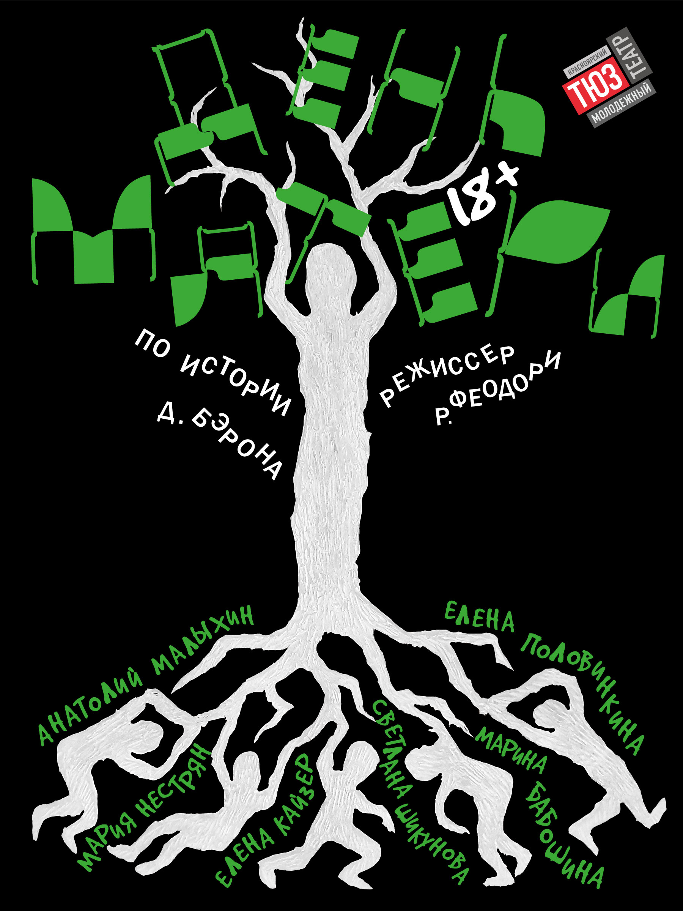
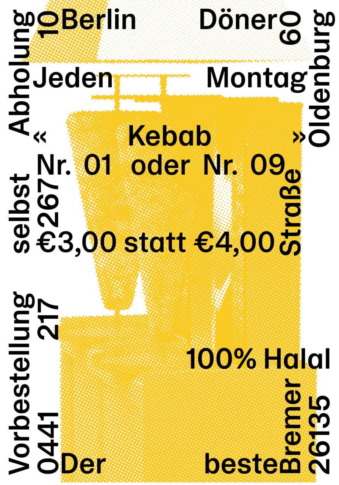
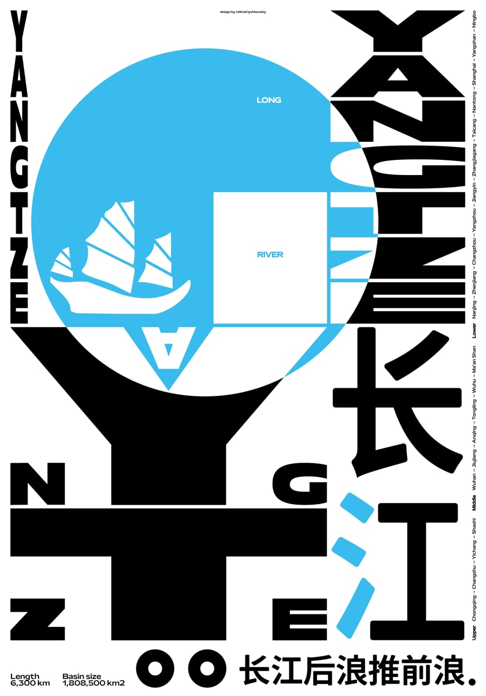
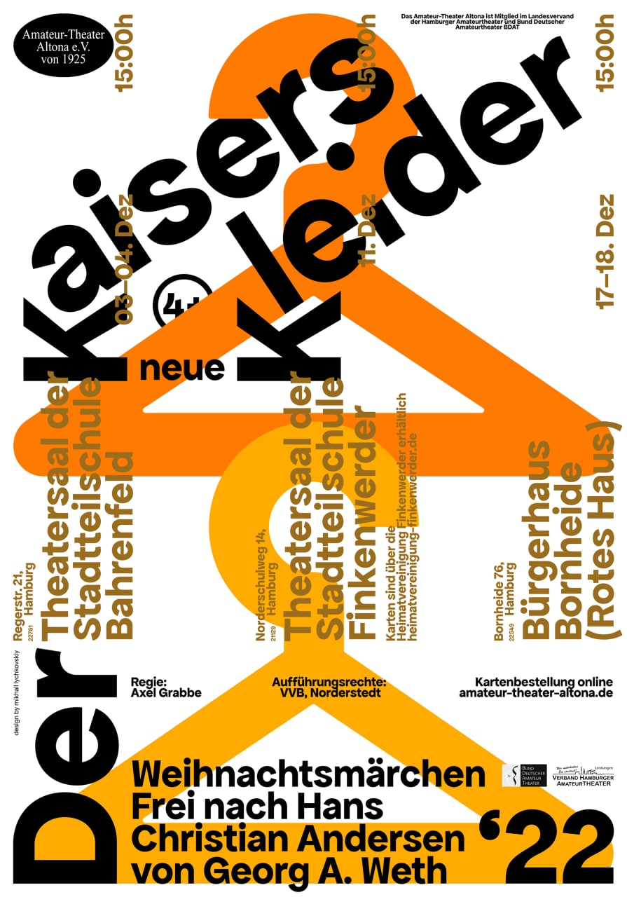
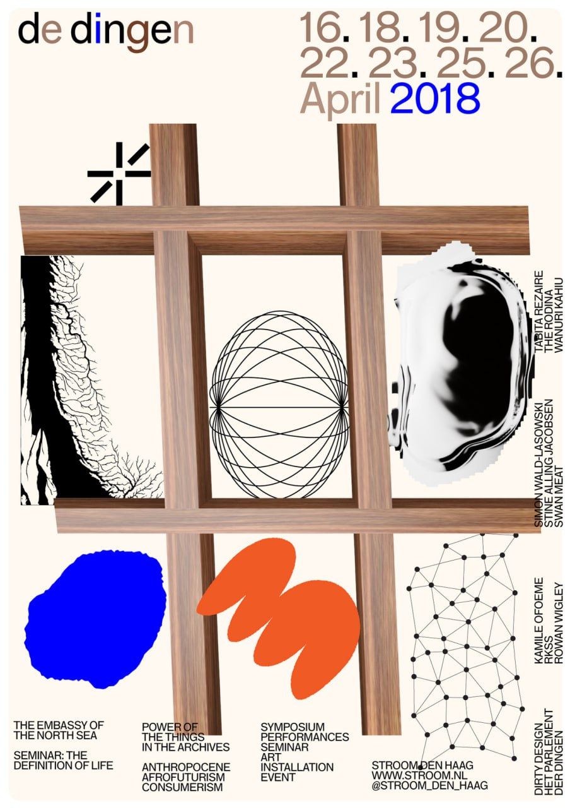
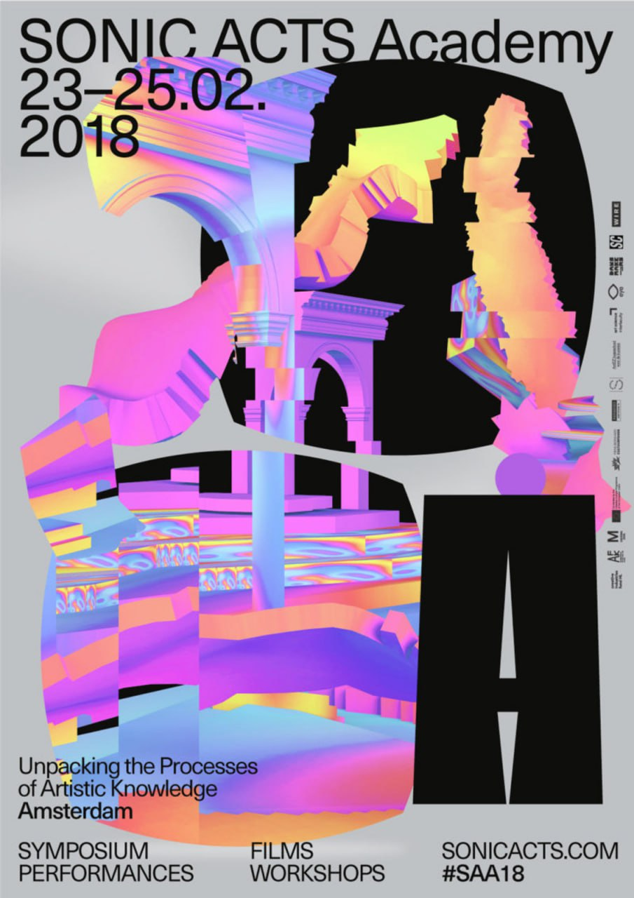
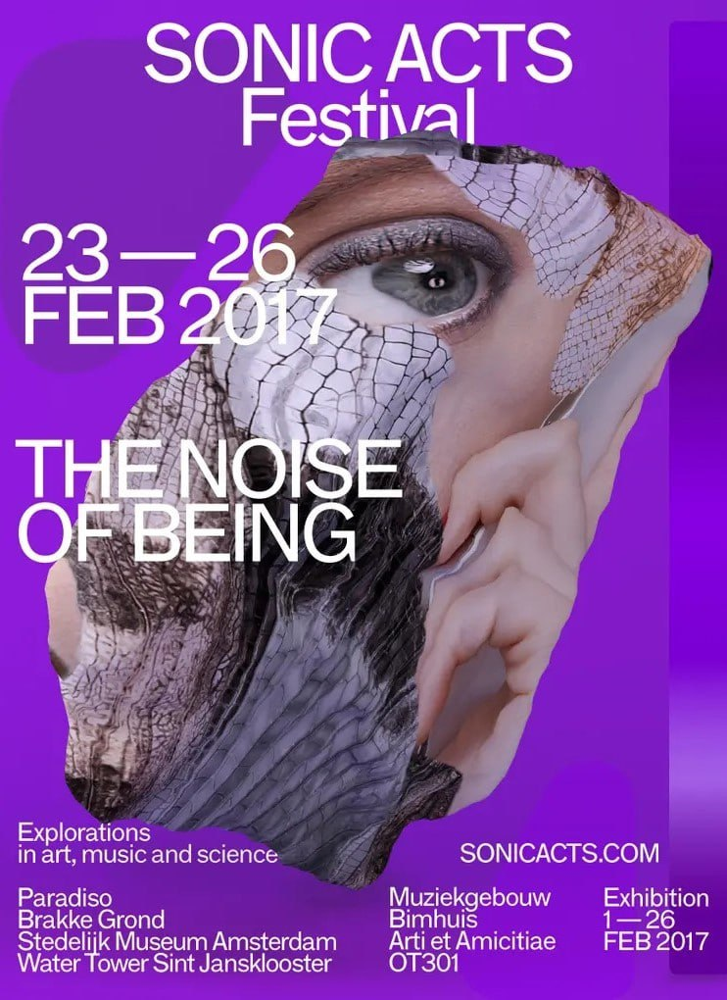
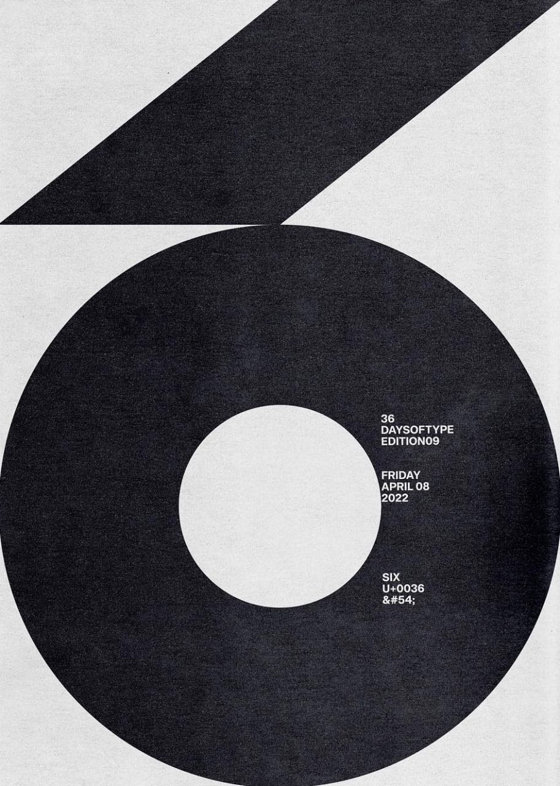
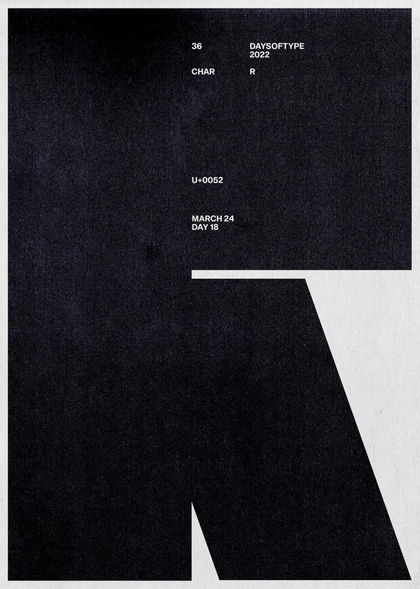
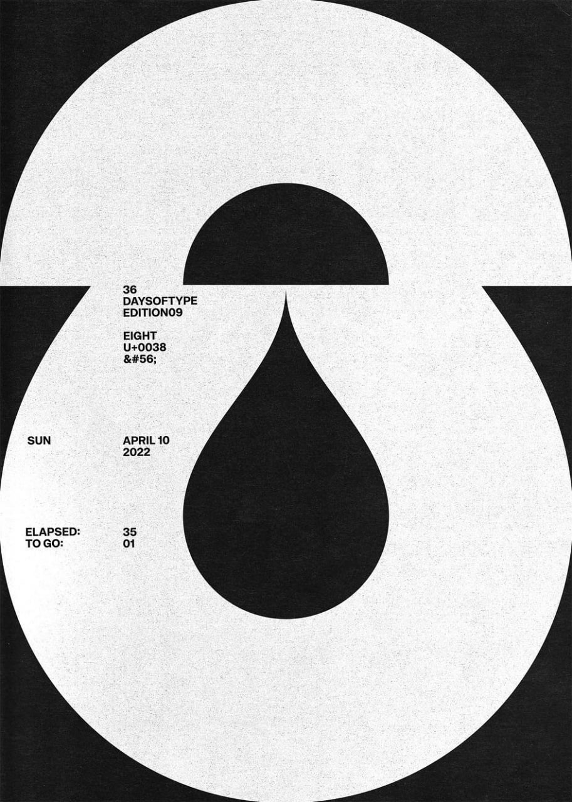

> **Хорошая композиция** — это гармоничное расположение элементов, которое позволяет максимально раскрыть их содержание, показывает зрителю, что каждый из них стоит на своём месте, соединяет их воедино и помогает дизайнеру рассказать историю.

**Композиция тоже может быть константой стиля. Чтобы соблюсти единство в проекте, на всех носителях может использоваться одна композиционная схема, например чётко выстроенная горизонталь.** Но если форматы носителей разные, композиционная схема может и не повторяться, но при этом важно, чтобы все носители работали в одной общей системе, в едином сценарии. Когда все элементы изображения расположены не случайно и в макете есть логика, наш взгляд сам понимает, за что зацепиться. Человеческий мозг стремится к порядку, и мы чувствуем себя комфортно, когда находим закономерность в расположении элементов.

> **Визуальная иерархия** — организация информации. Она даёт много полезного: помогает создать визуальную структуру, которая направляет взгляд зрителя по дизайну. Организует информацию в группы на основе их важности или значимости друг для друга.

Основная идея иерархической системы — разделение информации на уровни.
Каждый уровень содержит элементы, которые более важны, чем элементы предыдущего уровня, и менее важны, чем элементы следующего уровня. Иерархия помогает зрителям понять, что самое главное, чтобы они могли сначала сосредоточиться на этом, а затем — при желании — перейти к менее важным деталям.

**В основе иерархических структур в графическом дизайне три основных аспекта, или правила: баланс, контраст и близость.**

> **Контраст.** По принципу контраста создают визуальные различия между элементами, чтобы сделать одни более заметными, другие — менее. Для этого работают с цветами, формами, размерами и текстурами.

## Цветовой контраст  
Использовать этот приём довольно легко, потому что многие контрастные цвета видно невооруженным глазом: достаточно взять один светлый, один тёмный (например, на фон) и гармонирующие оттенки. Но и ошибиться просто, особенно если яркость выбранных цветов одинаковая, а отличается только оттенок.

## Контраст формы  
Два объекта или две области в одном дизайне могут иметь разные формы — так создаётся контраст. Например, иконки разделов и категорий товаров в онлайн-магазине могут быть одного размера, но круглыми и квадратными — и эта непохожесть поможет им выделяться.

## Контраст размеров
Крупные элементы, как правило, привлекают внимание легче, чем мелкие, поскольку их быстрее обрабатывают наши глаза и мозг. Конечно, это не означает, что всегда надо делать весь текст огромным.

> **Баланс.** Правильный баланс элементов создаёт визуальную последовательность и ощущения порядка и аккуратности (или их отсутствия, если дизайн это подразумевает).
Баланс позволяет зрителю увидеть общую гармонию композиции, не отвлекаясь на отдельные элементы. Его достигают с помощью симметрии и асимметрии, а также масштаба, пропорций и соотношения между элементами.

- **Симметрия.** Симметрия подчёркивает общность элементов, а симметричные макеты обычно считаются более формальными, чем асимметричные.

- **Асимметрия.** Асимметрия может отталкивать и этим самым привлекать больше внимания. Причём иногда будет достаточно просто не выровнять в макете два одинаковых серых прямоугольника

> **Близость.** Этот принцип означает, как близко друг к другу расположены элементы в общей схеме компоновки. Сближение или удаление помогает направлять пользователей к необходимой им информации на каждой странице, потому что создаёт визуальные подсказки, которые организовывают быстрый (или лёгкий) поиск того, что им нужно. Без верного соблюдения правила близости всё будет выглядеть хаотично — а этого никто не хочет!

- **Самое важное: объекты, расположенные рядом друг с другом, кажутся связанными. Это можно использовать как способ организовать информацию или элементы дизайна в группы.**

Элементы дизайна могут быть привязаны к сетке, а могут её игнорировать, и такое нарушение тоже становится правилом. А ещё структура бывает многослойной. В такой слоёной композиции правило может быть одним для всех слоёв или разным для каждого. Например, типографика выстраивается строго по модульной сетке, а иллюстрации перекрывают типографику поверх и игнорируют сетку.

## Композиционные принципы в проекте  
1. **Статичная или динамичная, ритмическая или метрическая.** Композиция может передавать ощущение движения или статики и управлять направлением взгляда зрителя. Кроме того, дизайнер может «управлять» скоростью движения с помощью ритмического чередования элементов. Или, наоборот, усиливать ощущение статики с помощью метрического построения — это когда равные по массам элементы выстраиваются на равном расстоянии.  
2. **Заполненная или минималистичная.** Элементы композиции могут занимать всё пространство, создавая ощущение изобилия, наполненности и тесноты. Или, наоборот, пространство может быть практическим пустым, воздушным и минималистичным.

> **Промежуточное задание:** Реши для себя, какие элементы и принципы будут использоваться в афише и попробуй их применить