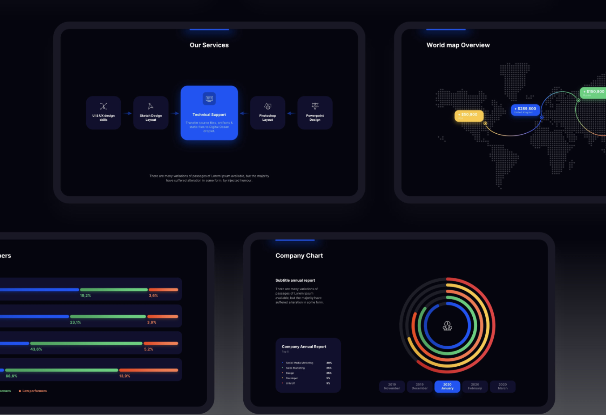

Очень часто дизайнеру приходится работать над презентациями, чтобы визуально представить новый продукт или услугу, компанию или бренд в целом, а также презентации используют для обучения своих сотрудников, партнеров или клиентов. Презентация может включать в себя информацию о возможностях продукта, его преимуществах и способах использования, тут может быть и история бренда, его ценности, миссия, а также ее можно использовать для привлечения инвесторов, партнеров или просто для установления связи с аудиторией и укрепления имиджа бренда. Это лишь некоторые примеры причин, по которым бренды делают презентации. Конкретная цель и содержание презентации могут зависеть от потребностей и стратегии каждого конкретного бренда.

**Перед тобой стоит задача создания презентации для Нейромаркетингового Агентства «Neurovision agency» для выступления на конференции. Рекомендуем не пропускать первый этап с аналитической частью и внимательно пройтись по всему материалу. Даже если кажется, что ты все знаешь. Так ты сможешь более полноценно донести свои идеи и убедительно продемонстрировать свой проект. Мы советуем потратить на это задание 7-10 дней с учетом интенсивной работы над ним. По окончанию ты можешь сдать проект на проверку свободным экспертам в любое время или же свериться самостоятельно по чек-листу.**

**Обязательно обрати внимание на конспекты с аналитикой, шрифтом, цветом и композицией и ритмом слайдов, а также структуру презентации. Это ключевые темы для создания действительно классного проекта.**
