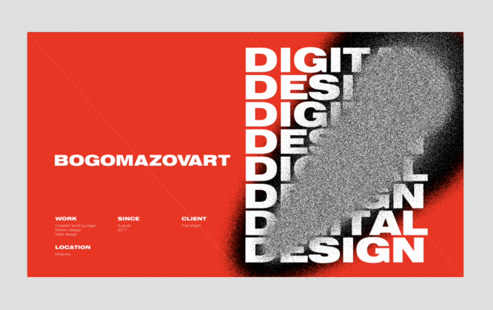
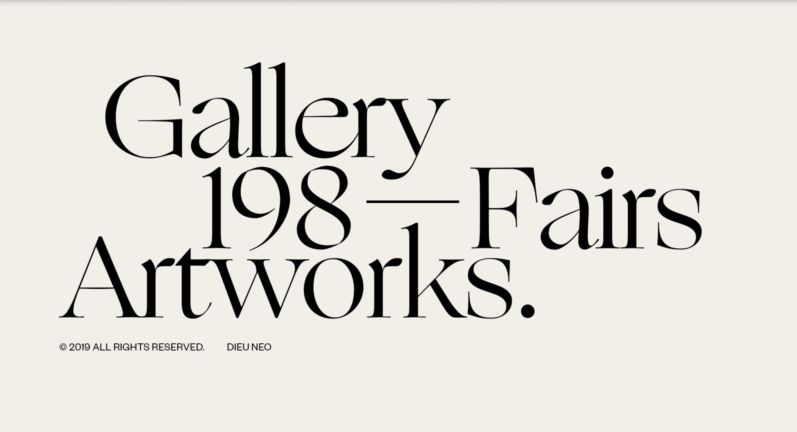
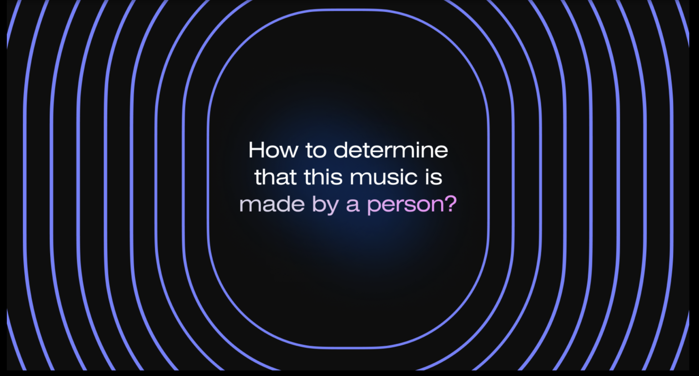
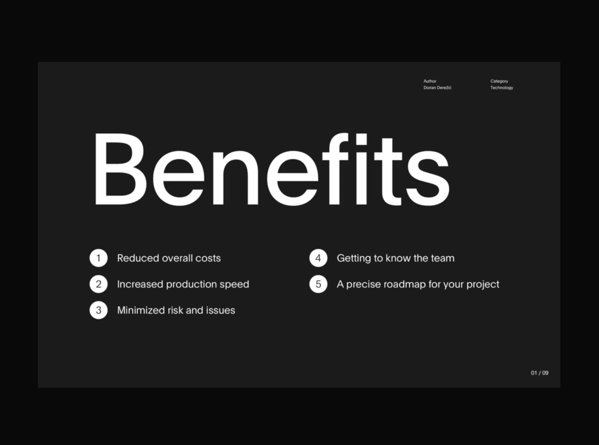
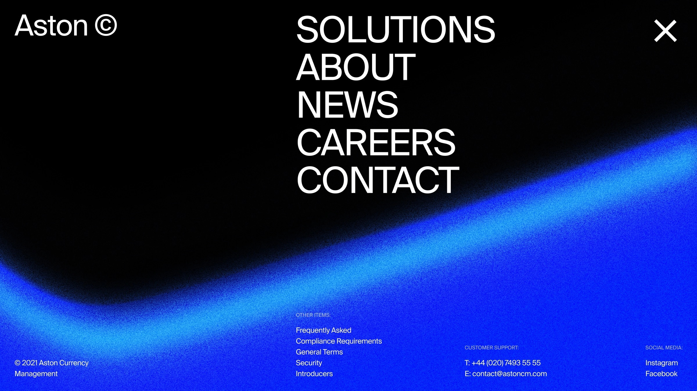
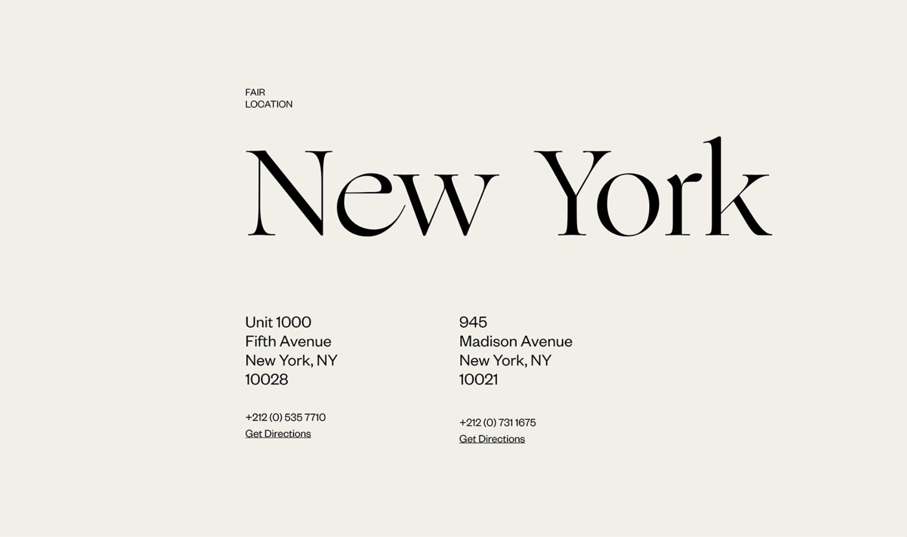

Структура, которой обычно пользуются дизайнеры:

**Титул**
Это слайд, который обычно располагается в начале и содержит основную информацию о презентации, такую как заголовок, название, автора. Титульный слайд помогает аудитории ориентироваться в контексте презентации и устанавливает тон для предстоящего материала.
Если человека сразу не заинтересовать, он, вероятно, не станет читать дальше. В титуле можно использовать не только текст, но и фотографии или иллюстрации.

- Заголовок должен быть ясным и лаконичным, отражая основную тему или цель презентации.
- Добавь логотип
- Используй достаточно большой шрифт для заголовка, выбери контрастные цвета, чтобы обеспечить хорошую читаемость

**Слайд-разделитель**  
Это специальный слайд в презентации, который используется для разделения различных разделов или тематических блоков. Он помогает организовать презентацию, улучшает ее структуру и облегчает навигацию для аудитории. Обычно на нём размещают название блока, иногда иллюстрацию или фотографию. Кроме того, там можно кратко перечислить тезисы, которые будут раскрыты далее.

Вы можете использовать слайд-разделитель, чтобы обозначить переход между различными тематическими разделами презентации. Например, если ваша презентация состоит из трех основных разделов, вы можете добавить слайд-разделитель между каждым из них, чтобы явно указать на изменение темы.

**Слайд с выводами**  
Создание слайда с выводами является важной частью презентации, поскольку это позволяет подчеркнуть основные результаты и заключения, которыми вы хотите поделиться с аудиторией.

- Выводы должны быть краткими и ясными, чтобы аудитория могла легко понять основные результаты работы.
- Старайся сформулировать выводы в нескольких предложениях или пунктах. Используй визуальные элементы, такие как графики, диаграммы или иллюстрации, чтобы визуально подкрепить выводы.
- Подчеркни ключевые точки, которые ты хочешь выделить в своих выводах. Используй жирный шрифт, цвет или другие дизайн-элементы, чтобы сделать эти ключевые точки более заметными на слайде
- Убедись, что выводы связаны с предыдущими слайдами и основными темами презентации. Это поможет аудитории понять контекст и значение ваших выводов.

**Слайд с контактами**  
Здесь все просто, размещаем контактные данные, предоставленные клиентом.
- Размести информацию о контактах на слайде в удобном и легко читаемом формате.
- Используй сочетание цветов и шрифтов, которые соответствуют общему дизайну презентации. - Ты также можете добавить графические элементы, такие как иконки телефона или электронной почты, чтобы сделать слайд более привлекательным.
- Размести слайд с контактами на видимом месте в презентации, например, в конце презентации или после слайда с выводами.

> **Задание:** Добавь в структуру своей презентации пару слайдов-разделителей с заголовками, которые уместно будут отделять смысловые блоки друг от друга. На этом этапе можно добавить их без дизайна. Просто пойми, где они будут уместны и добавь слайды-разделители в черновом варианте.