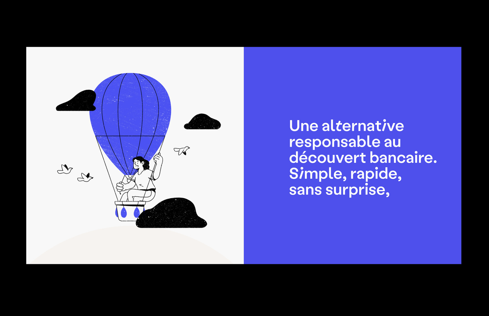
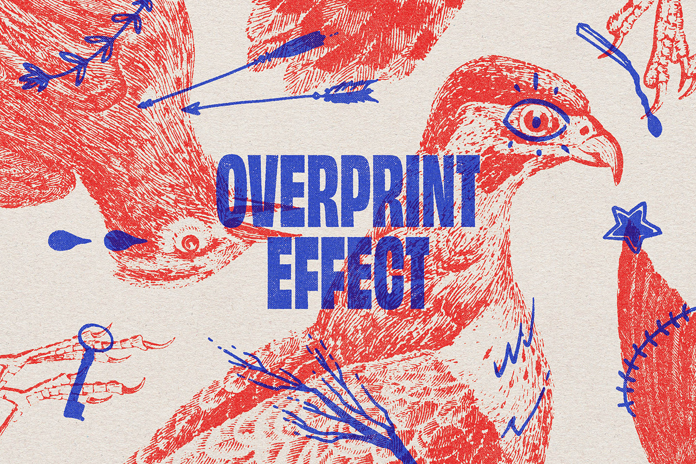
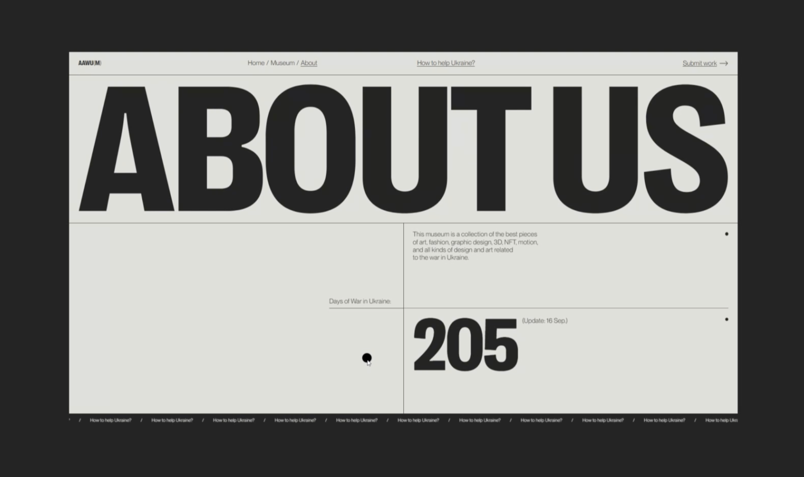
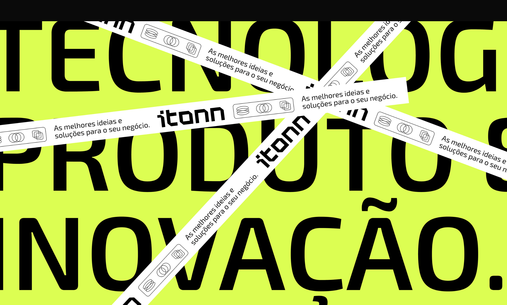
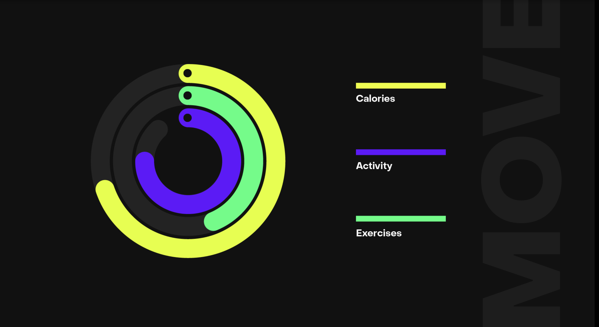
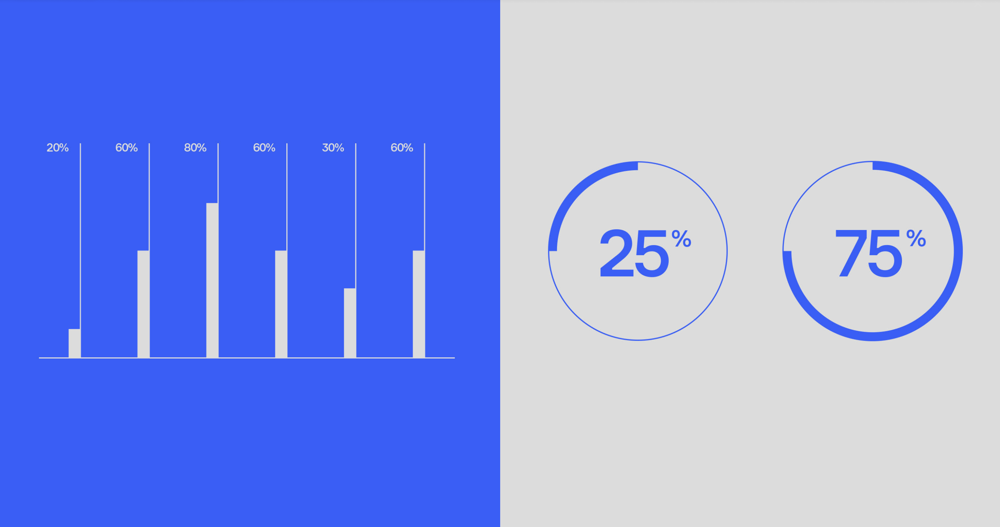
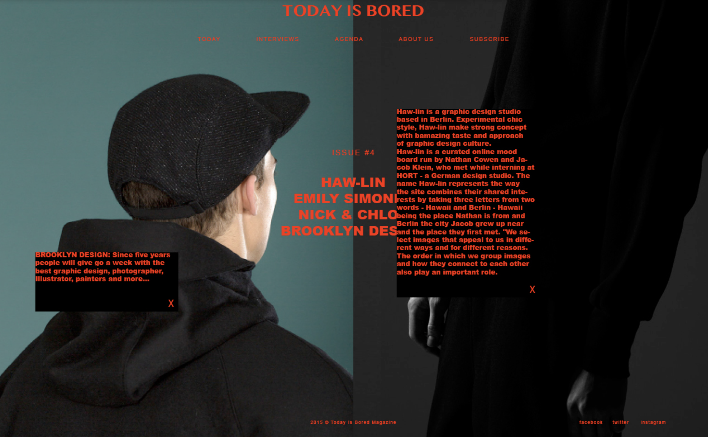

На этом этапе важно подобрать максимально эффективный способ упростить, а не усложнить передачу информации. В презентациях для устных форматов чаще применяются иллюстрации и фотографии без текстов. Ведь объяснить их смысл и назначение может выступающий. А вот в презентациях, предназначенных для чтения, смысл изображений или графиков лучше пояснять. Иначе многое останется непонятным.

**Приемы:**
1. **Иллюстрации.** Иллюстрации являются важным элементом презентаций, так как они помогают визуально поддерживать иллюстрировать презентуемую информацию. Если у вас есть статистические данные или факты, иллюстрации могут быть использованы для визуализации этих данных, а также, вы можете добавить фоновые изображения, текстурные элементы или декоративные иллюстрации, чтобы сделать слайды более привлекательными и эстетически приятными. Иллюстрации важно оформлять в фирменных цветах, а стиль иллюстраций во всей презентации должен быть единым.

2. **Типографика.** Иногда слайд с хорошо оформленными текстовыми блоками выглядит интереснее, чем слайд с фотографией или иллюстрацией. Типографика включает в себя выбор шрифтов, размеров шрифтов, интервалов между буквами и строками, а также выравнивание текста на слайдах.   **Основная цель типографики в презентации** - обеспечить читаемость текста для аудитории. Выбирай шрифты, которые легко читаются на экране и имеют достаточный размер, чтобы быть видимыми издалека. Избегай слишком маленьких размеров шрифта и заполненных или узких шрифтов, которые могут быть трудно прочитать.
- При создании презентации стоит выбрать 1-2 основных шрифта и использовать их на всех слайдах для создания единообразного внешнего вида. Это поможет улучшить восприятие информации.
- Чтобы выделить важные части презентации, используй различные уровни заголовков и изменяйте их размеры и жирность в соответствии с их важностью. Для основного текста используйте шрифт, который легко читается и не отвлекает внимание.
-  Используй адекватные интервалы между буквами и строками, чтобы обеспечить читаемость текста.
- Ограничь использование декоративных шрифтов: декоративные шрифты могут быть привлекательны, но они могут быть трудночитаемыми и отвлекающими для аудитории. Такие шрифты лучше подходят для заголовков или акцентов, но не для основного текста.

1. **Схемы.** Схемы помогают визуализировать сложную информацию, делая ее более понятной и наглядной для аудитории. Чтобы показать этапы какого-то процесса, лучше использовать схемы, состоящие из стандартных элементов: стрелок, блоков, ответвлений и т. д. Если схемы слишком большие и сложные, текст и графические элементы, скорее всего, будут трудно различимы. Чтобы справиться с этой проблемой, можно разместить части схемы на двух соседних слайдах. В этом случае зритель должен понимать, что перед ним половинки одной схемы и что она не обрывается, а будет продолжена на следующем слайде. Одно из возможных решений — нумерация пунктов или этапов.

2. **Графики и диаграммы** (инфографика) Статистические данные, результаты исследований, финансовые показатели компаний проще всего показать с помощью графиков и диаграмм. Особо продвинутый уровень — применение инфографики. В ней графики и диаграммы сочетают с иллюстрациями и тщательно продуманной типографикой.

> **Инфографика** — это форма визуализации информации, которая объединяет графические элементы, текст и данные для того, чтобы представить сложные концепции и факты более понятным и доступным образом. Она часто используется для передачи информации и коммуникации с помощью графических элементов, диаграмм, графиков, иллюстраций и других визуальных компонентов.

**Рекомендация!**
1. Определи цель инфографики: реши, какую информацию нужно включить в инфографику и с какой целью. Это может быть визуализация статистических данных, объяснение процесса или сравнение различных показателей. Определение цели поможет сфокусироваться на ключевых элементах и создать эффективную инфографику.
2. Выбери или создай макеты для инфографики. Ты можешь использовать встроенные шаблоны программы, в которой работаешь, если они там имеются. Это может быть столбчатая диаграмма, круговая диаграмма, таймлайн и другие. А также можно поискать варианты шаблонов на бесплатных платформах или отрисовать инфографику самостоятельно.
3. Добавь текст и графические элементы: заполни макет текстом и графическими элементами. Используй четкий и лаконичный текст, чтобы сделать информацию понятной и удобочитаемой. Добавь графические элементы, такие как иконки, изображения и символы, чтобы сделать инфографику более привлекательной.
4. Настрой внешний вид: измени цвета, шрифты и другие визуальные элементы, чтобы соответствовать общему стилю презентации. Это поможет создать согласованный и профессиональный вид инфографики.

**Ресурсы для поиска инфографики:**  
1. [visme.co](https://www.visme.co/ru/)  - предлагает более 700+ готовых шаблонов инфографики, которые можно использовать и настраивать под свои нужды.
2. [infogram.com](https://infogram.com)  - предоставляет инструменты для создания интерактивных инфографик. Вы можете добавлять графики, диаграммы и карты в свои инфографики.
3. [piktochart.com](https://piktochart.com)  - предлагает простой в использовании редактор и большой выбор шаблонов для создания инфографики. Вы можете добавлять графики, иконки и текст в свои инфографики.
4. [easel.ly](https://www.easel.ly) - предлагает простые инструменты для создания инфографики. Вы можете выбрать готовые шаблоны или создать свою собственную инфографику
5. [ru.freepik.com](https://ru.freepik.com) – предлагает готовые шаблоны с инфографикой, иконками, иллюстрациями.

**В презентации также можно использовать иконки или разработать целую систему для упрощения информации.**

> **Иконки.** Использование иконок в презентации может помочь сделать ее более визуально привлекательной и понятной для аудитории. Используй иконки, которые ясно и наглядно представляют предмет или концепцию, которую необходимо передать. Выбирай иконки, которые легко узнаваемы и соответствуют теме. При использовании иконок, старайся сохранять консистентность. Используй иконки одного стиля или набора, чтобы создать единый визуальный образ. Это поможет сделать презентацию более профессиональной и согласованной.

Ресурсы для поиска иконок:
1. [flaticon.com](https://www.flaticon.com) - это один из крупнейших ресурсов для бесплатных иконок. Он предлагает огромную коллекцию иконок в различных форматах, таких как SVG, PSD, PNG и EPS. Flaticon также предлагает возможность создавать собственные наборы иконок.
2. [ru.freepik.com](https://ru.freepik.com) - это еще один популярный ресурс с бесплатными иконками. Он предлагает большое количество иконок в различных стилях и форматах. Вы можете найти иконки в форматах SVG, PSD и PNG на Freepik.
3. [iconfinder.com](https://www.iconfinder.com) - это платформа для поиска иконок, которая предлагает широкий выбор иконок от разных дизайнеров. Она включает в себя иконки различных стилей и форматов. Iconfinder также предоставляет возможность фильтровать иконки по лицензии, размеру и цвету.
4. [thenounproject.com](https://thenounproject.com) - это сообщество дизайнеров, которые создают и делают доступными иконки для всех. Они предлагают огромную коллекцию иконок, которые можно использовать в коммерческих и некоммерческих проектах. Noun Project предлагает иконки в форматах SVG и PNG.
5. [iconarchive.com](https://www.iconarchive.com) - это еще один ресурс с большим выбором иконок. Он содержит бесплатные и платные иконки в различных форматах. Вы можете найти иконки в форматах PNG и ICO на IconArchive.

**Фотографии.** Самый простой способ проиллюстрировать нужный тезис — поместить на слайд фотографию. Но следи за тем, чтобы она была информативна. Она не обязана занимать весь слайд и не всегда бывает прямоугольной.

1. [ru.freepik.com](https://ru.freepik.com) является популярным ресурсом для поиска стоковых фотографий. Он предлагает огромную коллекцию бесплатных и платных изображений, иллюстраций и векторных файлов. Вы можете использовать их в коммерческих и некоммерческих проектах с различными лицензиями.
2. [allthefreestock.com](https://allthefreestock.com) является ресурсом, на котором вы можете найти бесплатные фотографии, видео, звуки и иконки. Он объединяет коллекции различных ресурсов в одном месте, что делает его удобным для поиска разнообразных стоковых материалов.
3. [istockphoto.com/ru](https://www.istockphoto.com/ru) предлагает широкий выбор стоковых фотографий, иллюстраций, видео и музыки. Они предоставляют различные планы подписки и позволяют использовать изображения в коммерческих проектах с помощью соответствующих лицензий.
4. [pixabay.com](https://pixabay.com) предлагает бесплатные фотографии, иллюстрации и видео, которые можно использовать в коммерческих проектах без необходимости указывать автора. Они предлагают большой выбор изображений различных категорий и качества.

> **Задание:** Создай инфографику для своей презентации из готовых шаблонов или нарисуй ее самостоятельно. Следи за тем, чтобы инфографика подходила по стилю и цвету твоей презентации, а также, обращай внимание на читабельность текста внутри нее. Можно использовать иконки, плашки, линейки, диаграммы, графики и тд.