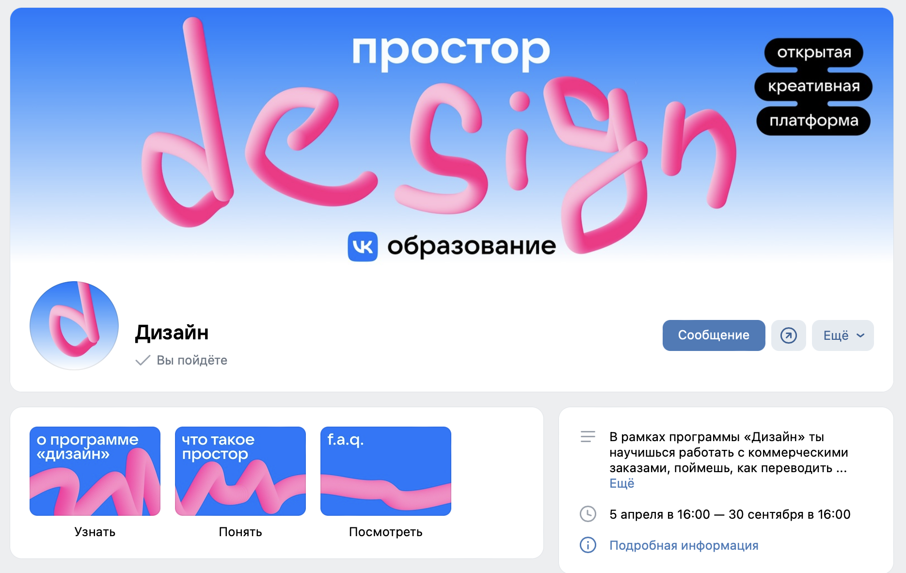
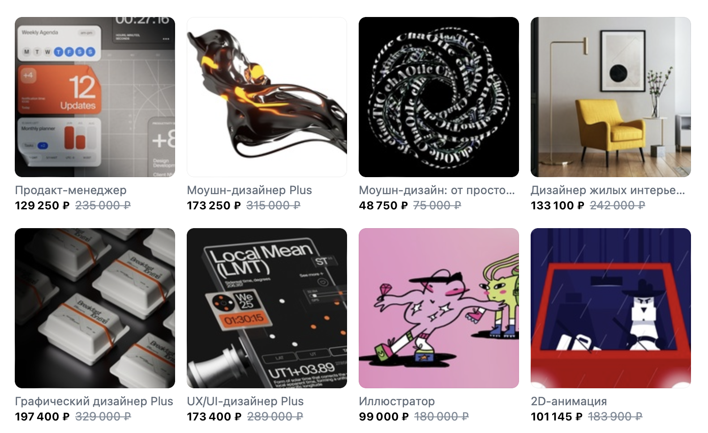
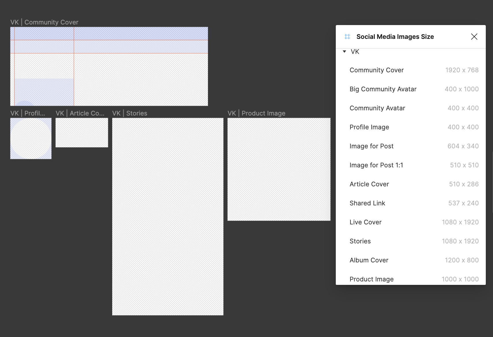
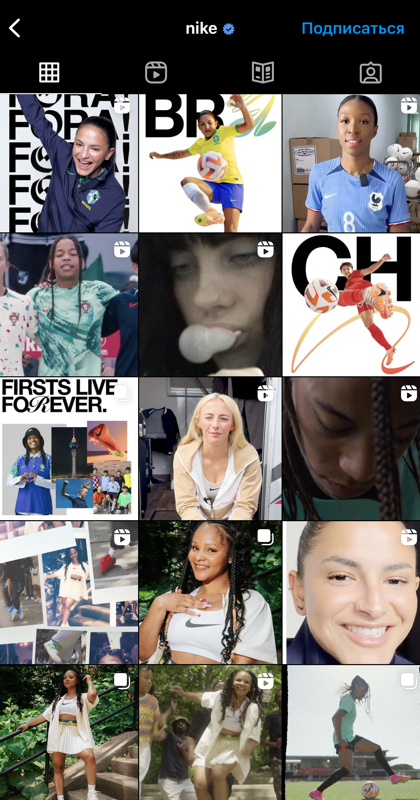
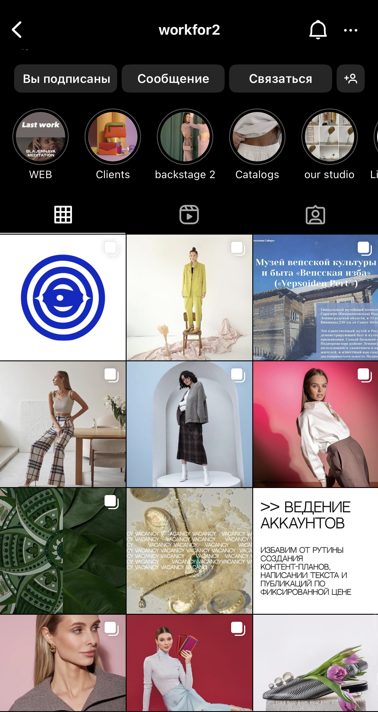
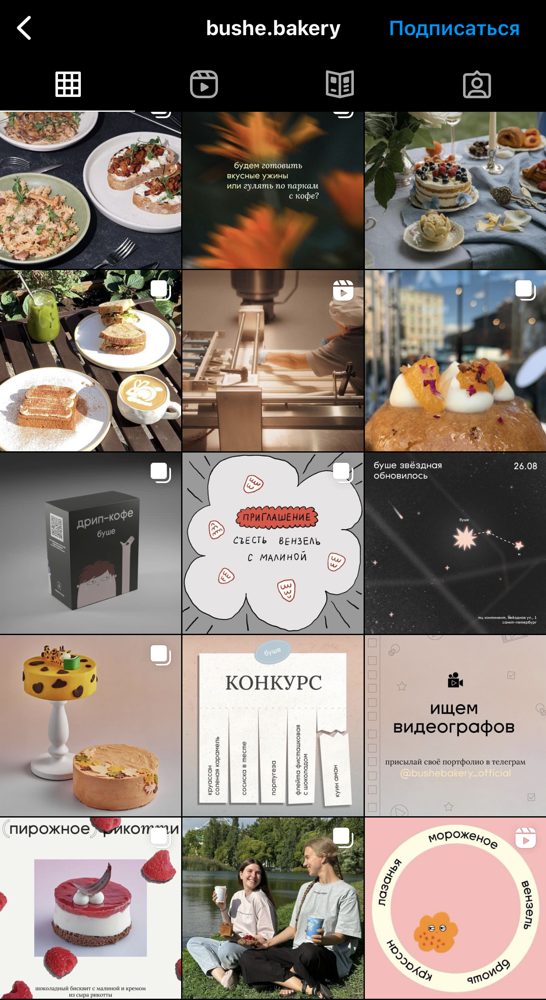
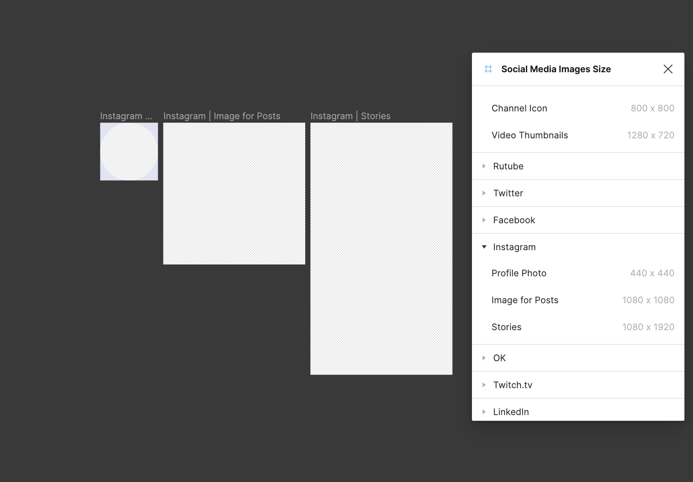
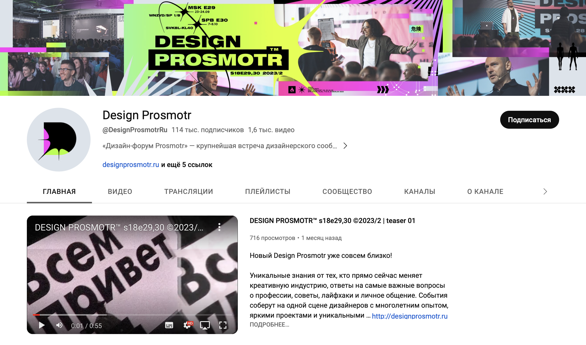
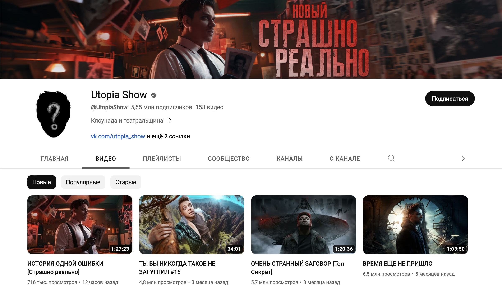
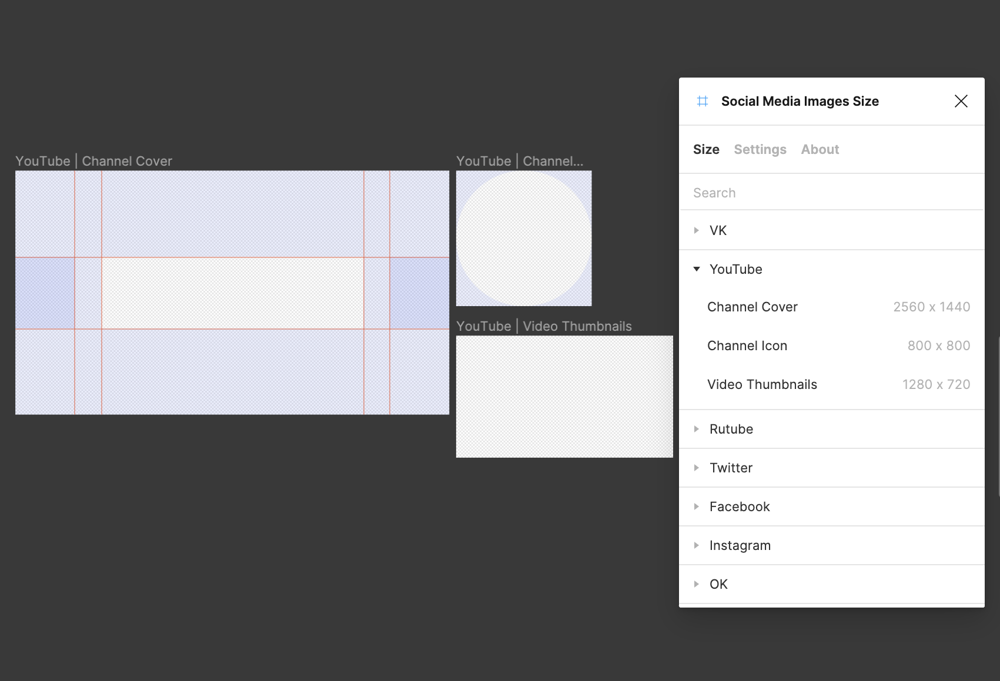

Перед началом работы тебе необходимо провести аналитику и все разложить по полочкам для того, чтобы визуальная концепция для соц. сетей решала именно те задачи, которые перед тобой поставил заказчик. **Аналитическую часть рекомендуем разместить на первых слайдах в презентации,** так как главной составляющей удачного визуала является не сам дизайн, а та работа, которая выполняется до него.

**Задание**
 
1. **Сформулируй задачу, которую перед тобой поставил заказчик и зафиксируй ее в презентации.** (На отдельном слайде пропиши, что конкретно планируется реализовать, вводные данные о проекте, которые есть в ТЗ)
2. **Пропиши портрет целевой аудитории из ТЗ.** На отдельном слайде выпиши все тезисы про ЦА из Технического Задания. Предположи возраст, пол, уровень дохода, образование, а также социальные, психологические, поведенческие, географические признаки. Зафиксируй их в презентации, для наглядности можешь прикрепить фотографии потенциальной аудитории.
 
> **Целевая аудитория** — это группа людей или организаций, которую компания выбирает для направленной рекламной или маркетинговой кампании. Выбор целевой аудитории помогает компании сосредоточить свои ресурсы и усилия на наиболее вероятных клиентах и повышает эффективность рекламных кампаний.
 
3. **Выбери платформы для соц. сетей**, с которыми будешь работать. Это необходимо, чтобы в полной мере продемонстрировать твой визуальный стиль заказчику. ВК / Instagram / Youtube, можешь предложить свою соц. сеть. У нас нет четкого регламента, где конкретно хочет размещаться клиент, поэтому ты можешь показать свою концепцию в любых соц. сетях, в комфортном для тебя количестве, которые по твоему мнению точно могут быть эффективны для заказчика.

 
> **ВК** — Оформление группы / сообщества ВКонтакте включает в себя несколько основных элементов, которые помогут сделать их более привлекательно:
 
**Аватар для сообщества:** размер миниатюры аватара — 200×200 пикселей. Минимальный размер целого аватара — 400×400 пикселей.  
**Главная обложка для сообщества:** размер главной обложки сообщества — 1590×530 пикселей. При загрузке изображения система автоматически поможет выделить подходящую по размеру область для обложки. Лучше оставлять пустое пространство сверху, так как верхние 128 пикселей отрезаются.  
**Изображения для записей:** минимальный размер квадратного изображения — 510×510 пикселей. Для прямоугольного изображения соотношение сторон 3:2.  
**Обложка для статьи:** размер изображения для обложки статьи — 510×286 пикселей. Не забывайте, что часть иллюстрации закроет текст заголовка и кнопка «Читать».  
**Размер изображений для витрины товаров:** рекомендуемый размер изображений для товаров — 1000×1000 пикселей.  
**Сторис** – 1080 х 1920 пикселей.

В Figma ты можешь установить плагин Social Media Images Size с готовыми шаблонами для соц сетей.

> **Instagram** многое зависит от того, какое впечатление производит профиль: какое общее настроение, цветовая палитра и сочетание фотографий. Ниже представлены основные элементы, которые помогут сделать красивую ленту и развивать особенную эстетику бренда.

 
**Аватар** – 180 x 180 пикселей.  
**Хайлайтс** – 150*150 пикселей.  
**Сторис** – 1080 х 1920 пикселей.  
**Изображение для поста** – 1080 х 1080 пикселей.  
**Вертикальное фото** – 1080 х 1350 пикселей.  
**Горизонтальное фото** – 1080 х 608 пикселей.
 

В Figma ты можешь установить плагин Social Media Images Size с готовыми шаблонами для соц сетей.

> **Youtube.** Оформление канала YouTube необходимо как начинающим видеоблогерам, так и опытным авторам видеороликов, размещающих свой контент на самом популярном видеохостинге в мире.

 
**Баннер:** Минимальный размер: 2560 x 1440 пикселей. Соотношение сторон: 16:9.  
Минимальный размер зоны для текста и логотипов: 1235 x 338 пикселей.  
Отсутствуют дополнительные эффекты, например тени, границы и рамки.  
**Обложка для видео:** размер — 1280х720 пикселей. Соотношение сторон: 16:9 (если этот показатель будет выше, то картинка обрежется под необходимые параметры и возможно не вся нужная информация будет видна пользователям)  
**Аватар для канала:** 800 x 800 пикселей.  
**Обложка Shorts:** 1920 x 1080 пикселей.  
 

В Figma ты можешь установить плагин Social Media Images Size с готовыми шаблонами для соц сетей.
 
1. **Создай фреймы с оригинальным размером макетов соц. сетей.** Чтобы сразу делать правильно, и соблюдать пропорции, можешь создать рабочую область в нужных размерах всех составляющих соц. сетей с верными размерами и форматами и работать уже с ними.
